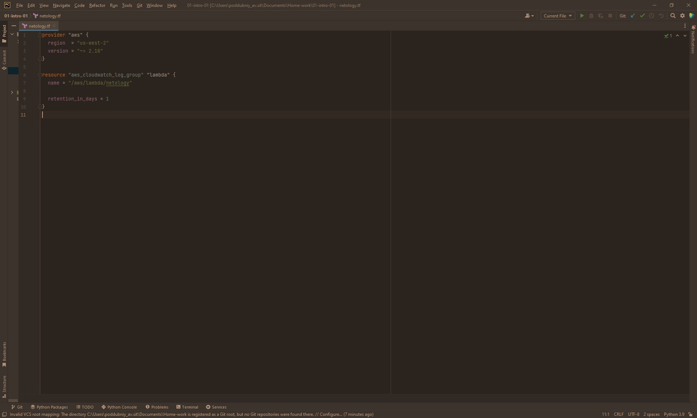
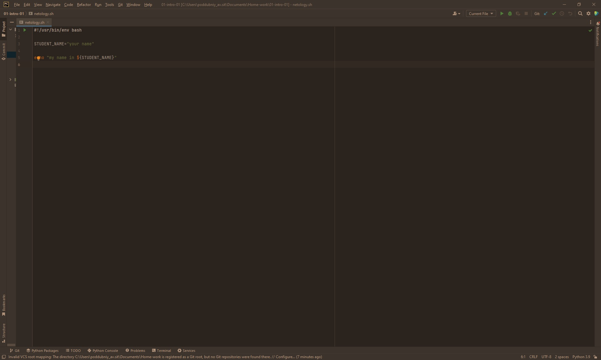
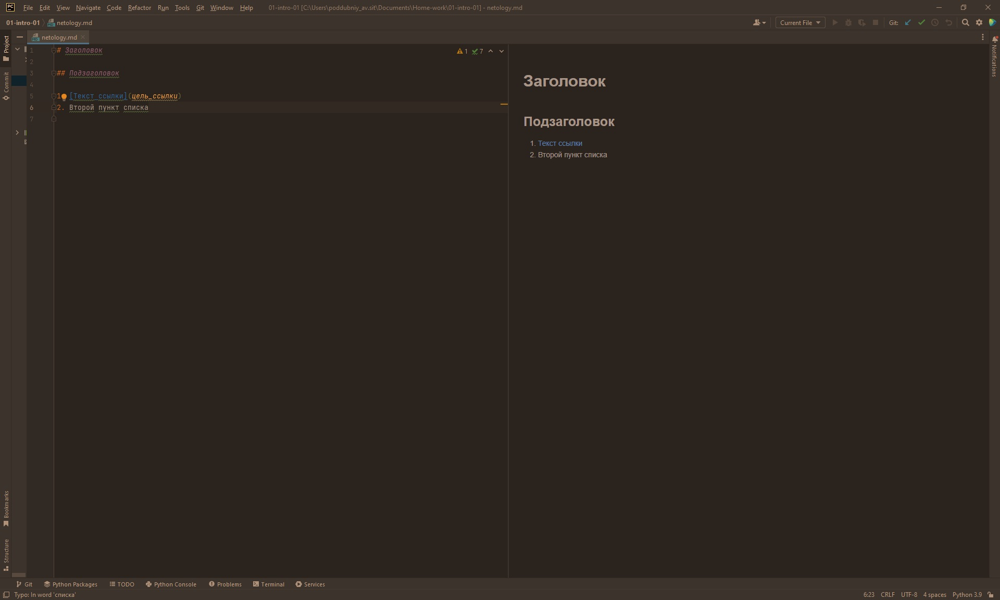
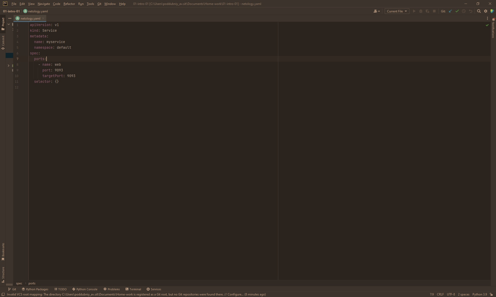
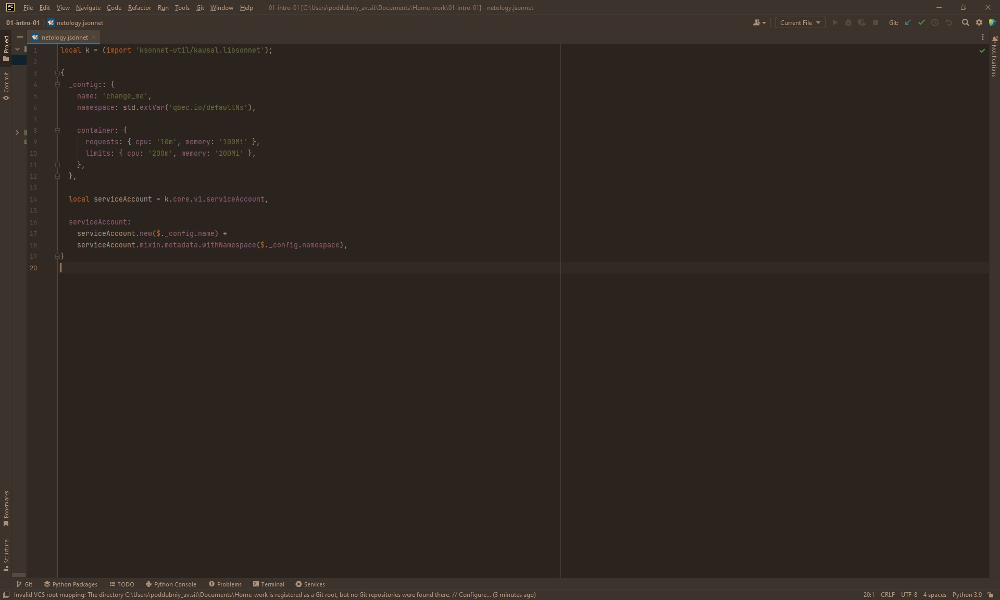
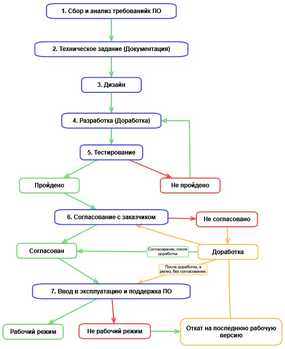

# Ответ на домашнее задание "Введение в DevOps"

### Цель задания

1. Научитесь настраивать окружение для работы

 - Terraform: 
    - Bash: 
    - Markdown: 
    - Yaml: 
    - Jsonnet: 

## Задание 2.

Рассмотрим разработку ПО по пунктам:
1. Собр и анализ требований (Менеджеры, технические консультанты)

Предварительное планирование этапов работ, сроков, ресурсов и стоимости.

2. Техническое задание (Документация) (Менеджеры, технические консультанты, )

Получение технических заданий, разработка спецификаций. Документальное изложение требований и планы проведения работ.
3. Дизайн (Дизайнеры, может быть frontend разработчики)

Получение графических макетов, визуальных форм, разработка интерфейсов. Создание индивидуального стиля. А так же доработка изменненного дизайна.
4. Разработка (Разработчики со специализацией в зависимости от проекта, так же devops-инженеры)

Написание исходного кода ПО и модулей.
5. Тестирование (Тестировщики и разработчики, devops-инженеры)

Проверка программы на соответствие всем предъявляемым к ней требованиям.
6. Согласование с заказчиком (Менеджеры)

На данном этапе согласовывается окончательный вариант перед внедрением.
7. Ввод в эксплуатацию. (системные администраторы, devops-инженеры, разработчики (возможно), техническая поддержка)

Установка программного обеспечения, обучение пользователей.

При применении devops практик производиться настройка автоматизации для планирования, тестирования, ввода в эксплуатацию. Так же необходимо автоматизировать откат на рабочую версию при не удачном релизе.

 - Блок-схема:
 - 

