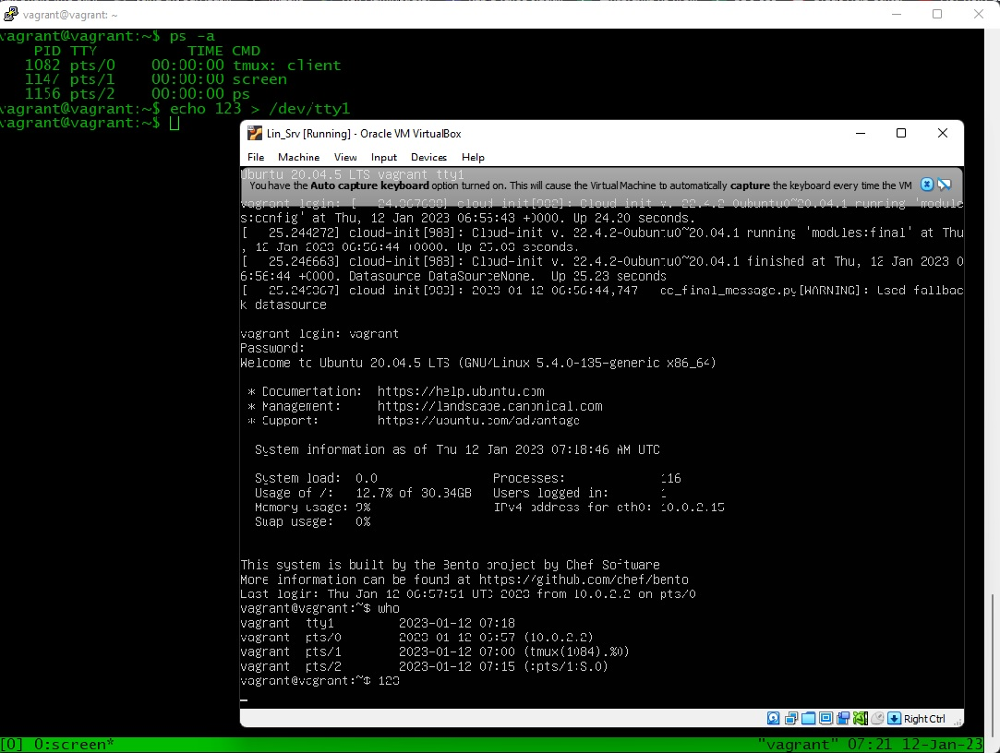
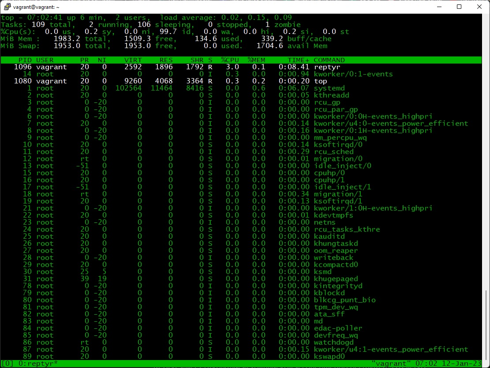

### Ответ на домашнее задание к занятию "03.02".

1. Какого типа команда cd?  
Команда "cd" встроенная в оболочку команда.   
С точки зрения логики и метода от противного, предположим что данная команда не встроена в оболочку, а находиться отдельным файлом и подгружается в оперативную память отдельными байтами.  
Тогда при возникновении какой-либо ошибки с этой программой в оперативной памяти, либо вследствии, чего-либо был удален исполняемый файл с
данной программой и ее модулями, то она просто не запустится. И в результате по факту, теряется возможность
перемещения по дисковому пространству в операционной системе без графической оболочки. Возможно реанимировать 
перемещения по файловой системе сторонними программами, но я о таких пока что не знаю.   
А при том что команда cd встроена в оболочку операционных систем, то перестанет работать только тогда, 
когда и сама оболочка перестанет работать.
2. 
```bash
vagrant@vagrant:~$ grep q test.txt | wc -l
1
 ``` 
 
```bash
vagrant@vagrant:~$ grep -c 'a'  test.txt
3
vagrant@vagrant:~$ cat test.txt
qwerty
asd
an
acvxxvn
123
vagrant@vagrant:~$
```
3. Процесс с PID 1 это "systemd(1)"  
4. Тут принципиально нужно вызвать ошибку `ls % 2> /dev/pts/0`  
5. cat <in.txt> out.txt 
6. Получиться командой `echo 123 > /dev/tty1`. Но только если осуществить консольный вход через Virtualbox.   

7. Команда `bash 5>&1` перенаправляет поток вывода в файловый дескриптор и создает его.  
Команда `echo netology > /proc/$$/fd/5` перенаправляет вывод в тоже самый файловый дескриптор и соответственно в консоли выводиться "netology".
8. А почему бы и нет
`ls /etc % 3>&2 2>&1 1>&3- | grep -i dir`
9. `cat /proc/$$/environ` содержит переменные окружения, заданные на этапе запуска текущей оболочки.  
Аналогичный по содержанию `echo $USER $HOME $PATH $SHELL $TERM $XDG_SESSION_ID $XDG_RUNTIME_DIR $1000DBUS_SESSION_BUS_ADDRESS
$XDG_SESSION_TYPE $XDG_SESSION_CLASS $MOTD_SHOWN $LANG $UTF-8SSH_CLIENT $22SSH_CONNECTION $22SSH_TTY`  
  А в человекочитаемом виде можно с помощью команты `printenv`.  
10. ```/proc/'PID'/exe``` это файл представляет собой символическую ссылку, содержащую фактический путь к выполняемой команде.  
```/proc/'PID'/cmdline``` содержит полную командную строку для процесса.
11. model name      : Intel(R) Core(TM) i5-3470 CPU @ 3.20GHz старшая версия инструкции SSE: sse4_2.  
12. ssh по умолчанию запрашивает только псевдотерминал (pty).
С помощью флагов -t и -T возможно подключиться к tty.
``` 
vagrant@vagrant:~$ ssh -t localhost 'tty'
vagrant@localhost's password:
/dev/pts/1
Connection to localhost closed. 
```
13. Получилось но только точно по [инструкции](https://github.com/nelhage/reptyr#readme) с правкой конфигов и нескольких перезагрузок.  

14. `tee` - считывает данные из стандартного устройства ввода и записывает их на стандартное устройство вывода или в файл. 
Копирует данные с ввода в ФАЙЛ, а также на стандартный вывод echo - показывает текстовую строку.   
Выдает СТРОКУ(И) на стандартное устройство вывода.Команда tee получает stdout команды echo, через перенаправление pipe, и копирует в файл. 
Так как команда запущена от sudo, имеет права на запись.


