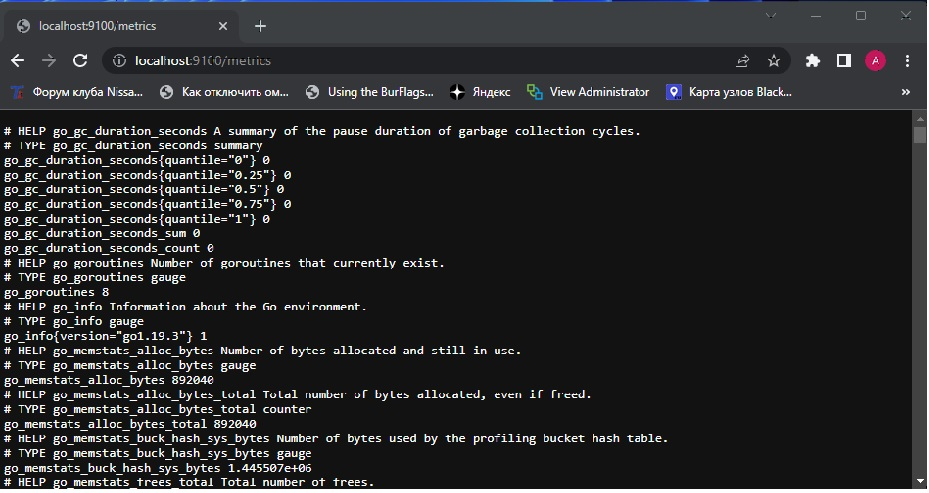
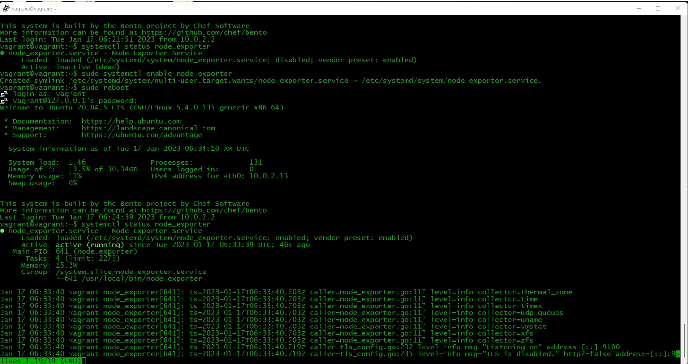
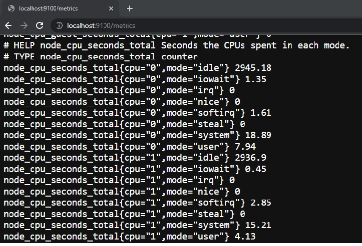
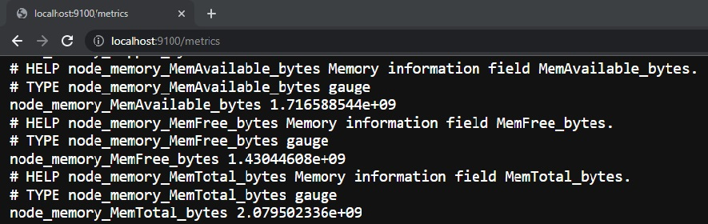
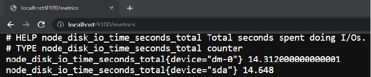
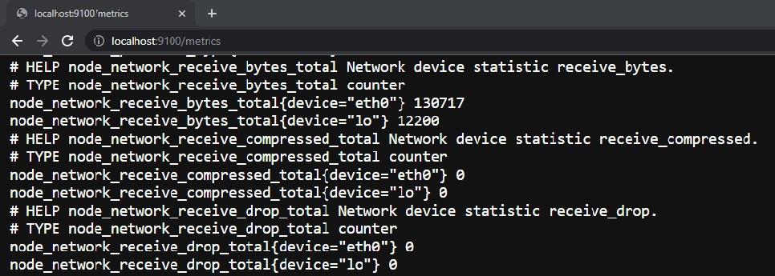
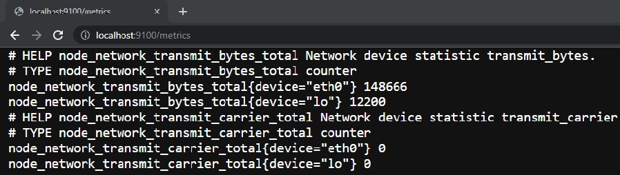
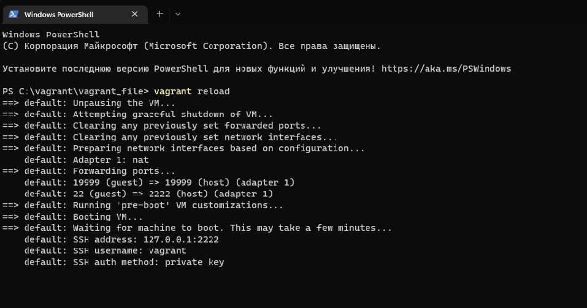
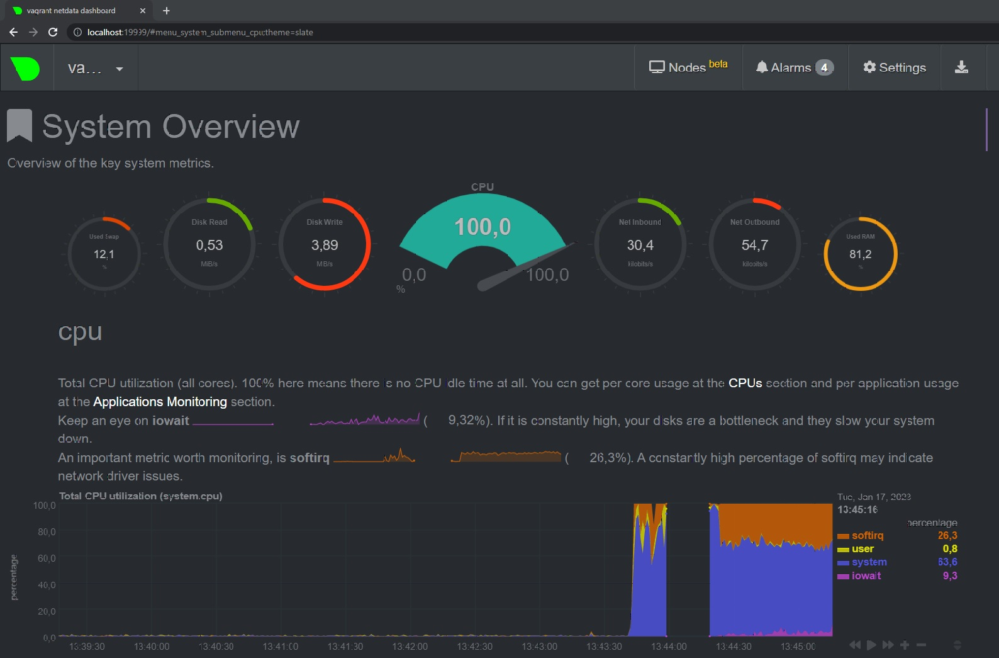

### Ответ на домашнее задание 03-sysadmin-04-os

1. 
* Скачиваем по ссылке ` wget https://github.com/prometheus/node_exporter/releases/download/v1.5.0/node_exporter-1.5.0.linux-amd64.tar.gz`,  
* распаковываем архив `tar xf node_exporter-1.5.0.linux-amd64.tar.gz`,   
* копируем сервис в /usr/local/bin/ `cp node_exporter /usr/local/bin/`,  
* Добавление опции в Unit теоретически так `ExecStart=/usr/local/bin/node_exporter`,  
* создаем пользователя для сервиса `useradd --no-create-home --shell /bin/false exporter`,  
* создаем init файл для сервиса `systemctl edit --full --force node_exporter.service`,  
```
systemctl cat  node_exporter
# /etc/systemd/system/node_exporter.service
[Unit]
Description=Node Exporter Service

[Service]
user=exporter
Group=exporter
Type=simple
ExecReload=/bin/kill -HUP $MAINPID
Restart=on-failure
ExecStart=/usr/local/bin/node_exporter

[Install]
WantedBy=multi-user.target
```
* Стартуем сервис 
```commandline
 systemctl status node_exporter
● node_exporter.service - Node Exporter Service
     Loaded: loaded (/etc/systemd/system/node_exporter.service; disabled; vendor preset: enabled)
     Active: active (running) since Mon 2023-01-16 13:42:03 UTC; 3min 13s ago
   Main PID: 4381 (node_exporter)
      Tasks: 4 (limit: 2273)
     Memory: 2.3M
     CGroup: /system.slice/node_exporter.service
             └─4381 /usr/local/bin/node_exporter

```
* Скриншот сервиса (заработал после проброса портов в virtualbox)  
    
* Добвляем сервис в автозагрузку и рестартуем машину 
```
vagrant@vagrant:~$ sudo systemctl enable node_exporter
Created symlink /etc/systemd/system/multi-user.target.wants/node_exporter.service → /etc/systemd/system/node_exporter.service.
```
  

* Добавление параметров запуска через внешний файл:
```commandline
vagrant@vagrant:~$ cat /usr/local/bin/node_service
[Service]
DOP_OPTIONS='--chto_to_tam'

```
```commandline
vagrant@vagrant:~$ sudo systemctl cat node_exporter
# /etc/systemd/system/node_exporter.service
[Unit]
Description=Node Exporter Service
Wants=network-online.target
After=network-online.target

[Service]
EnvironmentFile=/usr/local/bin/node_service
User=exporter
Group=exporter
Type=simple
ExecReload=/bin/kill -HUP $MAINPID
Restart=on-failure
ExecStart=/usr/local/bin/node_exporter

[Install]
WantedBy=multi-user.target

```
```commandline
vagrant@vagrant:~$ sudo systemctl daemon-reload
vagrant@vagrant:~$ sudo systemctl restart node_exporter
vagrant@vagrant:~$ sudo systemctl status node_exporter
● node_exporter.service - Node Exporter Service
     Loaded: loaded (/etc/systemd/system/node_exporter.service; enabled; vendor preset: enabled)
     Active: active (running) since Wed 2023-01-18 07:11:32 UTC; 9s ago
   Main PID: 40084 (node_exporter)
      Tasks: 4 (limit: 2273)
     Memory: 13.2M
     CGroup: /system.slice/node_exporter.service
             └─40084 /usr/local/bin/node_exporter
...
vagrant@vagrant:~$ cat /proc/40084/environ
cat: /proc/40084/environ: Permission denied
vagrant@vagrant:~$ sudo cat /proc/40084/environ
LANG=en_US.UTF-8PATH=/usr/local/sbin:/usr/local/bin:/usr/sbin:/usr/bin:/sbin:/bin:/snap/binHOME=
/home/exporterLOGNAME=exporterUSER=exporterINVOCATION_ID=2ca31945acc84872b93b881e707cfcceJOURNAL_STREAM=
9:499754DOP_OPTIONS=--chto_to_tam

```
* Добавление дополнительных параметров запуска:  
основной файл запуска службы:
```commandline
vagrant@vagrant:~$ systemctl cat node_exporter
# /etc/systemd/system/node_exporter.service
[Unit]
Description=Node Exporter Service
Wants=network-online.target
After=network-online.target


[Service]
EnvironmentFile=/usr/local/bin/node_service
User=exporter
Group=exporter
Type=simple
Restart=on-failure
ExecStart=/usr/local/bin/node_exporter $OPT

[Install]
WantedBy=multi-user.target

```
Дополнительные параметры: 
```commandline
vagrant@vagrant:~$ cat  /usr/local/bin/node_service
[Service]
DOP_OPTIONS='--chto_to_tam'
OPT='--log.level=error'

```
Запуск сервиса: 
```commandline
vagrant@vagrant:~$ sudo systemctl daemon-reload
vagrant@vagrant:~$ sudo systemctl restart node_exporter
vagrant@vagrant:~$ sudo systemctl status node_exporter
● node_exporter.service - Node Exporter Service
     Loaded: loaded (/etc/systemd/system/node_exporter.service; enabled; vendor preset: enabled)
     Active: active (running) since Wed 2023-01-18 12:10:03 UTC; 2s ago
   Main PID: 43195 (node_exporter)
      Tasks: 4 (limit: 2273)
     Memory: 2.2M
     CGroup: /system.slice/node_exporter.service
             └─43195 /usr/local/bin/node_exporter --log.level=error

Jan 18 12:10:03 vagrant systemd[1]: Started Node Exporter Service.

```


2. Ответ проще приложить в скриншотах.   
CPU



Memory



Disk



Net_receive



Net_transmit



3. Установлено
```commandline
vagrant@vagrant:~$ sudo apt install -y netdata
Reading package lists... Done
Building dependency tree
Reading state information... Done
netdata is already the newest version (1.19.0-3ubuntu1).
0 upgraded, 0 newly installed, 0 to remove and 0 not upgraded.

```
Заменил бинды
```commandline

[global]
        run as user = netdata
        web files owner = root
        web files group = root
        # Netdata is not designed to be exposed to potentially hostile
        # networks. See https://github.com/netdata/netdata/issues/164
        bind socket to IP = 0.0.0.0
```
Рестарт машины с новой конфигурацией

PROFIT!


4. Когда система загружена на виртуальной машине, то она об этом точно осведомлена:
```commandline
vagrant@vagrant:~$ dmesg | grep virtual
[    0.008426] CPU MTRRs all blank - virtualized system.
[    0.081129] Booting paravirtualized kernel on KVM
[   12.974890] systemd[1]: Detected virtualization oracle.
vagrant@vagrant:~$

```
5. `sysctl fs.nr_open` Это максимальный лимит на открытие файловых дескрипторов для процесса в системе.
```commandline
vagrant@vagrant:~$ sysctl fs.nr_open
fs.nr_open = 1048576

```
Мягкий лимит на создание файловых дескрипторов в системе, который процесс может превысить
```commandline
vagrant@vagrant:~$ ulimit -n
1024

vagrant@vagrant:~$ ulimit -Sn
1024

```
Жесткий лимит на создание файловых дескрипторов, который превысить нельзя.
```commandline
vagrant@vagrant:~$ ulimit -Hn
1048576

```
6. Запускаем `unshare`
```commandline
vagrant@vagrant:~$ sudo unshare --fork --pid --mount-proc  /bin/bash
root@vagrant:/home/vagrant# ps aux
USER         PID %CPU %MEM    VSZ   RSS TTY      STAT START   TIME COMMAND
root           1  0.0  0.1   7236  3944 pts/0    S    10:27   0:00 /bin/bash
root           8  0.0  0.1   8888  3300 pts/0    R+   10:27   0:00 ps aux
root@vagrant:/home/vagrant# sleep 5h
```
Подключаемся второй консолью к виртуальной машине.
```commandline
vagrant@vagrant:~$ ps aux
...
root        2002  0.0  0.2   9268  4776 pts/0    S    10:27   0:00 sudo unshare --fork --pid --mount-proc /bin/bash
root        2003  0.0  0.0   5480   516 pts/0    S    10:27   0:00 unshare --fork --pid --mount-proc /bin/bash
root        2004  0.0  0.2   7236  4064 pts/0    S    10:27   0:00 /bin/bash
root        2022  0.0  0.0   5476   516 pts/0    S+   10:29   0:00 sleep 5h
root        2023  0.0  0.4  13928  9100 ?        Ss   10:30   0:00 sshd: vagrant [priv]
vagrant     2068  0.0  0.3  13928  6208 ?        R    10:30   0:00 sshd: vagrant@pts/1
vagrant     2069  0.0  0.2   7356  4212 pts/1    Ss   10:30   0:00 -bash
vagrant     2080  0.0  0.1   8888  3464 pts/1    R+   10:31   0:00 ps aux

```
Через nsenter смотрим процесс в отдельном немспейсе.
```commandline
vagrant@vagrant:~$ sudo nsenter --target 2022 --pid --mount
root@vagrant:/# ps aux
USER         PID %CPU %MEM    VSZ   RSS TTY      STAT START   TIME COMMAND
root           1  0.0  0.2   7236  4064 pts/0    S    10:27   0:00 /bin/bash
root          15  0.0  0.0   5476   516 pts/0    S+   10:29   0:00 sleep 5h
root          16  0.0  0.2   7236  4156 pts/1    S    10:36   0:00 -bash
root          27  0.0  0.1   8888  3444 pts/1    R+   10:36   0:00 ps aux

```
7. Так как запускаем форк-бомбу  `:(){ :|:& };:` да и на виртуалке, то глуяем на все!  
Так `:` вызывает себя, передавая свой вывод через себя снова, и таким образом заполняет процессор запросами, и на диск пишет очень много данных.


```commandline
-bash: fork: Resource temporarily unavailable
-bash: fork: Resource temporarily unavailable
-bash: fork: retry: Resource temporarily unavailable
-bash: fork: retry: Resource temporarily unavailable
-bash: fork: retry: Resource temporarily unavailable

root@vagrant:/#

```

Ну посмотрим что произошло:
```commandline
root@vagrant:/# dmesg -T
...
[Tue Jan 17 10:43:45 2023] cgroup: fork rejected by pids controller in /user.slice/user-1000.slice/session-8.scope

```
Скорее всего отработала система управления лимитами дескрипторов для процесса. Превысив порог в 7579 шт. система просто убила процесс.  
А вот что бы такого не было, то лимиты можно занизить.
```commandline
Настройка количества файловых дескрипторов для процесса.
root@vagrant:/# ulimit -u
7579
root@vagrant:/# ulimit -u 100

```