### Ответ на домашнее задание 03-sysadmin-05-fs

1. Цитата из википедии: файл sparse (разряженный) это файл, в котором последовательности нулевых байтов заменены на информацию об этих последовательностях (список дыр).   
Дыра (англ. hole) — последовательность нулевых байт внутри файла, не записанная на диск. Информация о дырах (смещение от начала файла в байтах и количество байт) хранится в метаданных ФС.
2. Не могут жесткие ссылки и файл иметь разные права. Потому что у них один inode.
3. Виртуальная машина запущена через vagrant up
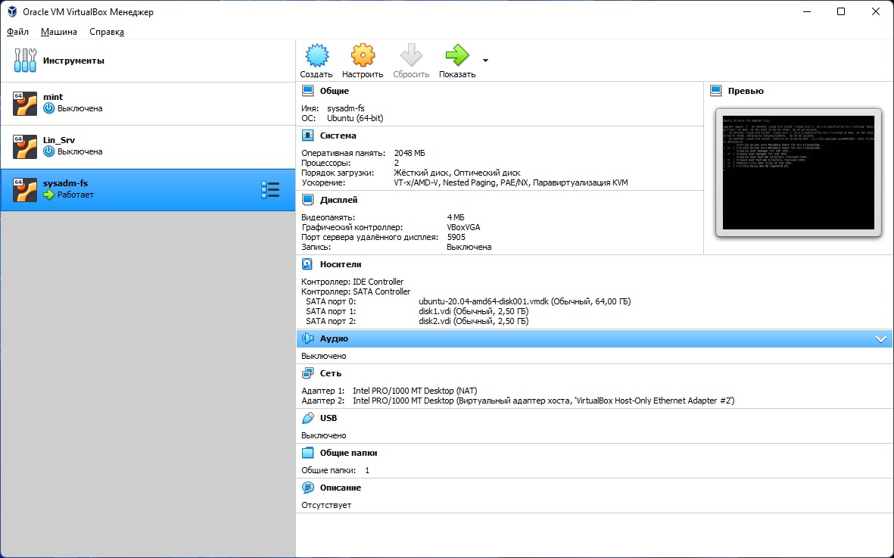  
4. После команды `sudo fdisk -L /dev/sdb` проваливаемся в интерактивный режим.
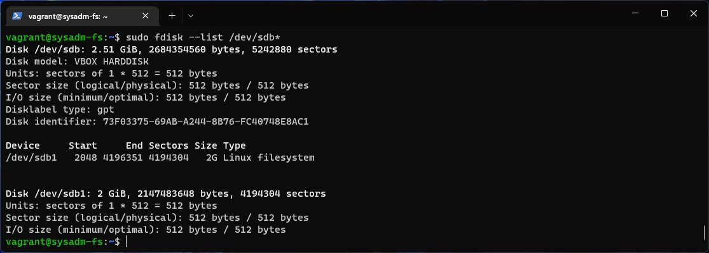 
5. Выгружаем таблицу разделов `sudo sfdisk -d /dev/sdb > part_table` а потом загружаем на другой диск ` sudo sfdisk  /dev/sdc < part_table` и в результате:
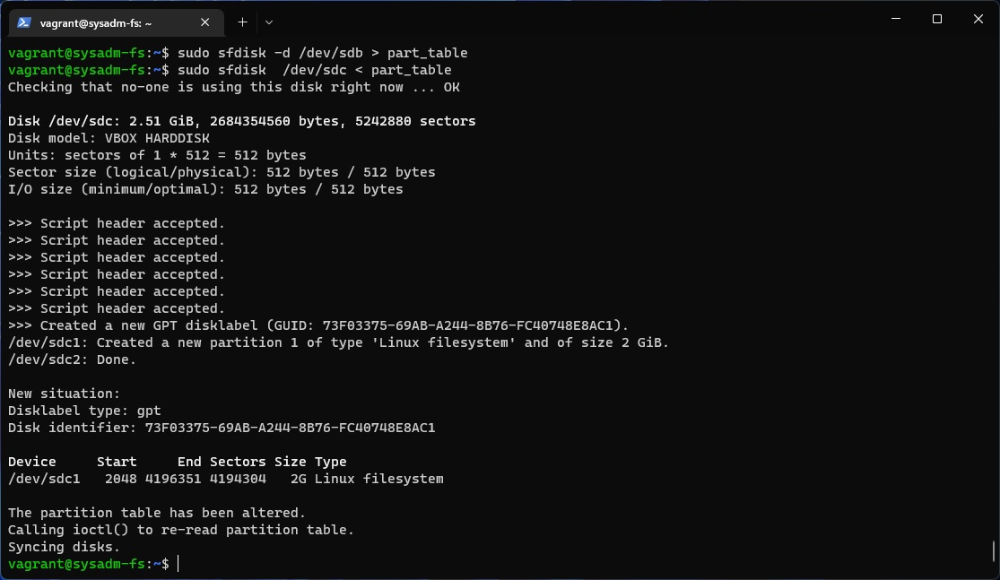 
6. Выполенно `sudo mdadm --create --verbose /dev/md0 -l 1 -n 2 /dev/sd{b,c}1`
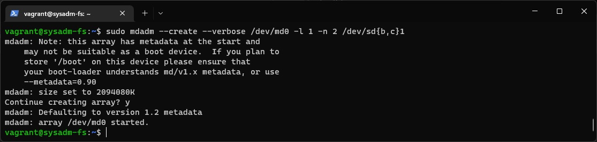  
Вывод `lsblk`
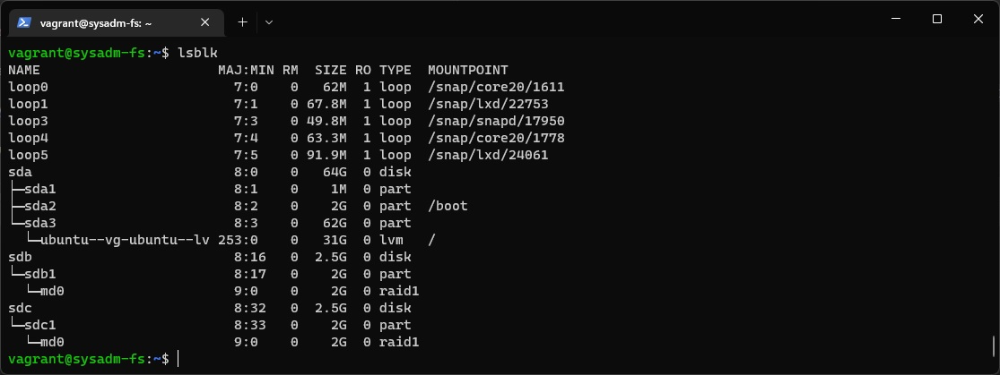
7. Создаем дополнительные разделы на дисках, которые деликатно забыли в предыдущем занятии:
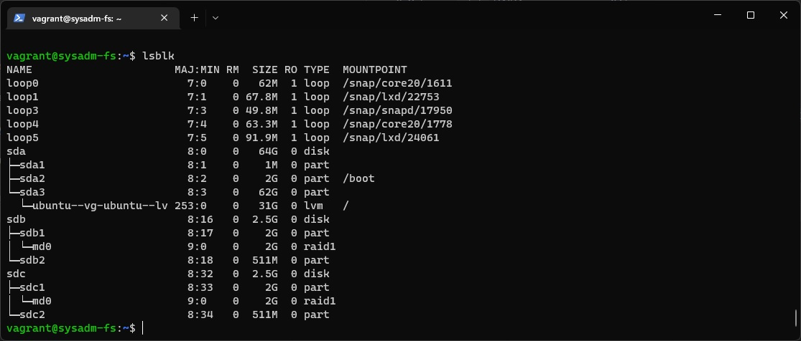  
 Созадем raid0 командой `sudo mdadm --create --verbose /dev/md1 -l 0 -n 2 /dev/sd{b,c}2`
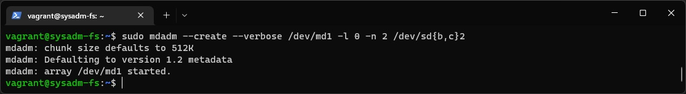
8. Выполнено командами
```commandline
vagrant@sysadm-fs:~$ sudo pvcreate /dev/md0
  Physical volume "/dev/md0" successfully created.
vagrant@sysadm-fs:~$ sudo pvcreate /dev/md1
  Physical volume "/dev/md1" successfully created.
```
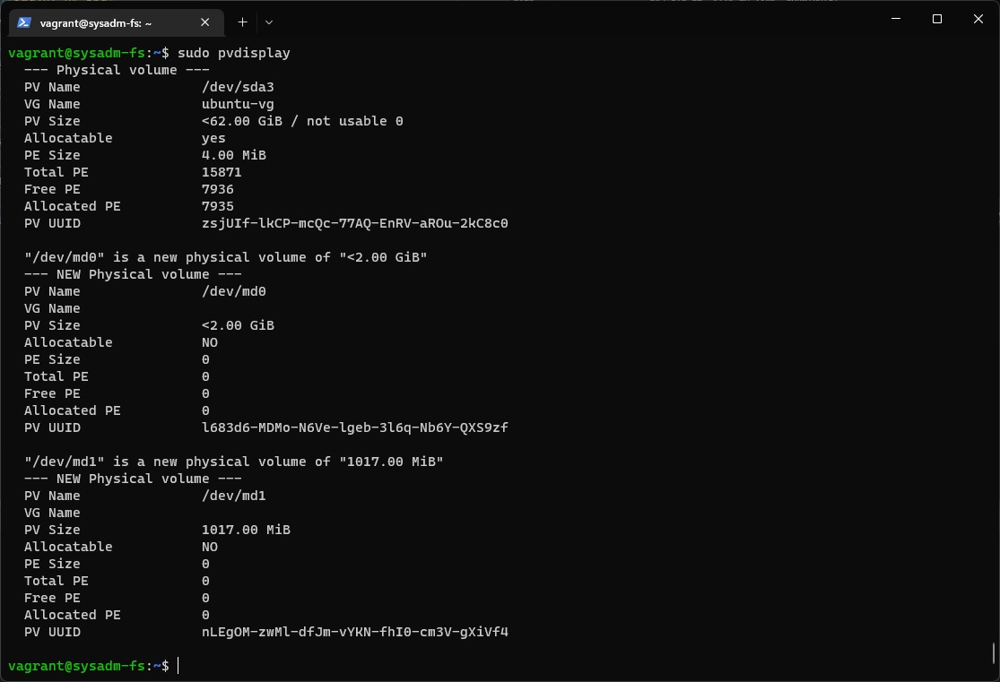
9. Выполнено командой `sudo vgcreate vg01 /dev/md{0,1}`
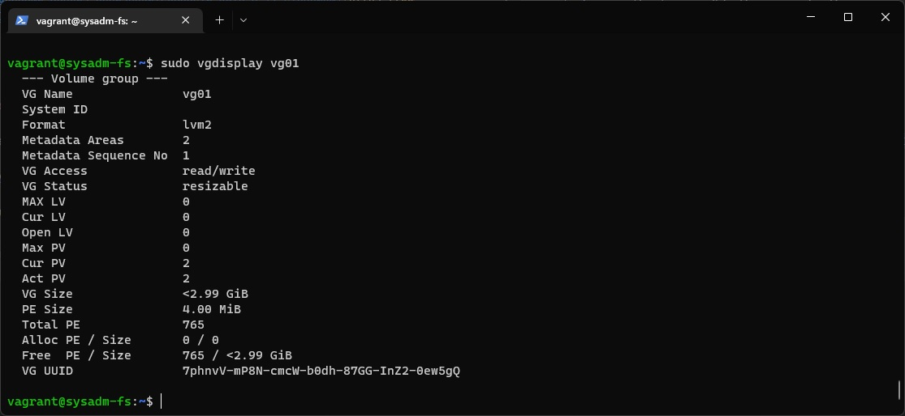
10. Выполнено командойй `sudo lvcreate -L 100M vg01 /dev/md1`
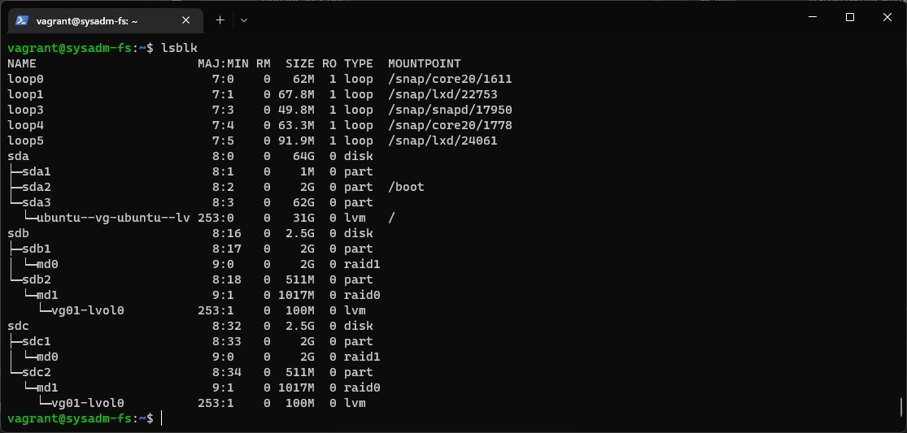
11. Выполнено `sudo sudo mke2fs -t ext4 /dev/vg01/lvol0`
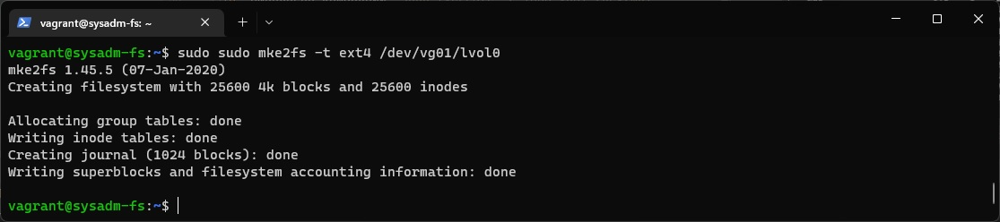
12. Выполнено  
```commandline
vagrant@sysadm-fs:~$ sudo mount /dev/vg01/lvol0 /tmp/new
mount: /tmp/new: mount point does not exist.
vagrant@sysadm-fs:~$ mkdir /tmp/new
vagrant@sysadm-fs:~$ sudo mount /dev/vg01/lvol0 /tmp/new
```
13. Выполнено   
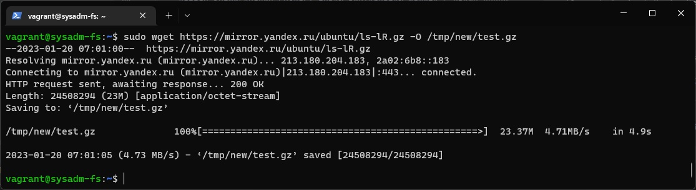
14. Вывод `lsblk`
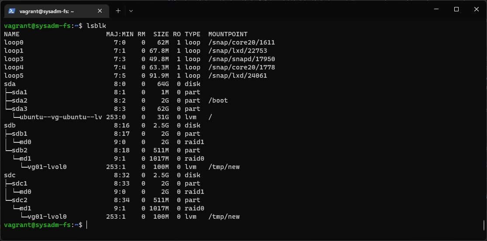
15. Протестировано  
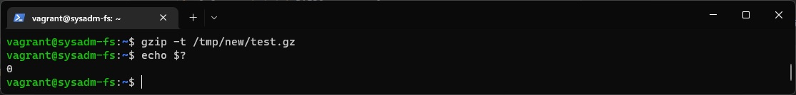
16. Перенес.  
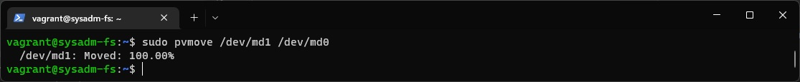
17. Должен был поломаться. 

18. Выполено `dmesg -T | grep md0`
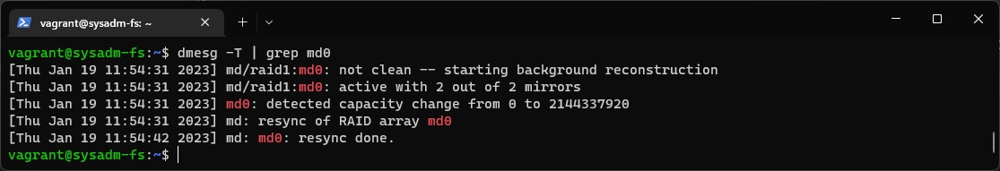
19. Протестировано 

20. Погасите тестовый хост, vagrant destroy: а можно я не буду этого делать. 
У меня еще есть желание дополнительно поработать с ним. Сделаю `vagrant suspend`