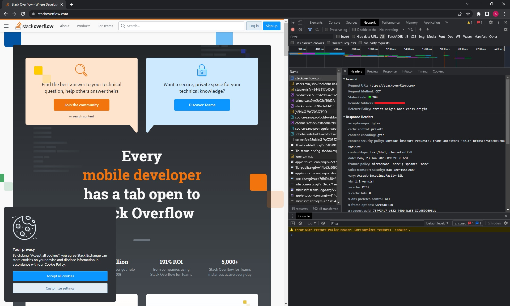

### Ответ на задание "3.6. Компьютерные сети. Лекция 1"

1. Выполнено подключение `telnet stackoverflow.com 80`
```commandline
vagrant@vagrant:~$ telnet stackoverflow.com 80
Trying 151.101.1.69...
Connected to stackoverflow.com.
Escape character is '^]'.
GET /questions HTTP/1.0
HOST: stackoverflow.com

HTTP/1.1 403 Forbidden
Connection: close
...
```
HTTP/1.1 403 Forbidden : Сервер понял запрос, но отказывается его выполнять.
2. Ответ на второе задание 
* Первый ответ от сервера Status Code: 307 Internal Redirect
* Время загрузки страницы: Load: 1.85 s, 
* самый долгий запрос (:method: GET :path: /) /ответ: `Documentstackoverflow.com	200	document	stackoverflow.com/	53.0 kB	599 ms`  
* 


3. 109.252.57.125 
4. descr: Moscow Local Telephone Network (OAO MGTS) AS25513
5. `traceroute -A 8.8.8.8`
```commandline
traceroute to 8.8.8.8 (8.8.8.8), 30 hops max, 60 byte packets
 1  mygpon (192.168.1.254) [*]  2.396 ms  3.348 ms  3.350 ms
 2  100.109.0.1 (100.109.0.1) [*]  11.498 ms  11.507 ms  11.503 ms
 3  mpts-ss-51.msk.mts-internet.net (212.188.1.6) [AS8359]  11.500 ms  11.496 ms  13.413 ms
 4  * * *
 5  72.14.223.72 (72.14.223.72) [AS15169]  13.418 ms 72.14.223.74 (72.14.223.74) [AS15169]  15.192 ms  17.780 ms
 6  108.170.250.83 (108.170.250.83) [AS15169]  19.224 ms  10.798 ms 108.170.250.34 (108.170.250.34) [AS15169]  9.426 ms
 7  142.250.238.214 (142.250.238.214) [AS15169]  23.098 ms  25.188 ms 142.251.238.84 (142.251.238.84) [AS15169]  21.476 ms
 8  74.125.253.109 (74.125.253.109) [AS15169]  28.413 ms 142.251.238.66 (142.251.238.66) [AS15169]  22.088 ms 142.250.235.62 (142.250.235.62) [AS15169]  25.724 ms
 9  172.253.79.237 (172.253.79.237) [AS15169]  30.161 ms 216.239.62.9 (216.239.62.9) [AS15169]  27.392 ms 142.250.208.23 (142.250.208.23) [AS15169]  29.036 ms
10  * * *
11  * * *
12  * * *
13  * * *
14  * * *
15  * * *
16  * * *
17  dns.google (8.8.8.8) [AS15169/AS263411]  29.825 ms * *

```
6. ` mtr -z 8.8.8.8`
```commandline
 My traceroute  [v0.95]
lex-PLCSF8 (192.168.1.82) -> 8.8.8.8 (8.8.8.8)                                                               2023-01-24T20:37:39+0300
Keys:  Help   Display mode   Restart statistics   Order of fields   quit
                                                                                             Packets               Pings
 Host                                                                                      Loss%   Snt   Last   Avg  Best  Wrst StDev
 1. AS???    mygpon                                                                         0.0%    33    3.0   3.1   2.8   7.3   0.9
 2. AS???    100.109.0.1                                                                    0.0%    33    7.0   7.1   6.1  10.8   0.9
 3. AS8359   mpts-ss-51.msk.mts-internet.net                                                0.0%    33    6.7   8.5   6.6  21.9   3.1
 4. AS8359   mag9-cr03-be12.51.msk.mts-internet.net                                        81.2%    33    7.0   6.8   6.6   7.0   0.2
 5. AS15169  72.14.223.74                                                                   0.0%    33    7.3  10.6   7.1 106.5  17.2
 6. AS15169  108.170.250.146                                                                3.1%    33    7.3  12.9   6.8  53.4  12.6
 7. AS15169  142.251.237.156                                                                9.1%    33   21.3  25.0  21.1  43.1   6.0
 8. AS15169  142.251.237.142                                                                0.0%    33   20.0  20.6  19.3  27.1   2.1
 9. AS15169  209.85.246.111                                                                 0.0%    33   22.2  22.7  22.1  25.0   0.6
10. (waiting for reply)
11. (waiting for reply)
12. (waiting for reply)
13. (waiting for reply)
14. (waiting for reply)
15. (waiting for reply)
16. (waiting for reply)
17. (waiting for reply)
18. (waiting for reply)
19. AS15169  dns.google                                                                     0.0%    32   19.3  20.0  19.2  24.2   1.2


```
По среднему Avg:

 7. AS15169  142.251.237.156                                                                9.1%    33   21.3  25.0  21.1  43.1   6.0

По максимальному Wrst:

5. AS15169  72.14.223.74                                                                   0.0%    33    7.3  10.6   7.1 106.5  17.2  


7. ` dig +trace @8.8.8.8 dns.google`  
```commandline
;; ANSWER SECTION:
dns.google.		887	IN	A	8.8.4.4
dns.google.		887	IN	A	8.8.8.8

```
8. `dig -x 8.8.8.8`, `dig -x 8.8.4.4`
```commandline
vagrant@vagrant:~$ dig -x 8.8.8.8

; <<>> DiG 9.16.1-Ubuntu <<>> -x 8.8.8.8
;; global options: +cmd
;; Got answer:
;; ->>HEADER<<- opcode: QUERY, status: NOERROR, id: 10548
;; flags: qr rd ra; QUERY: 1, ANSWER: 1, AUTHORITY: 0, ADDITIONAL: 1

;; OPT PSEUDOSECTION:
; EDNS: version: 0, flags:; udp: 65494
;; QUESTION SECTION:
;8.8.8.8.in-addr.arpa.          IN      PTR

;; ANSWER SECTION:
8.8.8.8.in-addr.arpa.   27849   IN      PTR     dns.google.

;; Query time: 12 msec
;; SERVER: 127.0.0.53#53(127.0.0.53)
;; WHEN: Tue Jan 24 07:53:16 UTC 2023
;; MSG SIZE  rcvd: 73

vagrant@vagrant:~$ dig -x 8.8.4.4

; <<>> DiG 9.16.1-Ubuntu <<>> -x 8.8.4.4
;; global options: +cmd
;; Got answer:
;; ->>HEADER<<- opcode: QUERY, status: NOERROR, id: 37535
;; flags: qr rd ra; QUERY: 1, ANSWER: 1, AUTHORITY: 0, ADDITIONAL: 1

;; OPT PSEUDOSECTION:
; EDNS: version: 0, flags:; udp: 65494
;; QUESTION SECTION:
;4.4.8.8.in-addr.arpa.          IN      PTR

;; ANSWER SECTION:
4.4.8.8.in-addr.arpa.   86400   IN      PTR     dns.google.

;; Query time: 264 msec
;; SERVER: 127.0.0.53#53(127.0.0.53)
;; WHEN: Tue Jan 24 07:53:43 UTC 2023
;; MSG SIZE  rcvd: 73

```