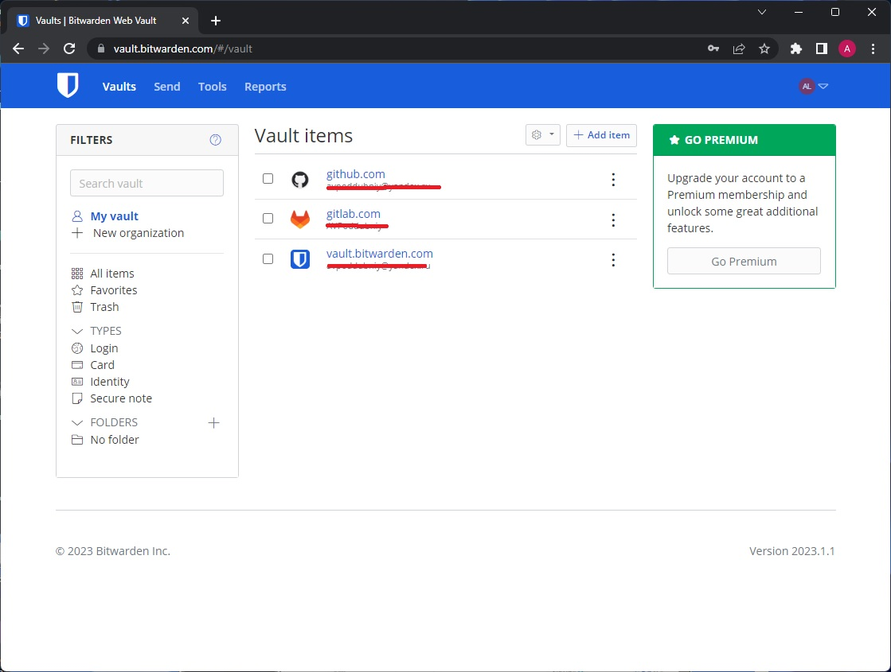
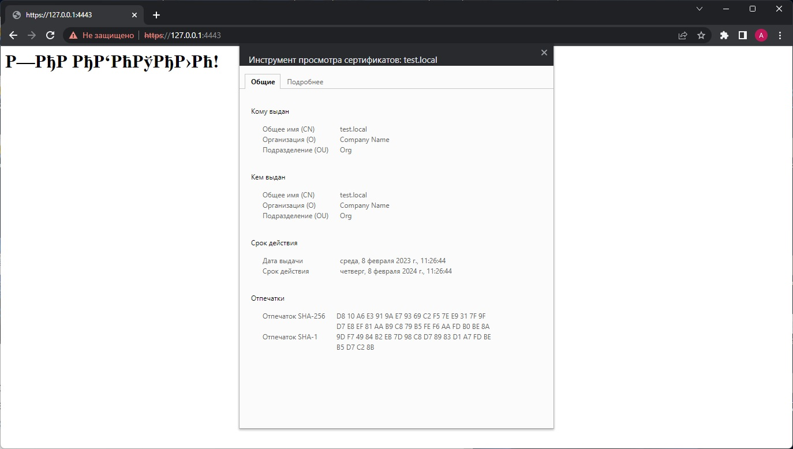
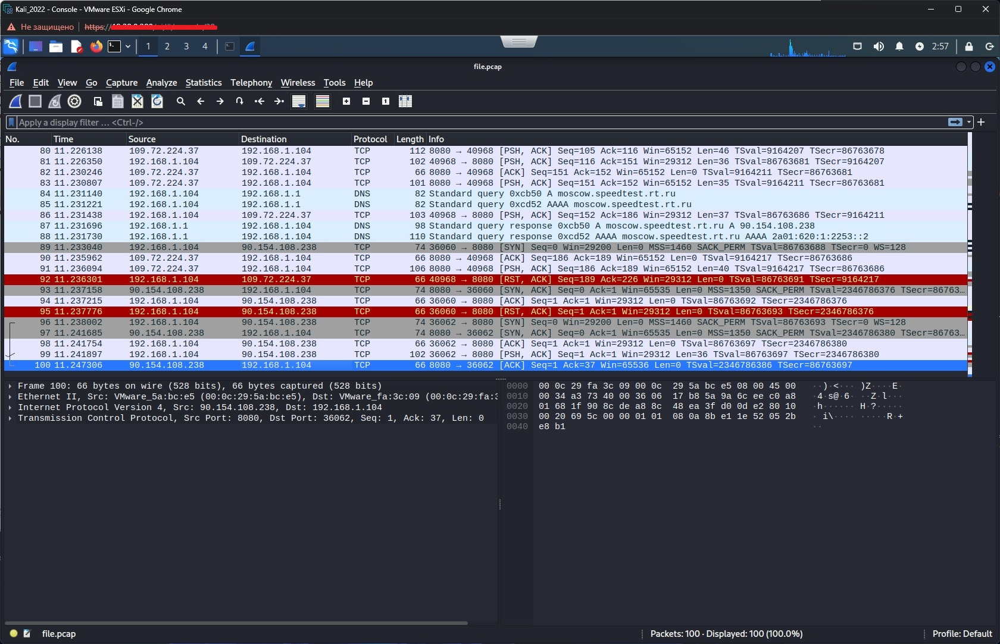

### Ответ на домашнее задание к занятию "3.9. Элементы безопасности информационных систем"

1. Выполнено
  
2. Выполнено
  
3. На Centos не получилось, сделал на виртуальной машине с Ubuntu
```commandline
vagrant@vagrant:~$ sudo apt install apache2
vagrant@vagrant:~$ sudo a2enmod ssl
vagrant@vagrant:~$ sudo systemctl restart apache2
vagrant@vagrant:~$ sudo openssl req -x509 -nodes -days 365 -newkey rsa:2048 \-keyout /etc/ssl/private/apache-selfsigned.key \-out /etc/ssl/certs/apache-selfsigned.crt \-subj "/C=RU/ST=Moscow/L=Moscow/O=Company Name/OU=Org/CN=test.local"
Generating a RSA private key
....................................................+++++
.....................+++++
writing new private key to '/etc/ssl/private/apache-selfsigned.key'
vagrant@vagrant:~$ sudo vim /etc/apache2/sites-available/your_domain_or_ip.conf
vagrant@vagrant:~$ sudo mv /etc/apache2/sites-available/your_domain_or_ip.conf /etc/apache2/sites-available/test.local.conf
vagrant@vagrant:~$ sudo mkdir /var/www/test.local
vagrant@vagrant:~$ sudo vim /var/www/test.local/index.html
vagrant@vagrant:~$ sudo a2ensite test.local.conf
vagrant@vagrant:~$ sudo apache2ctl configtest
vagrant@vagrant:~$ sudo systemctl reload apache2

vagrant@vagrant:~$ cat /var/www/test.local/index.html
<h1>ЗАРАБОТАЛО!</h1>
```
После проброса портов в виртуальную машину получаем следующее: ну не любит linux кириллицу. 
   

4. Выполнено:
```commandline
vagrant@vagrant:~$ git clone https://github.com/drwetter/testssl.sh.git
Cloning into 'testssl.sh'...
remote: Enumerating objects: 104, done.
remote: Counting objects: 100% (104/104), done.
remote: Compressing objects: 100% (100/100), done.
remote: Total 104 (delta 14), reused 31 (delta 4), pack-reused 0
Receiving objects: 100% (104/104), 8.70 MiB | 6.32 MiB/s, done.
Resolving deltas: 100% (14/14), done.
vagrant@vagrant:~$ cd testssl.sh
vagrant@vagrant:~/testssl.sh$ ./testssl.sh -U --sneaky https://www.mail.ru/

###########################################################
    testssl.sh       3.2rc2 from https://testssl.sh/dev/
    (8260ca1 2023-02-07 12:23:04)

      This program is free software. Distribution and
             modification under GPLv2 permitted.
      USAGE w/o ANY WARRANTY. USE IT AT YOUR OWN RISK!

       Please file bugs @ https://testssl.sh/bugs/

###########################################################

 Using "OpenSSL 1.0.2-bad (1.0.2k-dev)" [~183 ciphers]
 on vagrant:./bin/openssl.Linux.x86_64
 (built: "Sep  1 14:03:44 2022", platform: "linux-x86_64")

Testing all IPv4 addresses (port 443): 94.100.180.70 217.69.139.70
----------------------------------------------------------------------------------------------------
 Start 2023-02-08 10:10:02        -->> 94.100.180.70:443 (www.mail.ru) <<--

 Further IP addresses:   217.69.139.70
 rDNS (94.100.180.70):   www.mail.ru.
 Service detected:       HTTP

 Testing vulnerabilities

 Heartbleed (CVE-2014-0160)                not vulnerable (OK), timed out
 CCS (CVE-2014-0224)                       not vulnerable (OK)
 Ticketbleed (CVE-2016-9244), experiment.  test failed, non reproducible results! Please run again w "--debug=2"  (# of faked TLS SIDs detected: 0)
 ROBOT                                     not vulnerable (OK)
 Secure Renegotiation (RFC 5746)           supported (OK)
...
 Done 2023-02-08 10:10:45 [  46s] -->> 94.100.180.70:443 (www.mail.ru) <<--


```
5. Генерим ключ на сервере.
````commandline
[lex@chrm-centos7 ~]$ ssh-keygen -b 4096
Generating public/private rsa key pair.
Enter file in which to save the key (/home/lex/.ssh/id_rsa):
Enter passphrase (empty for no passphrase):
Enter same passphrase again:
Your identification has been saved in /home/lex/.ssh/id_rsa.
Your public key has been saved in /home/lex/.ssh/id_rsa.pub.
The key fingerprint is:
SHA256:arqPC0o7K7xSKayMZc9t05vutcmq05/wKpYfBYN+88Q lex@chrm-centos7
The key's randomart image is:
+---[RSA 4096]----+
|                 |
|       .         |
|      . o        |
|     .   +       |
|.  .  . S E      |
|..=    o =       |
|=*.o .o+o o      |
|*=..o+O oB +     |
|+++ =*oOO=B      |
+----[SHA256]-----+
        
````
Далее передаем публичный ключ на другой сервер:
```commandline
[lex@chrm-centos7 ~]$ ssh-copy-id lex@192.168.1.108
/usr/bin/ssh-copy-id: INFO: Source of key(s) to be installed: "/home/lex/.ssh/id_rsa.pub"
/usr/bin/ssh-copy-id: INFO: attempting to log in with the new key(s), to filter out any that are already installed
/usr/bin/ssh-copy-id: INFO: 1 key(s) remain to be installed -- if you are prompted now it is to install the new keys
lex@192.168.1.108's password:

Number of key(s) added: 1

Now try logging into the machine, with:   "ssh 'lex@192.168.1.108'"
and check to make sure that only the key(s) you wanted were added.

[lex@chrm-centos7 ~]$ ssh lex@192.168.1.108
Activate the web console with: systemctl enable --now cockpit.socket

Last login: Wed Feb  8 15:32:24 2023 from 10.38.0.47
[lex@chrm-alma9 ~]$

```
6. 
```commandline
[lex@chrm-centos7 ~]$ mv ~/.ssh/id_rsa ~/.ssh/id_rsa_alma
[lex@chrm-centos7 ~]$ vi ~/.ssh/config
[lex@chrm-centos7 ~]$ cat ~/.ssh/config
Host alma
  HostName 192.168.1.108
  IdentityFile ~/.ssh/id_rsa_alma
  User lex
[lex@chrm-centos7 ~]$ ssh alma
Bad owner or permissions on /home/lex/.ssh/config  # НУ ПРОСТО СЛОВ НЕТ, ПОСЛЕ ТАКОГО.
[lex@chrm-centos7 ~]$ chmod 600 ~/.ssh/config
[lex@chrm-centos7 ~]$ chown $USER ~/.ssh/config
[lex@chrm-centos7 ~]$ ssh alma
Activate the web console with: systemctl enable --now cockpit.socket

Last login: Wed Feb  8 15:54:09 2023 from 192.168.1.104
[lex@chrm-alma9 ~]$

```
7. Запускаем tcpdump на сервере.
```commandline
[lex@chrm-centos7 ~]$ sudo tcpdump -c 100 -i ens192  -w file.pcap
tcpdump: listening on ens192, link-type EN10MB (Ethernet), capture size 262144 bytes
100 packets captured
531 packets received by filter
0 packets dropped by kernel

```
Дальше, ради практического интереса, устанавливаем kali-linux со всем софтом и загружаем файл с сервера:
```commandline
$spc lex@192.168.1.104:/home/lex/file.pcap /tmp/file.pcap
```
Результат: 

