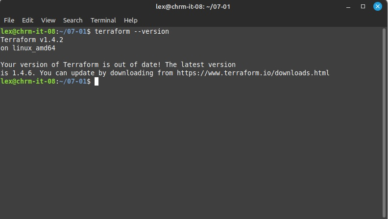
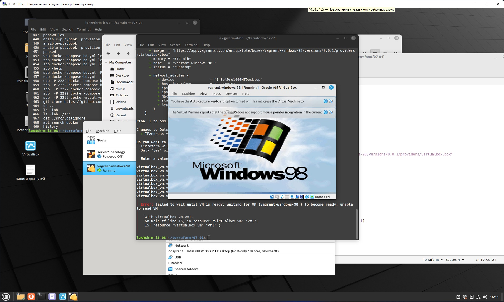

 ### Ответ на домашнее задание к 06-06 «Введение в Terraform»

Чек лист:
* Скачайте и установите актуальную версию terraform >=1.4.0 . Приложите скриншот вывода команды terraform --version.  

* Скачайте на свой ПК данный git репозиторий. Исходный код для выполнения задания расположен в директории 01/src.  
`git clone https://github.com/netology-code/ter-homeworks.git`
* Убедитесь, что в вашей ОС установлен docker.
```commandline
lex@chrm-it-08:~/terraform/07-01/src$ docker --version
Docker version 20.10.21, build 20.10.21-0ubuntu1~22.04.3
```

1. Решение:   
* Перейдите в каталог src. Скачайте все необходимые зависимости, использованные в проекте.  
```commandline
lex@chrm-it-08:~/terraform/07-01$ ls -lah
total 12K
drwxrwxr-x 3 lex lex 4,0K May 16 13:49 .
drwxrwxr-x 4 lex lex 4,0K May 16 13:49 ..
drwxrwxr-x 2 lex lex 4,0K May 16 13:48 src
lex@chrm-it-08:~/terraform/07-01$ ls -lah ./src
total 20K
drwxrwxr-x 2 lex lex 4,0K May 16 13:48 .
drwxrwxr-x 3 lex lex 4,0K May 16 13:49 ..
-rw-rw-r-- 1 lex lex  155 May 16 13:48 .gitignore
-rw-rw-r-- 1 lex lex  756 May 16 13:48 main.tf
-rw-rw-r-- 1 lex lex  206 May 16 13:48 .terraformrc

```
* Изучите файл .gitignore. В каком terraform файле согласно этому .gitignore допустимо сохранить личную, секретную информацию?  
```
# own secret vars store.  
personal.auto.tfvars
``` 
* Выполните код проекта. Найдите в State-файле секретное содержимое созданного ресурса random_password, пришлите в качестве ответа конкретный ключ и его значение.  
```commandline
 "result": "Thu250HJYetNC21b"
```
Раскомментируйте блок кода, примерно расположенный на строчках 29-42 файла main.tf. Выполните команду terraform validate. Объясните в чем заключаются намеренно допущенные ошибки? Исправьте их.  
Ну, terraform plan то же подойдет для этого.   
** Первая ошибка это:  `All resource blocks must have 2 labels (type, name).` Тут `esource "docker_image"`  
** Вторая ошибка: (имя не может начинаться с цифры). В этой строчке: `resource "docker_container" "1nginx":`  
** Третья ошибка: ошибка в переменной `${random_password.random_string_fake.resuld}`, так лучше `${random_password.random_string.result}`    

* Выполните код. В качестве ответа приложите вывод команды docker ps  
```commandline
lex@chrm-it-08:~/terraform/07-01/src$ sudo docker ps
CONTAINER ID   IMAGE          COMMAND                  CREATED              STATUS          PORTS                  NAMES
f77cb942e1c1   448a08f1d2f9   "/docker-entrypoint.…"   About a minute ago   Up 58 seconds   0.0.0.0:8000->80/tcp   example_Thu250HJYetNC21b

```
* Замените имя docker-контейнера в блоке кода на hello_world, выполните команду terraform apply -auto-approve. Объясните своими словами, в чем может быть опасность применения ключа -auto-approve ? В качестве ответа дополнительно приложите вывод команды docker ps
```commandline
lex@chrm-it-08:~/terraform/07-01/src$ sudo docker ps
CONTAINER ID   IMAGE          COMMAND                  CREATED         STATUS         PORTS                  NAMES
336dfaed311e   448a08f1d2f9   "/docker-entrypoint.…"   7 minutes ago   Up 7 minutes   0.0.0.0:8000->80/tcp   hello_world

```  
** Команда `terraform apply -auto-approve`, применяет все изменения в конфигурации сразу без подтверждения, даже не дает набрать `yes`.
* Уничтожьте созданные ресурсы с помощью terraform. Убедитесь, что все ресурсы удалены. Приложите содержимое файла terraform.tfstate.
```commandline
lex@chrm-it-08:~/terraform/07-01/src$ sudo terraform destroy
docker_image.nginx: Refreshing state... [id=sha256:448a08f1d2f94e8db6db9286fd77a3a4f3712786583720a12f1648abb8cace25nginx:latest]
...
Destroy complete! Resources: 3 destroyed.
lex@chrm-it-08:~/terraform/07-01/src$ cat terraform.tfstate
{
  "version": 4,
  "terraform_version": "1.4.2",
  "serial": 25,
  "lineage": "0286f14b-b7ff-5069-34ff-2623cc6cf02f",
  "outputs": {},
  "resources": [],
  "check_results": null
}

```
* Объясните, почему при этом не был удален docker образ nginx:latest ? Ответ подкрепите выдержкой из документации провайдера.  
** образ не был удален из-за этой части кода в файле main.tf `keep_locally = true`

2. ЗАРАБОТАЛО!
```commandline
ex@chrm-it-08:~/terraform/07-01$ terraform plan

Terraform used the selected providers to generate the following execution plan.
Resource actions are indicated with the following symbols:
  + create

Terraform will perform the following actions:

  # virtualbox_vm.vm1 will be created
  + resource "virtualbox_vm" "vm1" {
      + cpus   = 1
      + id     = (known after apply)
      + image  = "https://app.vagrantup.com/amitpatole/boxes/vagrant-windows-98/versions/0.0.1/providers/virtualbox.box"
      + memory = "512 mib"
      + name   = "vagrant-windows-98 "
      + status = "running"

      + network_adapter {
          + device                 = "IntelPro1000MTDesktop"
          + host_interface         = "vboxnet0"
          + ipv4_address           = (known after apply)
          + ipv4_address_available = (known after apply)
          + mac_address            = (known after apply)
          + status                 = (known after apply)
          + type                   = "hostonly"
        }
    }

Plan: 1 to add, 0 to change, 0 to destroy.

Changes to Outputs:
  + IPAddress = (known after apply)

───────────────────────────────────────────────────────────────────────────────

Note: You didn't use the -out option to save this plan, so Terraform can't
guarantee to take exactly these actions if you run "terraform apply" now.

```
После команды `terraform apply`, выяснилось что четвертый слой виртуализации для Windows 98 похоже не подходит.

