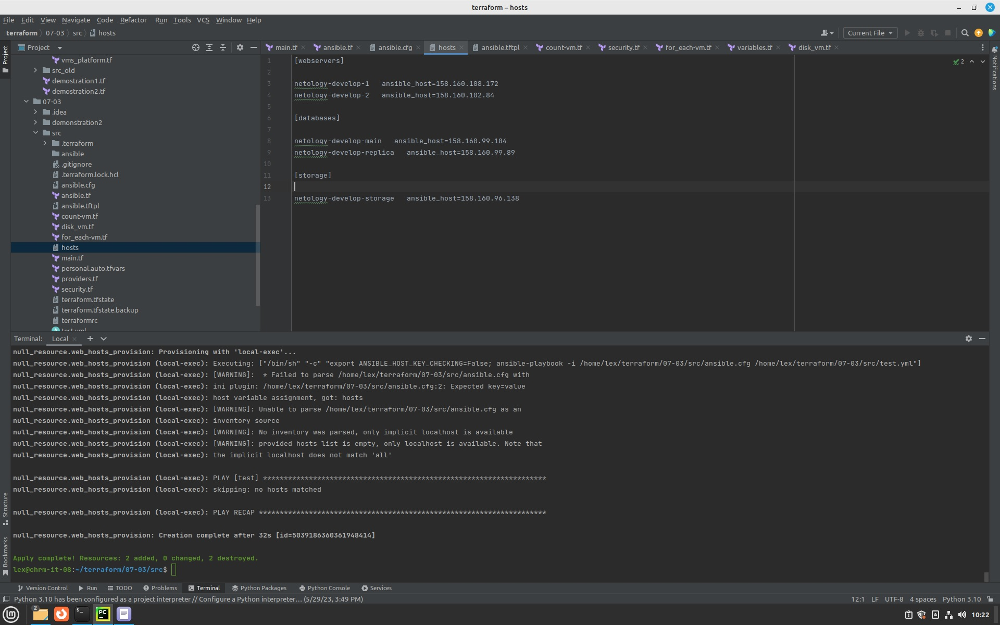
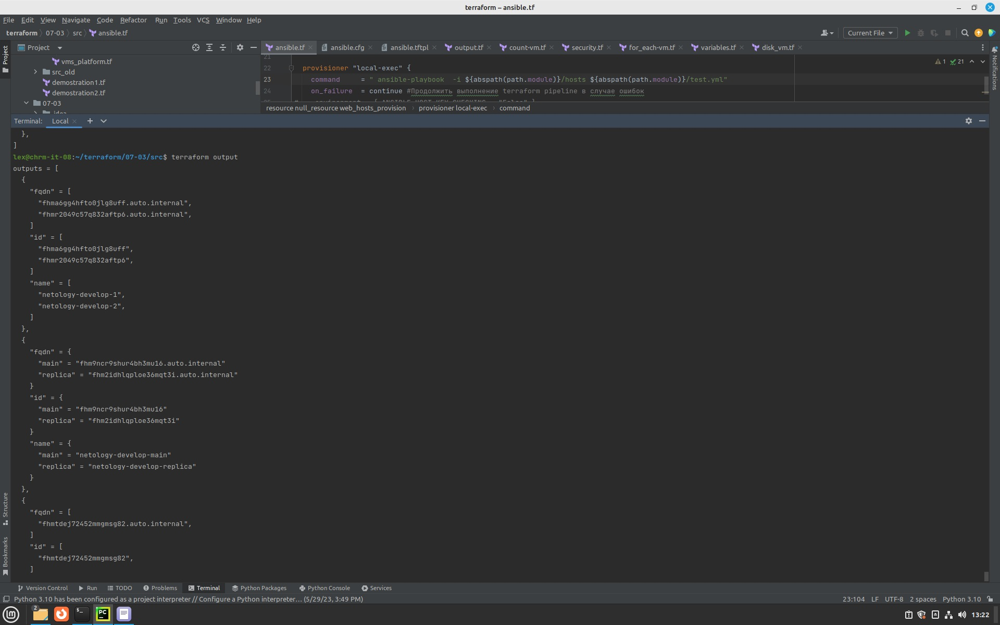

### Ответ на домашнее задание к 07-03 «Управляющие конструкции в коде Terraform»

***Ответ на задание № 1*** 

1. Изучите проект.  
`Выполнено`
2. Заполните файл personal.auto.tfvars  
`Взял с предыдущего занятия`
3. Инициализируйте проект, выполните код (он выполнится даже если доступа к preview нет).
`terraform init, terraform apply`

```commandline
lex@chrm-it-08:~/terraform/07-03$ terraform apply

No changes. Your infrastructure matches the configuration.

Terraform has compared your real infrastructure against your configuration and found no differences, so no changes are needed.

Apply complete! Resources: 0 added, 0 changed, 0 destroyed.

```
Заявка на доступ отправлена.


***Ответ на задание № 2***

1. Создайте файл count-vm.tf. Опишите в нем создание двух одинаковых виртуальных машин с минимальными параметрами, используя мета-аргумент count loop.
```commandline
resource "yandex_compute_instance" "web" {
  count = 2
  platform_id = var.standart
  name = "netology-develop-${count.index + 1}"
  boot_disk {
  .....
```
2. Создайте файл for_each-vm.tf. Опишите в нем создание 2 разных по cpu/ram/disk виртуальных машин, используя мета-аргумент for_each loop. Используйте переменную типа list(object({ vm_name=string, cpu=number, ram=number, disk=number })). При желании внесите в переменную все возможные параметры.  

`Переменная`
```commandline
variable "resources" {
  default = [{ vm_name="main", cpu="2", ram="1", disk="1", core_frac = "5"},
  { vm_name="replica", cpu="2", ram="1", disk="2", core_frac = "20"}]
}
```
`Прикручивание этой переменной`
```commandline
resource "yandex_compute_instance" "no_name" {
  depends_on = [yandex_compute_instance.web]
  for_each = {
    for key, param in var.resources : param.vm_name => param
  }
  name = each.value.vm_name
  .....
  resources {
    cores = each.value.cpu
    memory = each.value.ram
    core_fraction = each.value.core_frac
  }
```
3. ВМ из пункта 2.2 должны создаваться после создания ВМ из пункта 2.1.  
`Докинем в конфиг   depends_on = [yandex_compute_instance.web]`
4. Используйте функцию file в local переменной для считывания ключа ~/.ssh/id_rsa.pub и его последующего использования в блоке metadata, взятому из ДЗ №2.  
`Прикрутим еще одну переменную`
```commandline
locals {
  ssh_key = file("~/.ssh/id_ed25519.pub")
}
Ну и в конфиге пропишем вот так:
 metadata = {
    ssh = "ubuntu:${local.ssh_key}"
  }
```
5. Инициализируйте проект, выполните код.

<details>
<summary>terraform apply</summary>

```commandline
lex@chrm-it-08:~/terraform/07-03/src$ terraform apply
data.yandex_compute_image.image: Reading...
data.yandex_compute_image.image: Read complete after 0s [id=fd8lape4adm5melne14m]

Terraform used the selected providers to generate the following execution plan. Resource actions are indicated with the following symbols:
  + create

Terraform will perform the following actions:

  # yandex_compute_instance.no_name["main"] will be created
  + resource "yandex_compute_instance" "no_name" {
      + created_at                = (known after apply)
      + folder_id                 = (known after apply)
      + fqdn                      = (known after apply)
      + gpu_cluster_id            = (known after apply)
      + hostname                  = (known after apply)
      + id                        = (known after apply)
      + metadata                  = {
          + "ssh" = <<-EOT
                ubuntu:ssh-ed25519 AAAAC3NzaC1lZDI1NTE5AAAAILiUtF85NVCt/boCAYmIFlh49IRXeiv5TWlY7dY2fO8Z lex@chrm-it-08
            EOT
        }
      + name                      = "main"
      + network_acceleration_type = "standard"
      + platform_id               = "standard-v1"
      + service_account_id        = (known after apply)
      + status                    = (known after apply)
      + zone                      = (known after apply)

      + boot_disk {
          + auto_delete = true
          + device_name = (known after apply)
          + disk_id     = (known after apply)
          + mode        = (known after apply)

          + initialize_params {
              + block_size  = (known after apply)
              + description = (known after apply)
              + image_id    = "fd8lape4adm5melne14m"
              + name        = (known after apply)
              + size        = (known after apply)
              + snapshot_id = (known after apply)
              + type        = "network-hdd"
            }
        }

      + network_interface {
          + index              = (known after apply)
          + ip_address         = (known after apply)
          + ipv4               = true
          + ipv6               = (known after apply)
          + ipv6_address       = (known after apply)
          + mac_address        = (known after apply)
          + nat                = (known after apply)
          + nat_ip_address     = (known after apply)
          + nat_ip_version     = (known after apply)
          + security_group_ids = (known after apply)
          + subnet_id          = "develop"
        }

      + resources {
          + core_fraction = 5
          + cores         = 2
          + memory        = 1
        }
    }

  # yandex_compute_instance.no_name["replica"] will be created
  + resource "yandex_compute_instance" "no_name" {
      + created_at                = (known after apply)
      + folder_id                 = (known after apply)
      + fqdn                      = (known after apply)
      + gpu_cluster_id            = (known after apply)
      + hostname                  = (known after apply)
      + id                        = (known after apply)
      + metadata                  = {
          + "ssh" = <<-EOT
                ubuntu:ssh-ed25519 AAAAC3NzaC1lZDI1NTE5AAAAILiUtF85NVCt/boCAYmIFlh49IRXeiv5TWlY7dY2fO8Z lex@chrm-it-08
            EOT
        }
      + name                      = "replica"
      + network_acceleration_type = "standard"
      + platform_id               = "standard-v1"
      + service_account_id        = (known after apply)
      + status                    = (known after apply)
      + zone                      = (known after apply)

      + boot_disk {
          + auto_delete = true
          + device_name = (known after apply)
          + disk_id     = (known after apply)
          + mode        = (known after apply)

          + initialize_params {
              + block_size  = (known after apply)
              + description = (known after apply)
              + image_id    = "fd8lape4adm5melne14m"
              + name        = (known after apply)
              + size        = (known after apply)
              + snapshot_id = (known after apply)
              + type        = "network-hdd"
            }
        }

      + network_interface {
          + index              = (known after apply)
          + ip_address         = (known after apply)
          + ipv4               = true
          + ipv6               = (known after apply)
          + ipv6_address       = (known after apply)
          + mac_address        = (known after apply)
          + nat                = (known after apply)
          + nat_ip_address     = (known after apply)
          + nat_ip_version     = (known after apply)
          + security_group_ids = (known after apply)
          + subnet_id          = "develop"
        }

      + resources {
          + core_fraction = 20
          + cores         = 2
          + memory        = 1
        }
    }

  # yandex_compute_instance.web[0] will be created
  + resource "yandex_compute_instance" "web" {
      + created_at                = (known after apply)
      + folder_id                 = (known after apply)
      + fqdn                      = (known after apply)
      + gpu_cluster_id            = (known after apply)
      + hostname                  = (known after apply)
      + id                        = (known after apply)
      + metadata                  = {
          + "ssh" = <<-EOT
                ubuntu:ssh-ed25519 AAAAC3NzaC1lZDI1NTE5AAAAILiUtF85NVCt/boCAYmIFlh49IRXeiv5TWlY7dY2fO8Z lex@chrm-it-08
            EOT
        }
      + name                      = "netology-develop-1"
      + network_acceleration_type = "standard"
      + platform_id               = "standard-v1"
      + service_account_id        = (known after apply)
      + status                    = (known after apply)
      + zone                      = (known after apply)

      + boot_disk {
          + auto_delete = true
          + device_name = (known after apply)
          + disk_id     = (known after apply)
          + mode        = (known after apply)

          + initialize_params {
              + block_size  = (known after apply)
              + description = (known after apply)
              + image_id    = "fd8lape4adm5melne14m"
              + name        = (known after apply)
              + size        = (known after apply)
              + snapshot_id = (known after apply)
              + type        = "network-hdd"
            }
        }

      + network_interface {
          + index              = (known after apply)
          + ip_address         = (known after apply)
          + ipv4               = true
          + ipv6               = (known after apply)
          + ipv6_address       = (known after apply)
          + mac_address        = (known after apply)
          + nat                = (known after apply)
          + nat_ip_address     = (known after apply)
          + nat_ip_version     = (known after apply)
          + security_group_ids = (known after apply)
          + subnet_id          = "develop"
        }

      + resources {
          + core_fraction = 5
          + cores         = 2
          + memory        = 1
        }
    }

  # yandex_compute_instance.web[1] will be created
  + resource "yandex_compute_instance" "web" {
      + created_at                = (known after apply)
      + folder_id                 = (known after apply)
      + fqdn                      = (known after apply)
      + gpu_cluster_id            = (known after apply)
      + hostname                  = (known after apply)
      + id                        = (known after apply)
      + metadata                  = {
          + "ssh" = <<-EOT
                ubuntu:ssh-ed25519 AAAAC3NzaC1lZDI1NTE5AAAAILiUtF85NVCt/boCAYmIFlh49IRXeiv5TWlY7dY2fO8Z lex@chrm-it-08
            EOT
        }
      + name                      = "netology-develop-2"
      + network_acceleration_type = "standard"
      + platform_id               = "standard-v1"
      + service_account_id        = (known after apply)
      + status                    = (known after apply)
      + zone                      = (known after apply)

      + boot_disk {
          + auto_delete = true
          + device_name = (known after apply)
          + disk_id     = (known after apply)
          + mode        = (known after apply)

          + initialize_params {
              + block_size  = (known after apply)
              + description = (known after apply)
              + image_id    = "fd8lape4adm5melne14m"
              + name        = (known after apply)
              + size        = (known after apply)
              + snapshot_id = (known after apply)
              + type        = "network-hdd"
            }
        }

      + network_interface {
          + index              = (known after apply)
          + ip_address         = (known after apply)
          + ipv4               = true
          + ipv6               = (known after apply)
          + ipv6_address       = (known after apply)
          + mac_address        = (known after apply)
          + nat                = (known after apply)
          + nat_ip_address     = (known after apply)
          + nat_ip_version     = (known after apply)
          + security_group_ids = (known after apply)
          + subnet_id          = "develop"
        }

      + resources {
          + core_fraction = 5
          + cores         = 2
          + memory        = 1
        }
    }

  # yandex_vpc_network.develop will be created
  + resource "yandex_vpc_network" "develop" {
      + created_at                = (known after apply)
      + default_security_group_id = (known after apply)
      + folder_id                 = (known after apply)
      + id                        = (known after apply)
      + labels                    = (known after apply)
      + name                      = "develop"
      + subnet_ids                = (known after apply)
    }

  # yandex_vpc_security_group.example will be created
  + resource "yandex_vpc_security_group" "example" {
      + created_at = (known after apply)
      + folder_id  = "b1gg31vsahh4l6825v53"
      + id         = (known after apply)
      + labels     = (known after apply)
      + name       = "example_dynamic"
      + network_id = (known after apply)
      + status     = (known after apply)

      + egress {
          + description    = "разрешить весь исходящий трафик"
          + from_port      = 0
          + id             = (known after apply)
          + labels         = (known after apply)
          + port           = -1
          + protocol       = "TCP"
          + to_port        = 65365
          + v4_cidr_blocks = [
              + "0.0.0.0/0",
            ]
          + v6_cidr_blocks = []
        }

      + ingress {
          + description    = "разрешить входящий  http"
          + from_port      = -1
          + id             = (known after apply)
          + labels         = (known after apply)
          + port           = 80
          + protocol       = "TCP"
          + to_port        = -1
          + v4_cidr_blocks = [
              + "0.0.0.0/0",
            ]
          + v6_cidr_blocks = []
        }
      + ingress {
          + description    = "разрешить входящий https"
          + from_port      = -1
          + id             = (known after apply)
          + labels         = (known after apply)
          + port           = 443
          + protocol       = "TCP"
          + to_port        = -1
          + v4_cidr_blocks = [
              + "0.0.0.0/0",
            ]
          + v6_cidr_blocks = []
        }
      + ingress {
          + description    = "разрешить входящий ssh"
          + from_port      = -1
          + id             = (known after apply)
          + labels         = (known after apply)
          + port           = 22
          + protocol       = "TCP"
          + to_port        = -1
          + v4_cidr_blocks = [
              + "0.0.0.0/0",
            ]
          + v6_cidr_blocks = []
        }
    }

  # yandex_vpc_subnet.develop will be created
  + resource "yandex_vpc_subnet" "develop" {
      + created_at     = (known after apply)
      + folder_id      = (known after apply)
      + id             = (known after apply)
      + labels         = (known after apply)
      + name           = "develop"
      + network_id     = (known after apply)
      + v4_cidr_blocks = [
          + "10.0.1.0/24",
        ]
      + v6_cidr_blocks = (known after apply)
      + zone           = "ru-central1-a"
    }

Plan: 7 to add, 0 to change, 0 to destroy.

Do you want to perform these actions?
  Terraform will perform the actions described above.
  Only 'yes' will be accepted to approve.

  Enter a value: 

```
</details>


***Ответ на задание № 3***   
* Создайте 3 одинаковых виртуальных диска, размером 1 Гб с помощью ресурса yandex_compute_disk и мета-аргумента count в файле disk_vm.tf .  
Как то так:
```commandline
resource "yandex_compute_disk" "second_hdd" {
  name       = "disk-${count.index}"
  type       = "network-hdd"
  zone       = var.default_zone
  size       = 1
  block_size = 4096
  count = 3
}
```
* Создайте в том же файле одну ВМ c именем "storage". Используйте блок dynamic secondary_disk{..} и мета-аргумент for_each для подключения созданных вами дополнительных дисков.  
Собираем ресурс:
```commandline
resource "yandex_compute_instance" "storage" {
.....
 dynamic secondary_disk {
      for_each    = yandex_compute_disk.second_hdd.*.id
      content {
        disk_id   = secondary_disk.value
      }
  }
  ......
```
Скриншотs:
  


***Ответ на задание № 4***

* В файле ansible.tf создайте inventory-файл для ansible. Используйте функцию tepmplatefile и файл-шаблон для создания ansible inventory-файла из лекции. Готовый код возьмите из демонстрации к лекции demonstration2. Передайте в него в качестве переменных группы виртуальных машин из задания 2.1, 2.2 и 3.2.(т.е. 5 ВМ)  
```commandline
resource "local_file" "hosts_conf" {
  content = templatefile("${path.module}/ansible.tftpl",
    { web = yandex_compute_instance.web ,
      databases = yandex_compute_instance.databases,
      storage = yandex_compute_instance.storage  })

  filename = "${abspath(path.module)}/hosts"

}
```
* Инвентарь должен содержать 3 группы [webservers], [databases], [storage] и быть динамическим, т.е. обработать как группу из 2-х ВМ так и 999 ВМ.  
```commandline
[webservers]

%{~ for i in web ~}

${i["name"]}   ansible_host=${i["network_interface"][0]["nat_ip_address"]}
%{~ endfor ~}


[databases]

%{~ for k in databases ~}

${k["name"]}   ansible_host=${k["network_interface"][0]["nat_ip_address"]}
%{~ endfor ~}


[storage]

%{~ for s in storage ~}

${s["name"]}   ansible_host=${s["network_interface"][0]["nat_ip_address"]}
%{~ endfor ~}
```
* Выполните код. Приложите скриншот получившегося файла.  


***Ответ на задание № 5***

* Напишите output, который отобразит все 5 созданных ВМ в виде списка словарей:  
`terrafrom output не отработает пока не применен terraform apply. а вот из terraform plan можно что то достать.`  
Код будет в файле output.tf  



***Ответ на задание № 6***

* Используя null_resource и local-exec примените ansible-playbook к ВМ из ansible inventory файла. Готовый код возьмите из демонстрации к лекции demonstration2.  
`Смастерил вот такую конструкцию, но ругается на отсутствие публичного ключа. А вот как его прикрутить это вопрос другой:`

```commandline
resource "null_resource" "web_hosts_provision" {
  #Ждем создания инстанса
  depends_on = [yandex_compute_instance.web, yandex_compute_instance.storage, yandex_compute_instance.databases]

  provisioner "local-exec" {
    command = "cat ~/.ssh/id_ed25519 | ssh-add -"
  }
 provisioner "local-exec" {
    command = "sleep 30"
  }

  provisioner "local-exec" {
    command     = " ansible-playbook  ${abspath(path.module)}/test.yml"
    on_failure  = continue #Продолжить выполнение terraform pipeline в случае ошибок
#    environment = { ANSIBLE_HOST_KEY_CHECKING = "False" }

    #срабатывание триггера при изменении переменных
  }
  triggers = {
    always_run        = "${timestamp()}" #всегда т.к. дата и время постоянно изменяются
    playbook_src_hash = file("${abspath(path.module)}/test.yml") # при изменении содержимого playbook файла
    ssh_public_key    = local.ssh_key # при изменении переменной
  }
```
* Дополните файл шаблон hosts.tftpl. Формат готового файла: netology-develop-platform-web-0   ansible_host="<внешний IP-address или внутренний IP-address если у ВМ отсутвует внешний адрес>"  
`На скриншоте в 4 задании так и есть и ничего дополнять не нужно. Собирается и удаляется автоматически`