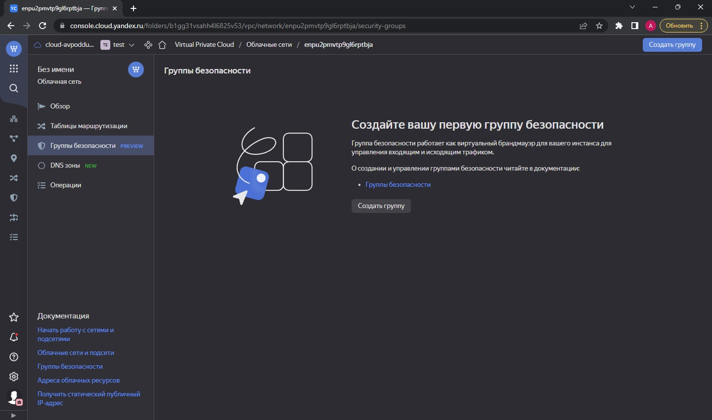

### Ответ на домашнее задание к 07-03 «Управляющие конструкции в коде Terraform»

***Ответ на задание № 1*** 

1. Изучите проект.
`Выполнено`
2. Заполните файл personal.auto.tfvars
`Взял с предыдущего занятия`
3. Инициализируйте проект, выполните код (он выполнится даже если доступа к preview нет).
`terraform init, terraform apply`

```commandline
lex@chrm-it-08:~/terraform/07-03$ terraform apply

No changes. Your infrastructure matches the configuration.

Terraform has compared your real infrastructure against your configuration and found no differences, so no changes are needed.

Apply complete! Resources: 0 added, 0 changed, 0 destroyed.

```
Заявка на доступ отправлена.


***Ответ на задание № 2***

1. Создайте файл count-vm.tf. Опишите в нем создание двух одинаковых виртуальных машин с минимальными параметрами, используя мета-аргумент count loop.

2. Создайте файл for_each-vm.tf. Опишите в нем создание 2 разных по cpu/ram/disk виртуальных машин, используя мета-аргумент for_each loop. Используйте переменную типа list(object({ vm_name=string, cpu=number, ram=number, disk=number })). При желании внесите в переменную все возможные параметры.

3. ВМ из пункта 2.2 должны создаваться после создания ВМ из пункта 2.1.

4. Используйте функцию file в local переменной для считывания ключа ~/.ssh/id_rsa.pub и его последующего использования в блоке metadata, взятому из ДЗ №2.

5. Инициализируйте проект, выполните код.