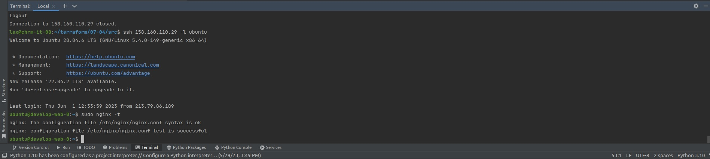

### Ответ на домашнее задание к 07-03 «Продвинутые методы работы с Terraform»

***Ответ на задание № 1*** 

* Возьмите из демонстрации к лекции готовый код для создания ВМ с помощью remote модуля.  
`Скопировано`
* Создайте 1 ВМ, используя данный модуль. В файле cloud-init.yml необходимо использовать переменную для ssh ключа вместо хардкода. Передайте ssh-ключ в функцию template_file в блоке vars ={} . Воспользуйтесь примером. Обратите внимание что ssh-authorized-keys принимает в себя список, а не строку!  
`В файле  cloud-init.yml исправлено на это  - ${ssh_public_key}`
* Добавьте в файл cloud-init.yml установку nginx.  
`Дописано в конце файла "nginx"`
* Предоставьте скриншот подключения к консоли и вывод команды sudo nginx -t.  

***Ответ на задание № 2*** 