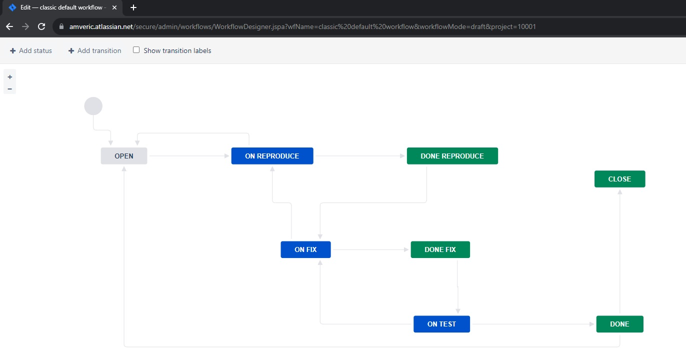
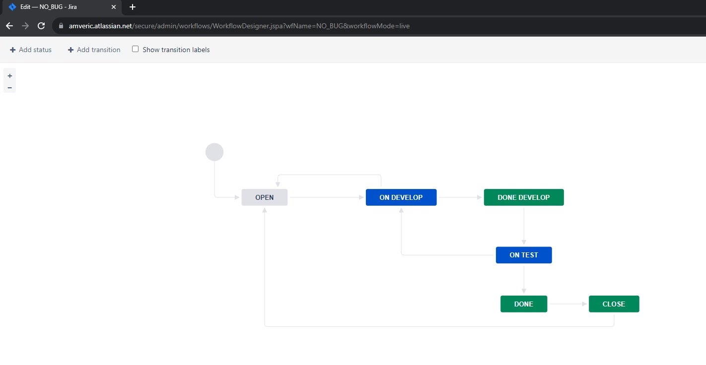
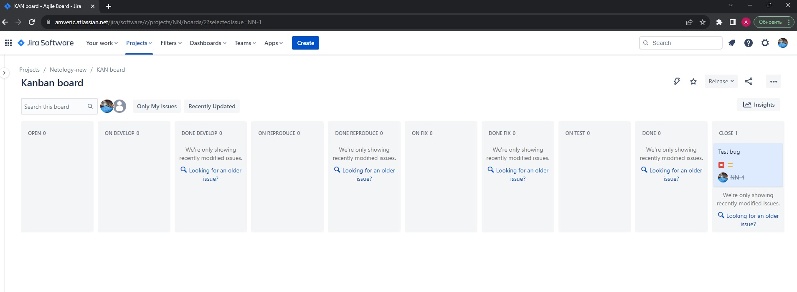
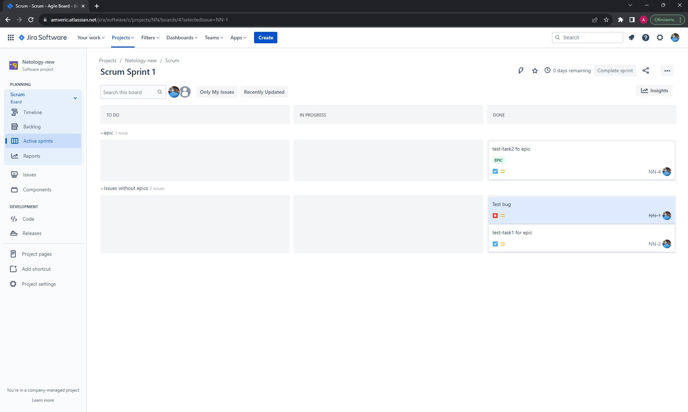
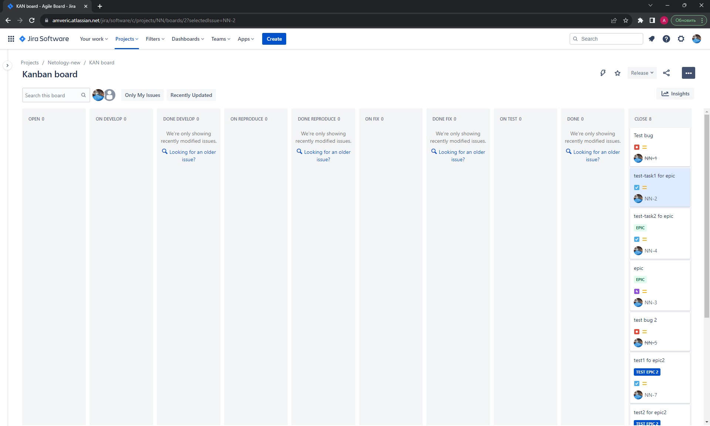

## Ответ на домашнее задание к 09-01 «Жизненный цикл ПО»  

### Основная часть

----
Необходимо создать собственные workflow для двух типов задач: bug и остальные типы задач. Задачи типа bug должны проходить жизненный цикл:

### [Ссылка на xml](files/bug.xml)

Остальные задачи должны проходить по упрощённому workflow:

### [Ссылка на xml](files/NO_BUG.xml)

---

### Что сделано

Получилось не с первого раза:

