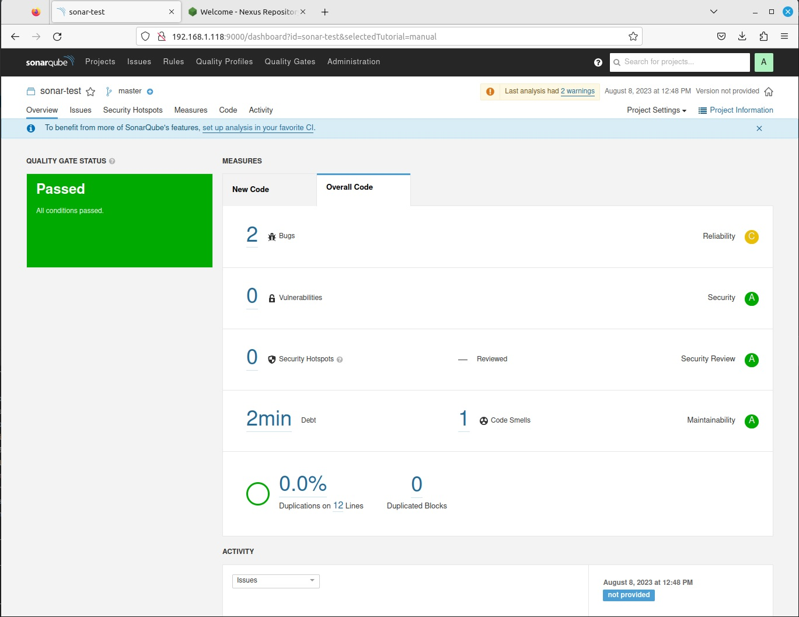
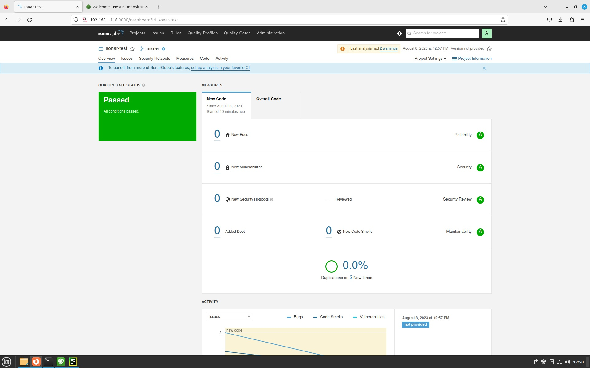

## Ответ на домашнее задание к 09-03 «Процессы CI/CD»  


### Знакомоство с SonarQube

### Основная часть
Пункты 1-3 сделаны. 

4. Проверьте sonar-scanner --version.
```commandline
lex@chrm-it-08:~/ci-cd/09-03$ sonar-scanner --version
INFO: Scanner configuration file: /home/lex/sonar/sonar-scanner-5.0.1.3006-linux/conf/sonar-scanner.properties
INFO: Project root configuration file: NONE
INFO: SonarScanner 5.0.1.3006
INFO: Java 17.0.7 Eclipse Adoptium (64-bit)
INFO: Linux 6.2.10-060210-generic amd64

```
5. Запустите анализатор против кода из директории example с дополнительным ключом -Dsonar.coverage.exclusions=fail.py.

<details>
<summary>Вывод консоли</summary>

```commandline
lex@chrm-it-08:~/ci-cd/09-03$ sonar-scanner \
  -Dsonar.projectKey=sonar-test \
  -Dsonar.sources=. \
  -Dsonar.host.url=http://192.168.1.118:9000 \
  -Dsonar.login=592ee5f750debcee2da8b53d0f9980f12b65d4f2 \
> -Dsonar.coverage.exclusions=fail.py
INFO: Scanner configuration file: /home/lex/sonar/sonar-scanner-5.0.1.3006-linux/conf/sonar-scanner.properties
INFO: Project root configuration file: NONE
INFO: SonarScanner 5.0.1.3006
INFO: Java 17.0.7 Eclipse Adoptium (64-bit)
INFO: Linux 6.2.10-060210-generic amd64
INFO: User cache: /home/lex/.sonar/cache
INFO: Analyzing on SonarQube server 9.1.0
INFO: Default locale: "en_US", source code encoding: "UTF-8" (analysis is platform dependent)
INFO: Load global settings
INFO: Load global settings (done) | time=164ms
INFO: Server id: 9CFC3560-AYnURwaqL0JaM6NpLsT6
INFO: User cache: /home/lex/.sonar/cache
INFO: Load/download plugins
INFO: Load plugins index
INFO: Load plugins index (done) | time=137ms
INFO: Load/download plugins (done) | time=3910ms
INFO: Process project properties
INFO: Process project properties (done) | time=13ms
INFO: Execute project builders
INFO: Execute project builders (done) | time=3ms
INFO: Project key: sonar-test
INFO: Base dir: /home/lex/ci-cd/09-03
INFO: Working dir: /home/lex/ci-cd/09-03/.scannerwork
INFO: Load project settings for component key: 'sonar-test'
INFO: Load project settings for component key: 'sonar-test' (done) | time=38ms
INFO: Load quality profiles
INFO: Load quality profiles (done) | time=165ms
INFO: Load active rules
INFO: Load active rules (done) | time=3295ms
WARN: SCM provider autodetection failed. Please use "sonar.scm.provider" to define SCM of your project, or disable the SCM Sensor in the project settings.
INFO: Indexing files...
INFO: Project configuration:
INFO:   Excluded sources for coverage: fail.py
INFO: 16 files indexed
INFO: Quality profile for py: Sonar way
INFO: ------------- Run sensors on module sonar-test
INFO: Load metrics repository
INFO: Load metrics repository (done) | time=54ms
INFO: Sensor Python Sensor [python]
WARN: Your code is analyzed as compatible with python 2 and 3 by default. This will prevent the detection of issues specific to python 2 or python 3. You can get a more precise analysis by setting a python version in your configuration via the parameter "sonar.python.version"
INFO: Starting global symbols computation
INFO: 1 source file to be analyzed
INFO: Load project repositories
INFO: Load project repositories (done) | time=37ms
INFO: 1/1 source file has been analyzed
INFO: Starting rules execution
INFO: 1 source file to be analyzed
INFO: 1/1 source file has been analyzed
INFO: Sensor Python Sensor [python] (done) | time=1207ms
INFO: Sensor Cobertura Sensor for Python coverage [python]
INFO: Sensor Cobertura Sensor for Python coverage [python] (done) | time=12ms
INFO: Sensor PythonXUnitSensor [python]
INFO: Sensor PythonXUnitSensor [python] (done) | time=2ms
INFO: Sensor CSS Rules [cssfamily]
INFO: No CSS, PHP, HTML or VueJS files are found in the project. CSS analysis is skipped.
INFO: Sensor CSS Rules [cssfamily] (done) | time=2ms
INFO: Sensor JaCoCo XML Report Importer [jacoco]
INFO: 'sonar.coverage.jacoco.xmlReportPaths' is not defined. Using default locations: target/site/jacoco/jacoco.xml,target/site/jacoco-it/jacoco.xml,build/reports/jacoco/test/jacocoTestReport.xml
INFO: No report imported, no coverage information will be imported by JaCoCo XML Report Importer
INFO: Sensor JaCoCo XML Report Importer [jacoco] (done) | time=7ms
INFO: Sensor C# Project Type Information [csharp]
INFO: Sensor C# Project Type Information [csharp] (done) | time=1ms
INFO: Sensor C# Analysis Log [csharp]
INFO: Sensor C# Analysis Log [csharp] (done) | time=32ms
INFO: Sensor C# Properties [csharp]
INFO: Sensor C# Properties [csharp] (done) | time=0ms
INFO: Sensor JavaXmlSensor [java]
INFO: Sensor JavaXmlSensor [java] (done) | time=2ms
INFO: Sensor HTML [web]
INFO: Sensor HTML [web] (done) | time=6ms
INFO: Sensor VB.NET Project Type Information [vbnet]
INFO: Sensor VB.NET Project Type Information [vbnet] (done) | time=1ms
INFO: Sensor VB.NET Analysis Log [vbnet]
INFO: Sensor VB.NET Analysis Log [vbnet] (done) | time=16ms
INFO: Sensor VB.NET Properties [vbnet]
INFO: Sensor VB.NET Properties [vbnet] (done) | time=0ms
INFO: ------------- Run sensors on project
INFO: Sensor Zero Coverage Sensor
INFO: Sensor Zero Coverage Sensor (done) | time=4ms
INFO: SCM Publisher No SCM system was detected. You can use the 'sonar.scm.provider' property to explicitly specify it.
INFO: CPD Executor Calculating CPD for 1 file
INFO: CPD Executor CPD calculation finished (done) | time=42ms
INFO: Analysis report generated in 331ms, dir size=103.0 kB
INFO: Analysis report compressed in 131ms, zip size=14.2 kB
INFO: Analysis report uploaded in 62ms
INFO: ANALYSIS SUCCESSFUL, you can browse http://192.168.1.118:9000/dashboard?id=sonar-test
INFO: Note that you will be able to access the updated dashboard once the server has processed the submitted analysis report
INFO: More about the report processing at http://192.168.1.118:9000/api/ce/task?id=AYnUjCwbL0JaM6NpLxZB
INFO: Analysis total time: 8.977 s
INFO: ------------------------------------------------------------------------
INFO: EXECUTION SUCCESS
INFO: ------------------------------------------------------------------------
INFO: Total time: 15.701s
INFO: Final Memory: 8M/34M
INFO: ------------------------------------------------------------------------

```
</details>

6. Посмотрите результат в интерфейсе.


7-8 проделаны

9. Сделайте скриншот успешного прохождения анализа, приложите к решению ДЗ.



---
### Знакомство с Nexus

#### [Ссылка на xml-файл](files/maven-metadata.xml)

```commandline
<?xml version="1.0" encoding="UTF-8"?>
<metadata modelVersion="1.1.0">
  <groupId>netology</groupId>
  <artifactId>java</artifactId>
  <versioning>
    <latest>8_282</latest>
    <release>8_282</release>
    <versions>
      <version>8_102</version>
      <version>8_282</version>
    </versions>
    <lastUpdated>20230808101347</lastUpdated>
  </versioning>
</metadata>

```
---
### Знакомство с Maven

#### Подготовка 
Пункты 1-3, 5 сделаны

4. Проверьте mvn --version
```commandline
lex@chrm-it-08:~/ci-cd/09-03$ mvn --version
Apache Maven 3.9.4 (dfbb324ad4a7c8fb0bf182e6d91b0ae20e3d2dd9)
Maven home: /home/lex/mvn/apache-maven-3.9.4
Java version: 11.0.20, vendor: Ubuntu, runtime: /usr/lib/jvm/java-11-openjdk-amd64
Default locale: en_US, platform encoding: UTF-8
OS name: "linux", version: "6.2.10-060210-generic", arch: "amd64", family: "unix"

```
#### Основная часть

1. Файл приложен в пункте 4 данного блока.

2. Похоже, что-то не отключил в настройках maven. Но артифакт скачался.

<details>
<summary>Вывод консоли "mvn package" </summary>

```commandline
lex@chrm-it-08:~/ci-cd/09-03/mvn$ mvn package
[INFO] Scanning for projects...
[INFO] 
[INFO] --------------------< com.netology.app:simple-app >---------------------
[INFO] Building simple-app 1.0-SNAPSHOT
[INFO]   from pom.xml
[INFO] --------------------------------[ jar ]---------------------------------
[WARNING] The POM for netology:java:jar:distrib:8_282 is missing, no dependency information available
Downloading from my-repo: http://192.168.1.119:8081/repository/maven-public/netology/java/8_282/java-8_282-distrib.jar
Downloaded from my-repo: http://192.168.1.119:8081/repository/maven-public/netology/java/8_282/java-8_282-distrib.jar (0 B at 0 B/s)
[INFO] 
[INFO] --- resources:3.3.1:resources (default-resources) @ simple-app ---
Downloading from central: https://repo.maven.apache.org/maven2/org/codehaus/plexus/plexus-interpolation/1.26/plexus-interpolation-1.26.pom
Downloaded from central: https://repo.maven.apache.org/maven2/org/codehaus/plexus/plexus-interpolation/1.26/plexus-interpolation-1.26.pom (2.7 kB at 3.8 kB/s)
Downloading from central: https://repo.maven.apache.org/maven2/org/codehaus/plexus/plexus/5.1/plexus-5.1.pom
Downloaded from central: https://repo.maven.apache.org/maven2/org/codehaus/plexus/plexus/5.1/plexus-5.1.pom (23 kB at 210 kB/s)
Downloading from central: https://repo.maven.apache.org/maven2/org/codehaus/plexus/plexus-utils/3.5.1/plexus-utils-3.5.1.pom
Downloaded from central: https://repo.maven.apache.org/maven2/org/codehaus/plexus/plexus-utils/3.5.1/plexus-utils-3.5.1.pom (8.8 kB at 112 kB/s)
Downloading from central: https://repo.maven.apache.org/maven2/org/codehaus/plexus/plexus/10/plexus-10.pom
Downloaded from central: https://repo.maven.apache.org/maven2/org/codehaus/plexus/plexus/10/plexus-10.pom (25 kB at 314 kB/s)
Downloading from central: https://repo.maven.apache.org/maven2/org/apache/maven/shared/maven-filtering/3.3.1/maven-filtering-3.3.1.pom
Downloaded from central: https://repo.maven.apache.org/maven2/org/apache/maven/shared/maven-filtering/3.3.1/maven-filtering-3.3.1.pom (6.0 kB at 104 kB/s)
Downloading from central: https://repo.maven.apache.org/maven2/org/apache/maven/shared/maven-shared-components/39/maven-shared-components-39.pom
Downloaded from central: https://repo.maven.apache.org/maven2/org/apache/maven/shared/maven-shared-components/39/maven-shared-components-39.pom (3.2 kB at 50 kB/s)
Downloading from central: https://repo.maven.apache.org/maven2/javax/inject/javax.inject/1/javax.inject-1.pom
Downloaded from central: https://repo.maven.apache.org/maven2/javax/inject/javax.inject/1/javax.inject-1.pom (612 B at 9.7 kB/s)
Downloading from central: https://repo.maven.apache.org/maven2/org/slf4j/slf4j-api/1.7.36/slf4j-api-1.7.36.pom
Downloaded from central: https://repo.maven.apache.org/maven2/org/slf4j/slf4j-api/1.7.36/slf4j-api-1.7.36.pom (2.7 kB at 47 kB/s)
Downloading from central: https://repo.maven.apache.org/maven2/org/slf4j/slf4j-parent/1.7.36/slf4j-parent-1.7.36.pom
Downloaded from central: https://repo.maven.apache.org/maven2/org/slf4j/slf4j-parent/1.7.36/slf4j-parent-1.7.36.pom (14 kB at 217 kB/s)
Downloading from central: https://repo.maven.apache.org/maven2/org/sonatype/plexus/plexus-build-api/0.0.7/plexus-build-api-0.0.7.pom
Downloaded from central: https://repo.maven.apache.org/maven2/org/sonatype/plexus/plexus-build-api/0.0.7/plexus-build-api-0.0.7.pom (3.2 kB at 52 kB/s)
Downloading from central: https://repo.maven.apache.org/maven2/org/sonatype/spice/spice-parent/15/spice-parent-15.pom
Downloaded from central: https://repo.maven.apache.org/maven2/org/sonatype/spice/spice-parent/15/spice-parent-15.pom (8.4 kB at 131 kB/s)
Downloading from central: https://repo.maven.apache.org/maven2/org/sonatype/forge/forge-parent/5/forge-parent-5.pom
Downloaded from central: https://repo.maven.apache.org/maven2/org/sonatype/forge/forge-parent/5/forge-parent-5.pom (8.4 kB at 121 kB/s)
Downloading from central: https://repo.maven.apache.org/maven2/org/codehaus/plexus/plexus-utils/3.5.0/plexus-utils-3.5.0.pom
Downloaded from central: https://repo.maven.apache.org/maven2/org/codehaus/plexus/plexus-utils/3.5.0/plexus-utils-3.5.0.pom (8.0 kB at 113 kB/s)
Downloading from central: https://repo.maven.apache.org/maven2/commons-io/commons-io/2.11.0/commons-io-2.11.0.pom
Downloaded from central: https://repo.maven.apache.org/maven2/commons-io/commons-io/2.11.0/commons-io-2.11.0.pom (20 kB at 263 kB/s)
Downloading from central: https://repo.maven.apache.org/maven2/org/apache/commons/commons-parent/52/commons-parent-52.pom
Downloaded from central: https://repo.maven.apache.org/maven2/org/apache/commons/commons-parent/52/commons-parent-52.pom (79 kB at 539 kB/s)
Downloading from central: https://repo.maven.apache.org/maven2/org/apache/apache/23/apache-23.pom
Downloaded from central: https://repo.maven.apache.org/maven2/org/apache/apache/23/apache-23.pom (18 kB at 225 kB/s)
Downloading from central: https://repo.maven.apache.org/maven2/org/junit/junit-bom/5.7.2/junit-bom-5.7.2.pom
Downloaded from central: https://repo.maven.apache.org/maven2/org/junit/junit-bom/5.7.2/junit-bom-5.7.2.pom (5.1 kB at 81 kB/s)
Downloading from central: https://repo.maven.apache.org/maven2/org/apache/commons/commons-lang3/3.12.0/commons-lang3-3.12.0.pom
Downloaded from central: https://repo.maven.apache.org/maven2/org/apache/commons/commons-lang3/3.12.0/commons-lang3-3.12.0.pom (31 kB at 393 kB/s)
Downloading from central: https://repo.maven.apache.org/maven2/org/junit/junit-bom/5.7.1/junit-bom-5.7.1.pom
Downloaded from central: https://repo.maven.apache.org/maven2/org/junit/junit-bom/5.7.1/junit-bom-5.7.1.pom (5.1 kB at 94 kB/s)
Downloading from central: https://repo.maven.apache.org/maven2/org/codehaus/plexus/plexus-interpolation/1.26/plexus-interpolation-1.26.jar
Downloaded from central: https://repo.maven.apache.org/maven2/org/codehaus/plexus/plexus-interpolation/1.26/plexus-interpolation-1.26.jar (85 kB at 618 kB/s)
Downloading from central: https://repo.maven.apache.org/maven2/org/codehaus/plexus/plexus-utils/3.5.1/plexus-utils-3.5.1.jar
Downloading from central: https://repo.maven.apache.org/maven2/javax/inject/javax.inject/1/javax.inject-1.jar
Downloading from central: https://repo.maven.apache.org/maven2/org/apache/maven/shared/maven-filtering/3.3.1/maven-filtering-3.3.1.jar
Downloading from central: https://repo.maven.apache.org/maven2/org/sonatype/plexus/plexus-build-api/0.0.7/plexus-build-api-0.0.7.jar
Downloading from central: https://repo.maven.apache.org/maven2/org/slf4j/slf4j-api/1.7.36/slf4j-api-1.7.36.jar
Downloaded from central: https://repo.maven.apache.org/maven2/org/sonatype/plexus/plexus-build-api/0.0.7/plexus-build-api-0.0.7.jar (8.5 kB at 37 kB/s)
Downloading from central: https://repo.maven.apache.org/maven2/commons-io/commons-io/2.11.0/commons-io-2.11.0.jar
Downloaded from central: https://repo.maven.apache.org/maven2/javax/inject/javax.inject/1/javax.inject-1.jar (2.5 kB at 10 kB/s)
Downloading from central: https://repo.maven.apache.org/maven2/org/apache/commons/commons-lang3/3.12.0/commons-lang3-3.12.0.jar
Downloaded from central: https://repo.maven.apache.org/maven2/org/slf4j/slf4j-api/1.7.36/slf4j-api-1.7.36.jar (41 kB at 152 kB/s)
Downloaded from central: https://repo.maven.apache.org/maven2/org/apache/maven/shared/maven-filtering/3.3.1/maven-filtering-3.3.1.jar (55 kB at 192 kB/s)
Downloaded from central: https://repo.maven.apache.org/maven2/org/codehaus/plexus/plexus-utils/3.5.1/plexus-utils-3.5.1.jar (269 kB at 889 kB/s)
Downloaded from central: https://repo.maven.apache.org/maven2/commons-io/commons-io/2.11.0/commons-io-2.11.0.jar (327 kB at 717 kB/s)
Downloaded from central: https://repo.maven.apache.org/maven2/org/apache/commons/commons-lang3/3.12.0/commons-lang3-3.12.0.jar (587 kB at 1.1 MB/s)
[WARNING] Using platform encoding (UTF-8 actually) to copy filtered resources, i.e. build is platform dependent!
[INFO] skip non existing resourceDirectory /home/lex/ci-cd/09-03/mvn/src/main/resources
[INFO] 
[INFO] --- compiler:3.11.0:compile (default-compile) @ simple-app ---
Downloading from central: https://repo.maven.apache.org/maven2/org/apache/maven/shared/maven-shared-utils/3.3.4/maven-shared-utils-3.3.4.pom
Downloaded from central: https://repo.maven.apache.org/maven2/org/apache/maven/shared/maven-shared-utils/3.3.4/maven-shared-utils-3.3.4.pom (5.8 kB at 93 kB/s)
Downloading from central: https://repo.maven.apache.org/maven2/org/apache/maven/shared/maven-shared-components/34/maven-shared-components-34.pom
Downloaded from central: https://repo.maven.apache.org/maven2/org/apache/maven/shared/maven-shared-components/34/maven-shared-components-34.pom (5.1 kB at 84 kB/s)
Downloading from central: https://repo.maven.apache.org/maven2/org/apache/maven/maven-parent/34/maven-parent-34.pom
Downloaded from central: https://repo.maven.apache.org/maven2/org/apache/maven/maven-parent/34/maven-parent-34.pom (43 kB at 752 kB/s)
Downloading from central: https://repo.maven.apache.org/maven2/commons-io/commons-io/2.6/commons-io-2.6.pom
Downloaded from central: https://repo.maven.apache.org/maven2/commons-io/commons-io/2.6/commons-io-2.6.pom (14 kB at 204 kB/s)
Downloading from central: https://repo.maven.apache.org/maven2/org/apache/commons/commons-parent/42/commons-parent-42.pom
Downloaded from central: https://repo.maven.apache.org/maven2/org/apache/commons/commons-parent/42/commons-parent-42.pom (68 kB at 999 kB/s)
Downloading from central: https://repo.maven.apache.org/maven2/org/apache/apache/18/apache-18.pom
Downloaded from central: https://repo.maven.apache.org/maven2/org/apache/apache/18/apache-18.pom (16 kB at 245 kB/s)
Downloading from central: https://repo.maven.apache.org/maven2/org/apache/maven/shared/maven-shared-incremental/1.1/maven-shared-incremental-1.1.pom
Downloaded from central: https://repo.maven.apache.org/maven2/org/apache/maven/shared/maven-shared-incremental/1.1/maven-shared-incremental-1.1.pom (4.7 kB at 72 kB/s)
Downloading from central: https://repo.maven.apache.org/maven2/org/apache/maven/shared/maven-shared-components/19/maven-shared-components-19.pom
Downloaded from central: https://repo.maven.apache.org/maven2/org/apache/maven/shared/maven-shared-components/19/maven-shared-components-19.pom (6.4 kB at 98 kB/s)
Downloading from central: https://repo.maven.apache.org/maven2/org/apache/maven/maven-parent/23/maven-parent-23.pom
Downloaded from central: https://repo.maven.apache.org/maven2/org/apache/maven/maven-parent/23/maven-parent-23.pom (33 kB at 453 kB/s)
Downloading from central: https://repo.maven.apache.org/maven2/org/apache/apache/13/apache-13.pom
Downloaded from central: https://repo.maven.apache.org/maven2/org/apache/apache/13/apache-13.pom (14 kB at 225 kB/s)
Downloading from central: https://repo.maven.apache.org/maven2/org/codehaus/plexus/plexus-component-annotations/1.5.5/plexus-component-annotations-1.5.5.pom
Downloaded from central: https://repo.maven.apache.org/maven2/org/codehaus/plexus/plexus-component-annotations/1.5.5/plexus-component-annotations-1.5.5.pom (815 B at 14 kB/s)
Downloading from central: https://repo.maven.apache.org/maven2/org/codehaus/plexus/plexus-containers/1.5.5/plexus-containers-1.5.5.pom
Downloaded from central: https://repo.maven.apache.org/maven2/org/codehaus/plexus/plexus-containers/1.5.5/plexus-containers-1.5.5.pom (4.2 kB at 68 kB/s)
Downloading from central: https://repo.maven.apache.org/maven2/org/codehaus/plexus/plexus/2.0.7/plexus-2.0.7.pom
Downloaded from central: https://repo.maven.apache.org/maven2/org/codehaus/plexus/plexus/2.0.7/plexus-2.0.7.pom (17 kB at 288 kB/s)
Downloading from central: https://repo.maven.apache.org/maven2/org/codehaus/plexus/plexus-java/1.1.2/plexus-java-1.1.2.pom
Downloaded from central: https://repo.maven.apache.org/maven2/org/codehaus/plexus/plexus-java/1.1.2/plexus-java-1.1.2.pom (5.0 kB at 83 kB/s)
Downloading from central: https://repo.maven.apache.org/maven2/org/codehaus/plexus/plexus-languages/1.1.2/plexus-languages-1.1.2.pom
Downloaded from central: https://repo.maven.apache.org/maven2/org/codehaus/plexus/plexus-languages/1.1.2/plexus-languages-1.1.2.pom (4.1 kB at 77 kB/s)
Downloading from central: https://repo.maven.apache.org/maven2/org/ow2/asm/asm/9.4/asm-9.4.pom
Downloaded from central: https://repo.maven.apache.org/maven2/org/ow2/asm/asm/9.4/asm-9.4.pom (2.4 kB at 42 kB/s)
Downloading from central: https://repo.maven.apache.org/maven2/org/ow2/ow2/1.5.1/ow2-1.5.1.pom
Downloaded from central: https://repo.maven.apache.org/maven2/org/ow2/ow2/1.5.1/ow2-1.5.1.pom (11 kB at 182 kB/s)
Downloading from central: https://repo.maven.apache.org/maven2/com/thoughtworks/qdox/qdox/2.0.3/qdox-2.0.3.pom
Downloaded from central: https://repo.maven.apache.org/maven2/com/thoughtworks/qdox/qdox/2.0.3/qdox-2.0.3.pom (17 kB at 224 kB/s)
Downloading from central: https://repo.maven.apache.org/maven2/org/sonatype/oss/oss-parent/9/oss-parent-9.pom
Downloaded from central: https://repo.maven.apache.org/maven2/org/sonatype/oss/oss-parent/9/oss-parent-9.pom (6.6 kB at 106 kB/s)
Downloading from central: https://repo.maven.apache.org/maven2/org/codehaus/plexus/plexus-compiler-api/2.13.0/plexus-compiler-api-2.13.0.pom
Downloaded from central: https://repo.maven.apache.org/maven2/org/codehaus/plexus/plexus-compiler-api/2.13.0/plexus-compiler-api-2.13.0.pom (1.1 kB at 19 kB/s)
Downloading from central: https://repo.maven.apache.org/maven2/org/codehaus/plexus/plexus-compiler/2.13.0/plexus-compiler-2.13.0.pom
Downloaded from central: https://repo.maven.apache.org/maven2/org/codehaus/plexus/plexus-compiler/2.13.0/plexus-compiler-2.13.0.pom (8.4 kB at 129 kB/s)
Downloading from central: https://repo.maven.apache.org/maven2/org/codehaus/plexus/plexus-components/10.0/plexus-components-10.0.pom
Downloaded from central: https://repo.maven.apache.org/maven2/org/codehaus/plexus/plexus-components/10.0/plexus-components-10.0.pom (2.7 kB at 53 kB/s)
Downloading from central: https://repo.maven.apache.org/maven2/org/junit/junit-bom/5.9.1/junit-bom-5.9.1.pom
Downloaded from central: https://repo.maven.apache.org/maven2/org/junit/junit-bom/5.9.1/junit-bom-5.9.1.pom (5.6 kB at 104 kB/s)
Downloading from central: https://repo.maven.apache.org/maven2/org/codehaus/plexus/plexus-compiler-manager/2.13.0/plexus-compiler-manager-2.13.0.pom
Downloaded from central: https://repo.maven.apache.org/maven2/org/codehaus/plexus/plexus-compiler-manager/2.13.0/plexus-compiler-manager-2.13.0.pom (1.1 kB at 19 kB/s)
Downloading from central: https://repo.maven.apache.org/maven2/org/codehaus/plexus/plexus-component-annotations/2.1.1/plexus-component-annotations-2.1.1.pom
Downloaded from central: https://repo.maven.apache.org/maven2/org/codehaus/plexus/plexus-component-annotations/2.1.1/plexus-component-annotations-2.1.1.pom (770 B at 10 kB/s)
Downloading from central: https://repo.maven.apache.org/maven2/org/codehaus/plexus/plexus-containers/2.1.1/plexus-containers-2.1.1.pom
Downloaded from central: https://repo.maven.apache.org/maven2/org/codehaus/plexus/plexus-containers/2.1.1/plexus-containers-2.1.1.pom (6.0 kB at 76 kB/s)
Downloading from central: https://repo.maven.apache.org/maven2/org/codehaus/plexus/plexus/6.5/plexus-6.5.pom
Downloaded from central: https://repo.maven.apache.org/maven2/org/codehaus/plexus/plexus/6.5/plexus-6.5.pom (26 kB at 436 kB/s)
Downloading from central: https://repo.maven.apache.org/maven2/org/codehaus/plexus/plexus-compiler-javac/2.13.0/plexus-compiler-javac-2.13.0.pom
Downloaded from central: https://repo.maven.apache.org/maven2/org/codehaus/plexus/plexus-compiler-javac/2.13.0/plexus-compiler-javac-2.13.0.pom (1.2 kB at 20 kB/s)
Downloading from central: https://repo.maven.apache.org/maven2/org/codehaus/plexus/plexus-compilers/2.13.0/plexus-compilers-2.13.0.pom
Downloaded from central: https://repo.maven.apache.org/maven2/org/codehaus/plexus/plexus-compilers/2.13.0/plexus-compilers-2.13.0.pom (1.3 kB at 20 kB/s)
Downloading from central: https://repo.maven.apache.org/maven2/org/apache/maven/shared/maven-shared-utils/3.3.4/maven-shared-utils-3.3.4.jar
Downloaded from central: https://repo.maven.apache.org/maven2/org/apache/maven/shared/maven-shared-utils/3.3.4/maven-shared-utils-3.3.4.jar (153 kB at 2.0 MB/s)
Downloading from central: https://repo.maven.apache.org/maven2/commons-io/commons-io/2.6/commons-io-2.6.jar
Downloading from central: https://repo.maven.apache.org/maven2/org/apache/maven/shared/maven-shared-incremental/1.1/maven-shared-incremental-1.1.jar
Downloading from central: https://repo.maven.apache.org/maven2/org/codehaus/plexus/plexus-component-annotations/1.5.5/plexus-component-annotations-1.5.5.jar
Downloading from central: https://repo.maven.apache.org/maven2/org/codehaus/plexus/plexus-java/1.1.2/plexus-java-1.1.2.jar
Downloading from central: https://repo.maven.apache.org/maven2/org/ow2/asm/asm/9.4/asm-9.4.jar
Downloaded from central: https://repo.maven.apache.org/maven2/org/apache/maven/shared/maven-shared-incremental/1.1/maven-shared-incremental-1.1.jar (14 kB at 233 kB/s)
Downloading from central: https://repo.maven.apache.org/maven2/com/thoughtworks/qdox/qdox/2.0.3/qdox-2.0.3.jar
Downloaded from central: https://repo.maven.apache.org/maven2/org/codehaus/plexus/plexus-component-annotations/1.5.5/plexus-component-annotations-1.5.5.jar (4.2 kB at 39 kB/s)
Downloading from central: https://repo.maven.apache.org/maven2/org/codehaus/plexus/plexus-compiler-api/2.13.0/plexus-compiler-api-2.13.0.jar
Downloaded from central: https://repo.maven.apache.org/maven2/org/codehaus/plexus/plexus-java/1.1.2/plexus-java-1.1.2.jar (55 kB at 399 kB/s)
Downloading from central: https://repo.maven.apache.org/maven2/org/codehaus/plexus/plexus-utils/3.5.0/plexus-utils-3.5.0.jar
Downloaded from central: https://repo.maven.apache.org/maven2/com/thoughtworks/qdox/qdox/2.0.3/qdox-2.0.3.jar (334 kB at 2.5 MB/s)
Downloading from central: https://repo.maven.apache.org/maven2/org/codehaus/plexus/plexus-compiler-manager/2.13.0/plexus-compiler-manager-2.13.0.jar
Downloaded from central: https://repo.maven.apache.org/maven2/org/codehaus/plexus/plexus-compiler-api/2.13.0/plexus-compiler-api-2.13.0.jar (27 kB at 175 kB/s)
Downloading from central: https://repo.maven.apache.org/maven2/org/codehaus/plexus/plexus-compiler-javac/2.13.0/plexus-compiler-javac-2.13.0.jar
Downloaded from central: https://repo.maven.apache.org/maven2/org/ow2/asm/asm/9.4/asm-9.4.jar (122 kB at 662 kB/s)
Downloaded from central: https://repo.maven.apache.org/maven2/commons-io/commons-io/2.6/commons-io-2.6.jar (215 kB at 1.0 MB/s)
Downloaded from central: https://repo.maven.apache.org/maven2/org/codehaus/plexus/plexus-compiler-manager/2.13.0/plexus-compiler-manager-2.13.0.jar (4.7 kB at 23 kB/s)
Downloaded from central: https://repo.maven.apache.org/maven2/org/codehaus/plexus/plexus-compiler-javac/2.13.0/plexus-compiler-javac-2.13.0.jar (23 kB at 109 kB/s)
Downloaded from central: https://repo.maven.apache.org/maven2/org/codehaus/plexus/plexus-utils/3.5.0/plexus-utils-3.5.0.jar (267 kB at 846 kB/s)
[INFO] No sources to compile
[INFO] 
[INFO] --- resources:3.3.1:testResources (default-testResources) @ simple-app ---
[WARNING] Using platform encoding (UTF-8 actually) to copy filtered resources, i.e. build is platform dependent!
[INFO] skip non existing resourceDirectory /home/lex/ci-cd/09-03/mvn/src/test/resources
[INFO] 
[INFO] --- compiler:3.11.0:testCompile (default-testCompile) @ simple-app ---
[INFO] No sources to compile
[INFO] 
[INFO] --- surefire:3.1.2:test (default-test) @ simple-app ---
Downloading from central: https://repo.maven.apache.org/maven2/org/apache/maven/surefire/maven-surefire-common/3.1.2/maven-surefire-common-3.1.2.pom
Downloaded from central: https://repo.maven.apache.org/maven2/org/apache/maven/surefire/maven-surefire-common/3.1.2/maven-surefire-common-3.1.2.pom (6.1 kB at 77 kB/s)
Downloading from central: https://repo.maven.apache.org/maven2/org/apache/maven/surefire/surefire-api/3.1.2/surefire-api-3.1.2.pom
Downloaded from central: https://repo.maven.apache.org/maven2/org/apache/maven/surefire/surefire-api/3.1.2/surefire-api-3.1.2.pom (3.5 kB at 39 kB/s)
Downloading from central: https://repo.maven.apache.org/maven2/org/apache/maven/surefire/surefire-logger-api/3.1.2/surefire-logger-api-3.1.2.pom
Downloaded from central: https://repo.maven.apache.org/maven2/org/apache/maven/surefire/surefire-logger-api/3.1.2/surefire-logger-api-3.1.2.pom (3.3 kB at 58 kB/s)
Downloading from central: https://repo.maven.apache.org/maven2/org/apache/maven/surefire/surefire-shared-utils/3.1.2/surefire-shared-utils-3.1.2.pom
Downloaded from central: https://repo.maven.apache.org/maven2/org/apache/maven/surefire/surefire-shared-utils/3.1.2/surefire-shared-utils-3.1.2.pom (4.1 kB at 62 kB/s)
Downloading from central: https://repo.maven.apache.org/maven2/org/apache/maven/surefire/surefire-extensions-api/3.1.2/surefire-extensions-api-3.1.2.pom
Downloaded from central: https://repo.maven.apache.org/maven2/org/apache/maven/surefire/surefire-extensions-api/3.1.2/surefire-extensions-api-3.1.2.pom (3.3 kB at 51 kB/s)
Downloading from central: https://repo.maven.apache.org/maven2/org/apache/maven/surefire/surefire-booter/3.1.2/surefire-booter-3.1.2.pom
Downloaded from central: https://repo.maven.apache.org/maven2/org/apache/maven/surefire/surefire-booter/3.1.2/surefire-booter-3.1.2.pom (4.5 kB at 66 kB/s)
Downloading from central: https://repo.maven.apache.org/maven2/org/apache/maven/surefire/surefire-extensions-spi/3.1.2/surefire-extensions-spi-3.1.2.pom
Downloaded from central: https://repo.maven.apache.org/maven2/org/apache/maven/surefire/surefire-extensions-spi/3.1.2/surefire-extensions-spi-3.1.2.pom (1.8 kB at 28 kB/s)
Downloading from central: https://repo.maven.apache.org/maven2/org/eclipse/aether/aether-util/1.0.0.v20140518/aether-util-1.0.0.v20140518.pom
Downloaded from central: https://repo.maven.apache.org/maven2/org/eclipse/aether/aether-util/1.0.0.v20140518/aether-util-1.0.0.v20140518.pom (2.2 kB at 35 kB/s)
Downloading from central: https://repo.maven.apache.org/maven2/org/eclipse/aether/aether/1.0.0.v20140518/aether-1.0.0.v20140518.pom
Downloaded from central: https://repo.maven.apache.org/maven2/org/eclipse/aether/aether/1.0.0.v20140518/aether-1.0.0.v20140518.pom (30 kB at 377 kB/s)
Downloading from central: https://repo.maven.apache.org/maven2/org/eclipse/aether/aether-api/1.0.0.v20140518/aether-api-1.0.0.v20140518.pom
Downloaded from central: https://repo.maven.apache.org/maven2/org/eclipse/aether/aether-api/1.0.0.v20140518/aether-api-1.0.0.v20140518.pom (1.9 kB at 27 kB/s)
Downloading from central: https://repo.maven.apache.org/maven2/org/apache/maven/shared/maven-common-artifact-filters/3.1.1/maven-common-artifact-filters-3.1.1.pom
Downloaded from central: https://repo.maven.apache.org/maven2/org/apache/maven/shared/maven-common-artifact-filters/3.1.1/maven-common-artifact-filters-3.1.1.pom (5.8 kB at 102 kB/s)
Downloading from central: https://repo.maven.apache.org/maven2/org/apache/maven/maven-artifact/3.2.5/maven-artifact-3.2.5.pom
Downloaded from central: https://repo.maven.apache.org/maven2/org/apache/maven/maven-artifact/3.2.5/maven-artifact-3.2.5.pom (2.3 kB at 33 kB/s)
Downloading from central: https://repo.maven.apache.org/maven2/org/apache/maven/maven/3.2.5/maven-3.2.5.pom
Downloaded from central: https://repo.maven.apache.org/maven2/org/apache/maven/maven/3.2.5/maven-3.2.5.pom (22 kB at 324 kB/s)
Downloading from central: https://repo.maven.apache.org/maven2/org/apache/maven/maven-parent/25/maven-parent-25.pom
Downloaded from central: https://repo.maven.apache.org/maven2/org/apache/maven/maven-parent/25/maven-parent-25.pom (37 kB at 543 kB/s)
Downloading from central: https://repo.maven.apache.org/maven2/org/apache/apache/15/apache-15.pom
Downloaded from central: https://repo.maven.apache.org/maven2/org/apache/apache/15/apache-15.pom (15 kB at 231 kB/s)
Downloading from central: https://repo.maven.apache.org/maven2/org/apache/maven/maven-core/3.2.5/maven-core-3.2.5.pom
Downloaded from central: https://repo.maven.apache.org/maven2/org/apache/maven/maven-core/3.2.5/maven-core-3.2.5.pom (8.1 kB at 126 kB/s)
Downloading from central: https://repo.maven.apache.org/maven2/org/apache/maven/maven-settings/3.2.5/maven-settings-3.2.5.pom
Downloaded from central: https://repo.maven.apache.org/maven2/org/apache/maven/maven-settings/3.2.5/maven-settings-3.2.5.pom (2.2 kB at 34 kB/s)
Downloading from central: https://repo.maven.apache.org/maven2/org/apache/maven/maven-settings-builder/3.2.5/maven-settings-builder-3.2.5.pom
Downloaded from central: https://repo.maven.apache.org/maven2/org/apache/maven/maven-settings-builder/3.2.5/maven-settings-builder-3.2.5.pom (2.6 kB at 39 kB/s)
Downloading from central: https://repo.maven.apache.org/maven2/org/codehaus/plexus/plexus-interpolation/1.21/plexus-interpolation-1.21.pom
Downloaded from central: https://repo.maven.apache.org/maven2/org/codehaus/plexus/plexus-interpolation/1.21/plexus-interpolation-1.21.pom (1.5 kB at 27 kB/s)
Downloading from central: https://repo.maven.apache.org/maven2/org/codehaus/plexus/plexus-components/1.3.1/plexus-components-1.3.1.pom
Downloaded from central: https://repo.maven.apache.org/maven2/org/codehaus/plexus/plexus-components/1.3.1/plexus-components-1.3.1.pom (3.1 kB at 45 kB/s)
Downloading from central: https://repo.maven.apache.org/maven2/org/codehaus/plexus/plexus/3.3.1/plexus-3.3.1.pom
Downloaded from central: https://repo.maven.apache.org/maven2/org/codehaus/plexus/plexus/3.3.1/plexus-3.3.1.pom (20 kB at 269 kB/s)
Downloading from central: https://repo.maven.apache.org/maven2/org/sonatype/spice/spice-parent/17/spice-parent-17.pom
Downloaded from central: https://repo.maven.apache.org/maven2/org/sonatype/spice/spice-parent/17/spice-parent-17.pom (6.8 kB at 99 kB/s)
Downloading from central: https://repo.maven.apache.org/maven2/org/sonatype/forge/forge-parent/10/forge-parent-10.pom
Downloaded from central: https://repo.maven.apache.org/maven2/org/sonatype/forge/forge-parent/10/forge-parent-10.pom (14 kB at 230 kB/s)
Downloading from central: https://repo.maven.apache.org/maven2/org/sonatype/plexus/plexus-sec-dispatcher/1.3/plexus-sec-dispatcher-1.3.pom
Downloaded from central: https://repo.maven.apache.org/maven2/org/sonatype/plexus/plexus-sec-dispatcher/1.3/plexus-sec-dispatcher-1.3.pom (3.0 kB at 48 kB/s)
Downloading from central: https://repo.maven.apache.org/maven2/org/sonatype/spice/spice-parent/12/spice-parent-12.pom
Downloaded from central: https://repo.maven.apache.org/maven2/org/sonatype/spice/spice-parent/12/spice-parent-12.pom (6.8 kB at 115 kB/s)
Downloading from central: https://repo.maven.apache.org/maven2/org/sonatype/forge/forge-parent/4/forge-parent-4.pom
Downloaded from central: https://repo.maven.apache.org/maven2/org/sonatype/forge/forge-parent/4/forge-parent-4.pom (8.4 kB at 108 kB/s)
Downloading from central: https://repo.maven.apache.org/maven2/org/sonatype/plexus/plexus-cipher/1.4/plexus-cipher-1.4.pom
Downloaded from central: https://repo.maven.apache.org/maven2/org/sonatype/plexus/plexus-cipher/1.4/plexus-cipher-1.4.pom (2.1 kB at 35 kB/s)
Downloading from central: https://repo.maven.apache.org/maven2/org/apache/maven/maven-repository-metadata/3.2.5/maven-repository-metadata-3.2.5.pom
Downloaded from central: https://repo.maven.apache.org/maven2/org/apache/maven/maven-repository-metadata/3.2.5/maven-repository-metadata-3.2.5.pom (2.2 kB at 32 kB/s)
Downloading from central: https://repo.maven.apache.org/maven2/org/apache/maven/maven-plugin-api/3.2.5/maven-plugin-api-3.2.5.pom
Downloaded from central: https://repo.maven.apache.org/maven2/org/apache/maven/maven-plugin-api/3.2.5/maven-plugin-api-3.2.5.pom (3.0 kB at 51 kB/s)
Downloading from central: https://repo.maven.apache.org/maven2/org/eclipse/sisu/org.eclipse.sisu.plexus/0.3.5/org.eclipse.sisu.plexus-0.3.5.pom
Downloaded from central: https://repo.maven.apache.org/maven2/org/eclipse/sisu/org.eclipse.sisu.plexus/0.3.5/org.eclipse.sisu.plexus-0.3.5.pom (4.3 kB at 71 kB/s)
Downloading from central: https://repo.maven.apache.org/maven2/org/eclipse/sisu/sisu-plexus/0.3.5/sisu-plexus-0.3.5.pom
Downloaded from central: https://repo.maven.apache.org/maven2/org/eclipse/sisu/sisu-plexus/0.3.5/sisu-plexus-0.3.5.pom (14 kB at 218 kB/s)
Downloading from central: https://repo.maven.apache.org/maven2/javax/annotation/javax.annotation-api/1.2/javax.annotation-api-1.2.pom
Downloaded from central: https://repo.maven.apache.org/maven2/javax/annotation/javax.annotation-api/1.2/javax.annotation-api-1.2.pom (13 kB at 200 kB/s)
Downloading from central: https://repo.maven.apache.org/maven2/net/java/jvnet-parent/3/jvnet-parent-3.pom
Downloaded from central: https://repo.maven.apache.org/maven2/net/java/jvnet-parent/3/jvnet-parent-3.pom (4.8 kB at 63 kB/s)
Downloading from central: https://repo.maven.apache.org/maven2/javax/enterprise/cdi-api/1.2/cdi-api-1.2.pom
Downloaded from central: https://repo.maven.apache.org/maven2/javax/enterprise/cdi-api/1.2/cdi-api-1.2.pom (6.3 kB at 82 kB/s)
Downloading from central: https://repo.maven.apache.org/maven2/org/jboss/weld/weld-parent/26/weld-parent-26.pom
Downloaded from central: https://repo.maven.apache.org/maven2/org/jboss/weld/weld-parent/26/weld-parent-26.pom (32 kB at 404 kB/s)
Downloading from central: https://repo.maven.apache.org/maven2/org/eclipse/sisu/org.eclipse.sisu.inject/0.3.5/org.eclipse.sisu.inject-0.3.5.pom
Downloaded from central: https://repo.maven.apache.org/maven2/org/eclipse/sisu/org.eclipse.sisu.inject/0.3.5/org.eclipse.sisu.inject-0.3.5.pom (2.6 kB at 40 kB/s)
Downloading from central: https://repo.maven.apache.org/maven2/org/eclipse/sisu/sisu-inject/0.3.5/sisu-inject-0.3.5.pom
Downloaded from central: https://repo.maven.apache.org/maven2/org/eclipse/sisu/sisu-inject/0.3.5/sisu-inject-0.3.5.pom (14 kB at 222 kB/s)
Downloading from central: https://repo.maven.apache.org/maven2/org/codehaus/plexus/plexus-classworlds/2.5.2/plexus-classworlds-2.5.2.pom
Downloaded from central: https://repo.maven.apache.org/maven2/org/codehaus/plexus/plexus-classworlds/2.5.2/plexus-classworlds-2.5.2.pom (7.3 kB at 124 kB/s)
Downloading from central: https://repo.maven.apache.org/maven2/org/apache/maven/maven-model-builder/3.2.5/maven-model-builder-3.2.5.pom
Downloaded from central: https://repo.maven.apache.org/maven2/org/apache/maven/maven-model-builder/3.2.5/maven-model-builder-3.2.5.pom (3.0 kB at 48 kB/s)
Downloading from central: https://repo.maven.apache.org/maven2/org/apache/maven/maven-aether-provider/3.2.5/maven-aether-provider-3.2.5.pom
Downloaded from central: https://repo.maven.apache.org/maven2/org/apache/maven/maven-aether-provider/3.2.5/maven-aether-provider-3.2.5.pom (4.2 kB at 57 kB/s)
Downloading from central: https://repo.maven.apache.org/maven2/org/eclipse/aether/aether-spi/1.0.0.v20140518/aether-spi-1.0.0.v20140518.pom
Downloaded from central: https://repo.maven.apache.org/maven2/org/eclipse/aether/aether-spi/1.0.0.v20140518/aether-spi-1.0.0.v20140518.pom (2.1 kB at 26 kB/s)
Downloading from central: https://repo.maven.apache.org/maven2/org/eclipse/aether/aether-impl/1.0.0.v20140518/aether-impl-1.0.0.v20140518.pom
Downloaded from central: https://repo.maven.apache.org/maven2/org/eclipse/aether/aether-impl/1.0.0.v20140518/aether-impl-1.0.0.v20140518.pom (3.5 kB at 61 kB/s)
Downloading from central: https://repo.maven.apache.org/maven2/org/sonatype/sisu/sisu-guice/3.2.3/sisu-guice-3.2.3.pom
Downloaded from central: https://repo.maven.apache.org/maven2/org/sonatype/sisu/sisu-guice/3.2.3/sisu-guice-3.2.3.pom (11 kB at 168 kB/s)
Downloading from central: https://repo.maven.apache.org/maven2/org/sonatype/sisu/inject/guice-parent/3.2.3/guice-parent-3.2.3.pom
Downloaded from central: https://repo.maven.apache.org/maven2/org/sonatype/sisu/inject/guice-parent/3.2.3/guice-parent-3.2.3.pom (13 kB at 180 kB/s)
Downloading from central: https://repo.maven.apache.org/maven2/org/sonatype/forge/forge-parent/38/forge-parent-38.pom
Downloaded from central: https://repo.maven.apache.org/maven2/org/sonatype/forge/forge-parent/38/forge-parent-38.pom (19 kB at 257 kB/s)
Downloading from central: https://repo.maven.apache.org/maven2/aopalliance/aopalliance/1.0/aopalliance-1.0.pom
Downloaded from central: https://repo.maven.apache.org/maven2/aopalliance/aopalliance/1.0/aopalliance-1.0.pom (363 B at 5.3 kB/s)
Downloading from central: https://repo.maven.apache.org/maven2/com/google/guava/guava/16.0.1/guava-16.0.1.pom
Downloaded from central: https://repo.maven.apache.org/maven2/com/google/guava/guava/16.0.1/guava-16.0.1.pom (6.1 kB at 102 kB/s)
Downloading from central: https://repo.maven.apache.org/maven2/com/google/guava/guava-parent/16.0.1/guava-parent-16.0.1.pom
Downloaded from central: https://repo.maven.apache.org/maven2/com/google/guava/guava-parent/16.0.1/guava-parent-16.0.1.pom (7.3 kB at 122 kB/s)
Downloading from central: https://repo.maven.apache.org/maven2/org/sonatype/oss/oss-parent/7/oss-parent-7.pom
Downloaded from central: https://repo.maven.apache.org/maven2/org/sonatype/oss/oss-parent/7/oss-parent-7.pom (4.8 kB at 70 kB/s)
Downloading from central: https://repo.maven.apache.org/maven2/commons-io/commons-io/2.12.0/commons-io-2.12.0.pom
Downloaded from central: https://repo.maven.apache.org/maven2/commons-io/commons-io/2.12.0/commons-io-2.12.0.pom (20 kB at 286 kB/s)
Downloading from central: https://repo.maven.apache.org/maven2/org/apache/commons/commons-parent/57/commons-parent-57.pom
Downloaded from central: https://repo.maven.apache.org/maven2/org/apache/commons/commons-parent/57/commons-parent-57.pom (83 kB at 786 kB/s)
Downloading from central: https://repo.maven.apache.org/maven2/org/junit/junit-bom/5.9.2/junit-bom-5.9.2.pom
Downloaded from central: https://repo.maven.apache.org/maven2/org/junit/junit-bom/5.9.2/junit-bom-5.9.2.pom (5.6 kB at 80 kB/s)
Downloading from central: https://repo.maven.apache.org/maven2/org/apache/maven/surefire/maven-surefire-common/3.1.2/maven-surefire-common-3.1.2.jar
Downloaded from central: https://repo.maven.apache.org/maven2/org/apache/maven/surefire/maven-surefire-common/3.1.2/maven-surefire-common-3.1.2.jar (306 kB at 1.6 MB/s)
Downloading from central: https://repo.maven.apache.org/maven2/org/apache/maven/surefire/surefire-api/3.1.2/surefire-api-3.1.2.jar
Downloading from central: https://repo.maven.apache.org/maven2/org/apache/maven/surefire/surefire-logger-api/3.1.2/surefire-logger-api-3.1.2.jar
Downloading from central: https://repo.maven.apache.org/maven2/org/apache/maven/surefire/surefire-extensions-api/3.1.2/surefire-extensions-api-3.1.2.jar
Downloading from central: https://repo.maven.apache.org/maven2/org/apache/maven/surefire/surefire-extensions-spi/3.1.2/surefire-extensions-spi-3.1.2.jar
Downloading from central: https://repo.maven.apache.org/maven2/org/apache/maven/surefire/surefire-booter/3.1.2/surefire-booter-3.1.2.jar
Downloaded from central: https://repo.maven.apache.org/maven2/org/apache/maven/surefire/surefire-extensions-api/3.1.2/surefire-extensions-api-3.1.2.jar (26 kB at 431 kB/s)
Downloading from central: https://repo.maven.apache.org/maven2/org/eclipse/aether/aether-util/1.0.0.v20140518/aether-util-1.0.0.v20140518.jar
Downloaded from central: https://repo.maven.apache.org/maven2/org/apache/maven/surefire/surefire-extensions-spi/3.1.2/surefire-extensions-spi-3.1.2.jar (8.2 kB at 124 kB/s)
Downloading from central: https://repo.maven.apache.org/maven2/org/eclipse/aether/aether-api/1.0.0.v20140518/aether-api-1.0.0.v20140518.jar
Downloaded from central: https://repo.maven.apache.org/maven2/org/apache/maven/surefire/surefire-logger-api/3.1.2/surefire-logger-api-3.1.2.jar (14 kB at 191 kB/s)
Downloading from central: https://repo.maven.apache.org/maven2/org/apache/maven/shared/maven-common-artifact-filters/3.1.1/maven-common-artifact-filters-3.1.1.jar
Downloaded from central: https://repo.maven.apache.org/maven2/org/apache/maven/surefire/surefire-booter/3.1.2/surefire-booter-3.1.2.jar (118 kB at 1.5 MB/s)
Downloading from central: https://repo.maven.apache.org/maven2/commons-io/commons-io/2.12.0/commons-io-2.12.0.jar
Downloaded from central: https://repo.maven.apache.org/maven2/org/apache/maven/surefire/surefire-api/3.1.2/surefire-api-3.1.2.jar (171 kB at 1.3 MB/s)
Downloading from central: https://repo.maven.apache.org/maven2/org/apache/maven/surefire/surefire-shared-utils/3.1.2/surefire-shared-utils-3.1.2.jar
Downloaded from central: https://repo.maven.apache.org/maven2/org/apache/maven/shared/maven-common-artifact-filters/3.1.1/maven-common-artifact-filters-3.1.1.jar (61 kB at 461 kB/s)
Downloaded from central: https://repo.maven.apache.org/maven2/org/eclipse/aether/aether-util/1.0.0.v20140518/aether-util-1.0.0.v20140518.jar (146 kB at 1.0 MB/s)
Downloaded from central: https://repo.maven.apache.org/maven2/org/eclipse/aether/aether-api/1.0.0.v20140518/aether-api-1.0.0.v20140518.jar (136 kB at 692 kB/s)
Downloaded from central: https://repo.maven.apache.org/maven2/commons-io/commons-io/2.12.0/commons-io-2.12.0.jar (474 kB at 2.2 MB/s)
Downloaded from central: https://repo.maven.apache.org/maven2/org/apache/maven/surefire/surefire-shared-utils/3.1.2/surefire-shared-utils-3.1.2.jar (2.3 MB at 4.5 MB/s)
[INFO] No tests to run.
[INFO] 
[INFO] --- jar:3.3.0:jar (default-jar) @ simple-app ---
Downloading from central: https://repo.maven.apache.org/maven2/org/apache/maven/shared/file-management/3.1.0/file-management-3.1.0.pom
Downloaded from central: https://repo.maven.apache.org/maven2/org/apache/maven/shared/file-management/3.1.0/file-management-3.1.0.pom (4.5 kB at 85 kB/s)
Downloading from central: https://repo.maven.apache.org/maven2/org/apache/maven/shared/maven-shared-components/36/maven-shared-components-36.pom
Downloaded from central: https://repo.maven.apache.org/maven2/org/apache/maven/shared/maven-shared-components/36/maven-shared-components-36.pom (4.9 kB at 78 kB/s)
Downloading from central: https://repo.maven.apache.org/maven2/org/apache/maven/maven-parent/36/maven-parent-36.pom
Downloaded from central: https://repo.maven.apache.org/maven2/org/apache/maven/maven-parent/36/maven-parent-36.pom (45 kB at 827 kB/s)
Downloading from central: https://repo.maven.apache.org/maven2/org/apache/apache/26/apache-26.pom
Downloaded from central: https://repo.maven.apache.org/maven2/org/apache/apache/26/apache-26.pom (21 kB at 321 kB/s)
Downloading from central: https://repo.maven.apache.org/maven2/org/codehaus/plexus/plexus-utils/3.3.0/plexus-utils-3.3.0.pom
Downloaded from central: https://repo.maven.apache.org/maven2/org/codehaus/plexus/plexus-utils/3.3.0/plexus-utils-3.3.0.pom (5.2 kB at 102 kB/s)
Downloading from central: https://repo.maven.apache.org/maven2/org/apache/maven/maven-archiver/3.6.0/maven-archiver-3.6.0.pom
Downloaded from central: https://repo.maven.apache.org/maven2/org/apache/maven/maven-archiver/3.6.0/maven-archiver-3.6.0.pom (3.9 kB at 59 kB/s)
Downloading from central: https://repo.maven.apache.org/maven2/org/codehaus/plexus/plexus-io/3.4.0/plexus-io-3.4.0.pom
Downloaded from central: https://repo.maven.apache.org/maven2/org/codehaus/plexus/plexus-io/3.4.0/plexus-io-3.4.0.pom (6.0 kB at 93 kB/s)
Downloading from central: https://repo.maven.apache.org/maven2/org/codehaus/plexus/plexus-archiver/4.4.0/plexus-archiver-4.4.0.pom
Downloaded from central: https://repo.maven.apache.org/maven2/org/codehaus/plexus/plexus-archiver/4.4.0/plexus-archiver-4.4.0.pom (6.3 kB at 120 kB/s)
Downloading from central: https://repo.maven.apache.org/maven2/org/apache/commons/commons-compress/1.21/commons-compress-1.21.pom
Downloaded from central: https://repo.maven.apache.org/maven2/org/apache/commons/commons-compress/1.21/commons-compress-1.21.pom (20 kB at 323 kB/s)
Downloading from central: https://repo.maven.apache.org/maven2/org/iq80/snappy/snappy/0.4/snappy-0.4.pom
Downloaded from central: https://repo.maven.apache.org/maven2/org/iq80/snappy/snappy/0.4/snappy-0.4.pom (15 kB at 274 kB/s)
Downloading from central: https://repo.maven.apache.org/maven2/org/tukaani/xz/1.9/xz-1.9.pom
Downloaded from central: https://repo.maven.apache.org/maven2/org/tukaani/xz/1.9/xz-1.9.pom (2.0 kB at 31 kB/s)
Downloading from central: https://repo.maven.apache.org/maven2/org/codehaus/plexus/plexus-utils/3.4.2/plexus-utils-3.4.2.pom
Downloaded from central: https://repo.maven.apache.org/maven2/org/codehaus/plexus/plexus-utils/3.4.2/plexus-utils-3.4.2.pom (8.2 kB at 139 kB/s)
Downloading from central: https://repo.maven.apache.org/maven2/org/codehaus/plexus/plexus/8/plexus-8.pom
Downloaded from central: https://repo.maven.apache.org/maven2/org/codehaus/plexus/plexus/8/plexus-8.pom (25 kB at 410 kB/s)
Downloading from central: https://repo.maven.apache.org/maven2/org/apache/maven/shared/file-management/3.1.0/file-management-3.1.0.jar
Downloaded from central: https://repo.maven.apache.org/maven2/org/apache/maven/shared/file-management/3.1.0/file-management-3.1.0.jar (36 kB at 443 kB/s)
Downloading from central: https://repo.maven.apache.org/maven2/org/apache/maven/maven-archiver/3.6.0/maven-archiver-3.6.0.jar
Downloading from central: https://repo.maven.apache.org/maven2/org/codehaus/plexus/plexus-io/3.4.0/plexus-io-3.4.0.jar
Downloading from central: https://repo.maven.apache.org/maven2/org/codehaus/plexus/plexus-archiver/4.4.0/plexus-archiver-4.4.0.jar
Downloading from central: https://repo.maven.apache.org/maven2/org/apache/commons/commons-compress/1.21/commons-compress-1.21.jar
Downloading from central: https://repo.maven.apache.org/maven2/org/iq80/snappy/snappy/0.4/snappy-0.4.jar
Downloaded from central: https://repo.maven.apache.org/maven2/org/codehaus/plexus/plexus-io/3.4.0/plexus-io-3.4.0.jar (79 kB at 991 kB/s)
Downloading from central: https://repo.maven.apache.org/maven2/org/tukaani/xz/1.9/xz-1.9.jar
Downloaded from central: https://repo.maven.apache.org/maven2/org/apache/maven/maven-archiver/3.6.0/maven-archiver-3.6.0.jar (26 kB at 273 kB/s)
Downloading from central: https://repo.maven.apache.org/maven2/org/codehaus/plexus/plexus-utils/3.4.2/plexus-utils-3.4.2.jar
Downloaded from central: https://repo.maven.apache.org/maven2/org/codehaus/plexus/plexus-archiver/4.4.0/plexus-archiver-4.4.0.jar (211 kB at 2.0 MB/s)
Downloaded from central: https://repo.maven.apache.org/maven2/org/iq80/snappy/snappy/0.4/snappy-0.4.jar (58 kB at 517 kB/s)
Downloaded from central: https://repo.maven.apache.org/maven2/org/tukaani/xz/1.9/xz-1.9.jar (116 kB at 758 kB/s)
Downloaded from central: https://repo.maven.apache.org/maven2/org/apache/commons/commons-compress/1.21/commons-compress-1.21.jar (1.0 MB at 6.2 MB/s)
Downloaded from central: https://repo.maven.apache.org/maven2/org/codehaus/plexus/plexus-utils/3.4.2/plexus-utils-3.4.2.jar (267 kB at 876 kB/s)
[WARNING] JAR will be empty - no content was marked for inclusion!
[INFO] Building jar: /home/lex/ci-cd/09-03/mvn/target/simple-app-1.0-SNAPSHOT.jar
[INFO] ------------------------------------------------------------------------
[INFO] BUILD SUCCESS
[INFO] ------------------------------------------------------------------------
[INFO] Total time:  14.082 s
[INFO] Finished at: 2023-08-08T13:56:22+03:00
[INFO] ------------------------------------------------------------------------

```
</details>

3. Проверьте директорию `~/.m2/repository/`, найдите ваш артефакт.
```commandline
lex@chrm-it-08:~/ci-cd/09-03/mvn$ ls -lah ~/.m2/repository/netology/java/8_282/
total 24K
drwxrwxr-x 2 lex lex 4,0K Aug  8 13:56 .
drwxrwxr-x 3 lex lex 4,0K Aug  8 13:33 ..
-rw-rw-r-- 1 lex lex    0 Aug  8 13:56 java-8_282-distrib.jar
-rw-rw-r-- 1 lex lex   40 Aug  8 13:56 java-8_282-distrib.jar.sha1
-rw-rw-r-- 1 lex lex  390 Aug  8 13:44 java-8_282-distrib.tar.gz.lastUpdated
-rw-rw-r-- 1 lex lex  686 Aug  8 13:44 java-8_282.pom.lastUpdated
-rw-rw-r-- 1 lex lex  172 Aug  8 13:56 _remote.repositories

```
4. В ответе пришлите исправленный файл pom.xml.
#### [Ссылка на файл pom.xml](files/pom.xml)