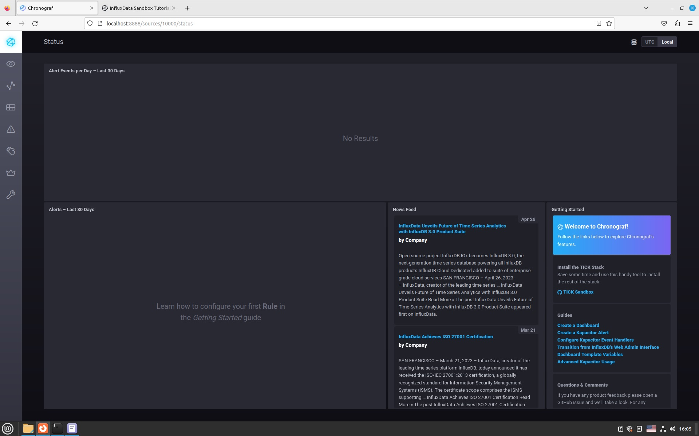
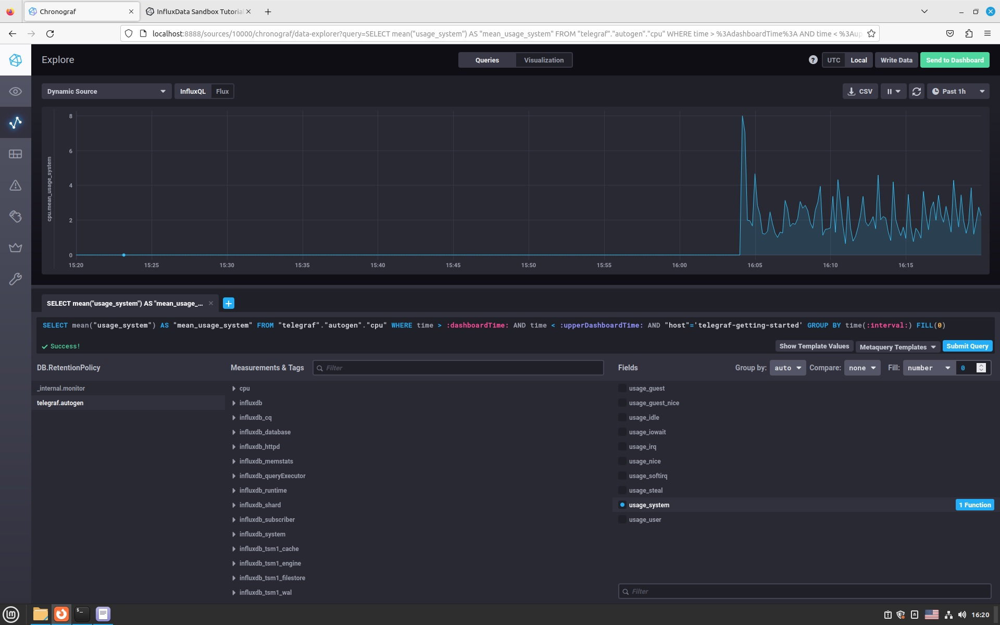
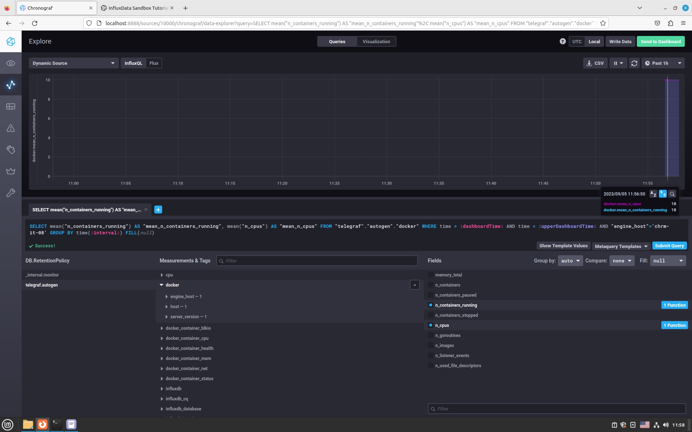

## Ответ на домашнее задание к 10-01 «Системы мониторинга»  

1. Вас пригласили настроить мониторинг на проект. На онбординге вам рассказали, что проект представляет из себя платформу для вычислений с выдачей текстовых отчётов, которые сохраняются на диск. Взаимодействие с платформой осуществляется по протоколу http. Также вам отметили, что вычисления загружают ЦПУ. Какой минимальный набор метрик вы выведите в мониторинг и почему?

  |   Метрика    | Обоснование                                                        |
  |:------------:|:-------------------------------------------------------------------|
  |     CPU      | Мониторинг нагрузки на CPU                                         | 
  |     RAM      | Контроль свободных ресурсов памяти и потребления                   |
  | HTTP/Request | Мониторинг общего количества запросов к системе                    |
  | HTTP/Answers | Мониторинг от ответов(400/500) для определения доступности ресурса |
  |     HDD      | Мониторинг свободного места на диске + (скорость чтение/запись)    |
  |     LAN      | Мониторинг сетевой нагрузки для анализа и планирования сети        |
  |    Inodes    | Мониторинг свободных дескрипторов, дабы избежать остановки сервиса |
  |   Service    | Мониторинг службы веб сервиса на предмет доступности               |

2. Менеджер продукта, посмотрев на ваши метрики, сказал, что ему непонятно, что такое RAM/inodes/CPUla. Также он сказал, что хочет понимать, насколько мы выполняем свои обязанности перед клиентами и какое качество обслуживания. Что вы можете ему предложить?  

Для того чтобы привести метрики в более простой и читаемый вид для менеджеров, необходимо утвердить SLA в рамках которого будут указаны SLO для тех или иных метрик. После чего менеджерам будет проще ориентироваться в состоянии продукта, так как их будут интересовать только разницы значений SLO и SLI. Если значения SLI той или иной метрики не противоречат установленным для неё SLO тогда проект в норме. Это позволяет менеджеру не знать для чего та или иная метрика, но позволяет им сложить общую картину состояния работоспособности проекта.  

3. Вашей DevOps-команде в этом году не выделили финансирование на построение системы сбора логов. Разработчики, в свою очередь, хотят видеть все ошибки, которые выдают их приложения. Какое решение вы можете предпринять в этой ситуации, чтобы разработчики получали ошибки приложения?  

* Если приложение маленькое и нагрузка не высока, тогда можно использовать скрипты для вытягивания ошибок, и других параметров.
* Если приложение более востребовано и бюджеты позволяют приобрести мощности, тогда лучше воспользоваться специализированным ПО.

4. Вы, как опытный SRE, сделали мониторинг, куда вывели отображения выполнения SLA = 99% по http-кодам ответов. Этот параметр вычисляется по формуле: summ_2xx_requests/summ_all_requests. Он не поднимается выше 70%, но при этом в вашей системе нет кодов ответа 5xx и 4xx. Где у вас ошибка?  

 В формуле учитываются только 200 ответы, которые деляться на  общее количество запросов.   
   Для правильного расчета нужно изменить формулу: (summ_1xx_requests+summ_2xx_requests+summ_3xx_requests)/sum_all_requests.
5. Опишите основные плюсы и минусы pull и push систем мониторинга.

#### Push

Плюсы:
- Можно слать данные в несколько тареготов. Это может быть полезно не только для репликации, но и в принципе чтобы слать в разные контуры. Например, если на сервере несколько сервисов, не связанных друг с другом
- Работает за NAT
- Можно монидторить ноды без лишних алёртов, если им не всегда нужно подключение к сети, или у них оно не всегда есть, например какие-то мобильные ноды, или при инвентаризации рабочих станций, которые включают/выключают постоянно
- Можно получить данные с хостов,  с которых мы их изначально не ждали. Иными словам, при вводе ноды в эксплуатацию, нужно настроить только ноду, сервер настраивать не нужно

Минусы:
- Агенты могут зафлудить сервера запросами и устроить ему DDoS
- Требует открытия порта сервера во вне, что может создать проблемы со службой безопасности и безопасности в принципе
- Могут приходить данные, которые нам не нужны, т.е. сервер не контролирует ничего: частоту отправки данных, объём и тд. 

#### Pull

Плюсы
- Нет требует открытия порта сервера во вне. При этом, порт должен быть открыт на клиенте, но с точки зрения безопасности это предпочтительней
- Подойдёт в ситуации, когда с ноды могут запрашивать данные разные сервисы, каждому из которых нужны свои данные
- Сервер тянет данные с агентов когда может, и если сейчас нет свободных ресурсов - заберёт данные позже
- Сервер сам определяет, в каком объёме нужны данные
- Проще защитить трафик, т.к. часто используется HTTP/S

Минусы:
- Не работает за NAT, либо надо ставить какой-нибудь прокси
- Менее производительный, более ресурсоёмкий, т.к. данные забираются по HTTP/S в основном

6. Какие из ниже перечисленных систем относятся к push модели, а какие к pull? А может есть гибридные?

   | Наименование        | Тип системы  |
   |---------------------|--------------|
   | **Prometheus**      | Pull         |
   | **TICK**            | Push         |
   | **Zabbix**          | Pull & Push  |
   | **VictoriaMetrics** | Pull & Push  |
   | **Nagios**          | Pull         |

7. Склонируйте себе репозиторий и запустите TICK-стэк, используя технологии docker и docker-compose....

8. Перейдите в веб-интерфейс Chronograf (http://localhost:8888) и откройте вкладку Data explorer....

9. Изучите список telegraf inputs. Добавьте в конфигурацию telegraf следующий плагин - docker....
`После допиливания напильником доступа к docker.sock, заработало.`

