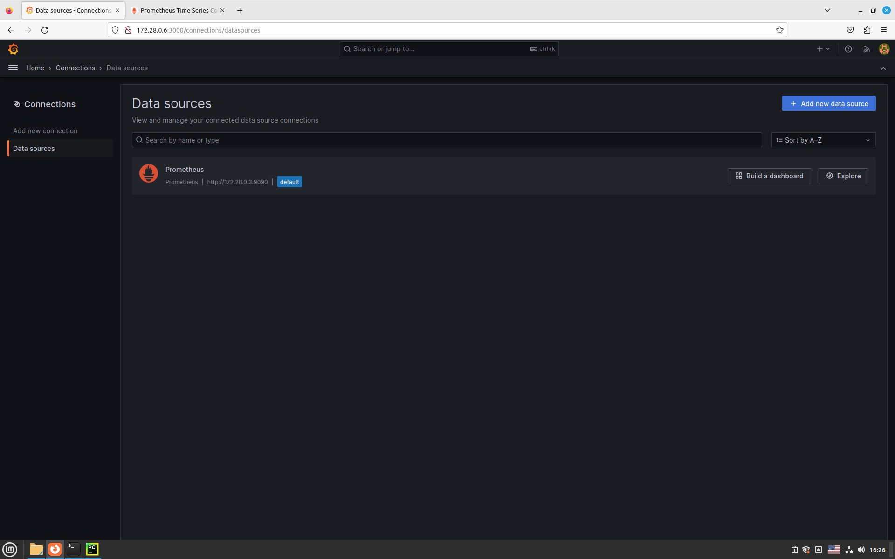
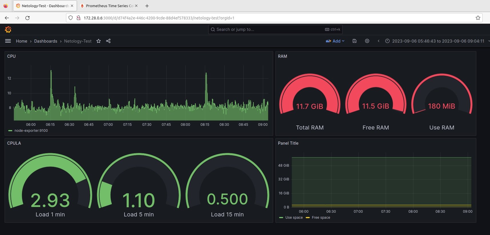
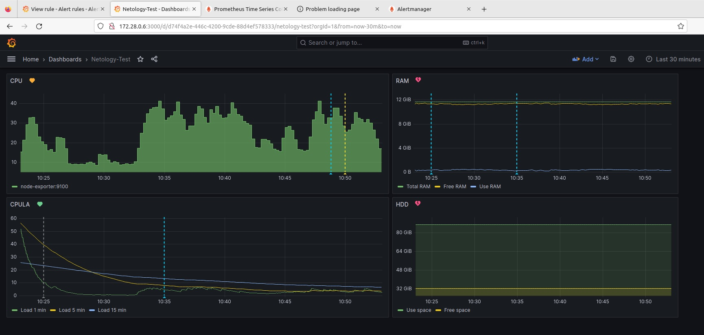

## Ответ на домашнее задание к 10-03 «Средство визуализации Grafana»

1. Решение домашнего задания — скриншот веб-интерфейса grafana со списком подключенных Datasource.  
#### Сборка проекта в папке [files](files)

2. Создайте Dashboard и в ней создайте Panels:

* утилизация CPU для nodeexporter (в процентах, 100-idle);
`100 - (avg by (instance) (rate(node_cpu_seconds_total{mode="idle"}[1m])) * 100)`
* CPULA 1/5/15;
`node_load1`, `node_load5`, `node_load15`
* количество свободной оперативной памяти;
`node_memory_MemTotal_bytes{}`, `node_memory_MemTotal_bytes{} - node_memory_MemFree_bytes{}`, `node_memory_MemFree_bytes{}`
* количество места на файловой системе.
`node_filesystem_size_bytes{device="/dev/mapper/vgmint-root", mountpoint="/"}`, `node_filesystem_free_bytes{device="/dev/mapper/vgmint-root"}`



3. Создайте для каждой Dashboard подходящее правило alert ...


4. Сохраните ваш Dashboard....

<details>
<summary>JSON MODELS</summary>

```json
{
  "annotations": {
    "list": [
      {
        "builtIn": 1,
        "datasource": {
          "type": "grafana",
          "uid": "-- Grafana --"
        },
        "enable": true,
        "hide": true,
        "iconColor": "rgba(0, 211, 255, 1)",
        "name": "Annotations & Alerts",
        "type": "dashboard"
      }
    ]
  },
  "editable": true,
  "fiscalYearStartMonth": 0,
  "graphTooltip": 0,
  "id": 1,
  "links": [],
  "liveNow": false,
  "panels": [
    {
      "datasource": {
        "type": "prometheus",
        "uid": "a4e1c0a4-07e6-4c32-91ae-528029f4e438"
      },
      "fieldConfig": {
        "defaults": {
          "color": {
            "mode": "palette-classic"
          },
          "custom": {
            "axisCenteredZero": false,
            "axisColorMode": "text",
            "axisLabel": "",
            "axisPlacement": "auto",
            "barAlignment": 0,
            "drawStyle": "line",
            "fillOpacity": 62,
            "gradientMode": "none",
            "hideFrom": {
              "legend": false,
              "tooltip": false,
              "viz": false
            },
            "insertNulls": false,
            "lineInterpolation": "stepAfter",
            "lineStyle": {
              "fill": "solid"
            },
            "lineWidth": 1,
            "pointSize": 5,
            "scaleDistribution": {
              "type": "linear"
            },
            "showPoints": "auto",
            "spanNulls": false,
            "stacking": {
              "group": "A",
              "mode": "none"
            },
            "thresholdsStyle": {
              "mode": "off"
            }
          },
          "mappings": [],
          "thresholds": {
            "mode": "absolute",
            "steps": [
              {
                "color": "green",
                "value": null
              },
              {
                "color": "red",
                "value": 80
              }
            ]
          }
        },
        "overrides": []
      },
      "gridPos": {
        "h": 8,
        "w": 12,
        "x": 0,
        "y": 0
      },
      "id": 1,
      "options": {
        "legend": {
          "calcs": [],
          "displayMode": "list",
          "placement": "bottom",
          "showLegend": true
        },
        "tooltip": {
          "mode": "single",
          "sort": "none"
        }
      },
      "pluginVersion": "10.1.1",
      "targets": [
        {
          "datasource": {
            "type": "prometheus",
            "uid": "a4e1c0a4-07e6-4c32-91ae-528029f4e438"
          },
          "editorMode": "code",
          "expr": "100 - (avg by (instance) (rate(node_cpu_seconds_total{mode=\"idle\"}[1m])) * 100)",
          "instant": false,
          "legendFormat": "__auto",
          "range": true,
          "refId": "A"
        }
      ],
      "title": "CPU",
      "type": "timeseries"
    },
    {
      "datasource": {
        "type": "prometheus",
        "uid": "a4e1c0a4-07e6-4c32-91ae-528029f4e438"
      },
      "fieldConfig": {
        "defaults": {
          "color": {
            "mode": "palette-classic"
          },
          "custom": {
            "axisCenteredZero": false,
            "axisColorMode": "text",
            "axisLabel": "",
            "axisPlacement": "auto",
            "barAlignment": 0,
            "drawStyle": "line",
            "fillOpacity": 0,
            "gradientMode": "none",
            "hideFrom": {
              "legend": false,
              "tooltip": false,
              "viz": false
            },
            "insertNulls": false,
            "lineInterpolation": "linear",
            "lineWidth": 1,
            "pointSize": 5,
            "scaleDistribution": {
              "type": "linear"
            },
            "showPoints": "auto",
            "spanNulls": false,
            "stacking": {
              "group": "A",
              "mode": "none"
            },
            "thresholdsStyle": {
              "mode": "off"
            }
          },
          "mappings": [],
          "thresholds": {
            "mode": "absolute",
            "steps": [
              {
                "color": "green",
                "value": null
              },
              {
                "color": "red",
                "value": 80
              }
            ]
          },
          "unit": "bytes"
        },
        "overrides": []
      },
      "gridPos": {
        "h": 8,
        "w": 9,
        "x": 12,
        "y": 0
      },
      "id": 4,
      "maxDataPoints": 1831,
      "options": {
        "legend": {
          "calcs": [],
          "displayMode": "list",
          "placement": "bottom",
          "showLegend": true
        },
        "tooltip": {
          "mode": "single",
          "sort": "none"
        }
      },
      "pluginVersion": "10.1.1",
      "targets": [
        {
          "datasource": {
            "type": "prometheus",
            "uid": "a4e1c0a4-07e6-4c32-91ae-528029f4e438"
          },
          "editorMode": "code",
          "expr": "node_memory_MemTotal_bytes{}",
          "instant": false,
          "legendFormat": "Total RAM",
          "range": true,
          "refId": "A"
        },
        {
          "datasource": {
            "type": "prometheus",
            "uid": "a4e1c0a4-07e6-4c32-91ae-528029f4e438"
          },
          "editorMode": "code",
          "expr": "node_memory_MemTotal_bytes{} - node_memory_MemFree_bytes{}",
          "hide": false,
          "instant": false,
          "legendFormat": "Free RAM",
          "range": true,
          "refId": "B"
        },
        {
          "datasource": {
            "type": "prometheus",
            "uid": "a4e1c0a4-07e6-4c32-91ae-528029f4e438"
          },
          "editorMode": "code",
          "expr": "node_memory_MemFree_bytes{}",
          "hide": false,
          "instant": false,
          "legendFormat": "Use RAM",
          "range": true,
          "refId": "C"
        }
      ],
      "title": "RAM",
      "type": "timeseries"
    },
    {
      "datasource": {
        "type": "prometheus",
        "uid": "a4e1c0a4-07e6-4c32-91ae-528029f4e438"
      },
      "fieldConfig": {
        "defaults": {
          "color": {
            "mode": "palette-classic"
          },
          "custom": {
            "axisCenteredZero": false,
            "axisColorMode": "text",
            "axisLabel": "",
            "axisPlacement": "auto",
            "barAlignment": 0,
            "drawStyle": "line",
            "fillOpacity": 0,
            "gradientMode": "none",
            "hideFrom": {
              "legend": false,
              "tooltip": false,
              "viz": false
            },
            "insertNulls": false,
            "lineInterpolation": "linear",
            "lineWidth": 1,
            "pointSize": 5,
            "scaleDistribution": {
              "type": "linear"
            },
            "showPoints": "auto",
            "spanNulls": false,
            "stacking": {
              "group": "A",
              "mode": "none"
            },
            "thresholdsStyle": {
              "mode": "off"
            }
          },
          "mappings": [],
          "thresholds": {
            "mode": "absolute",
            "steps": [
              {
                "color": "green",
                "value": null
              },
              {
                "color": "red",
                "value": 80
              }
            ]
          }
        },
        "overrides": []
      },
      "gridPos": {
        "h": 8,
        "w": 12,
        "x": 0,
        "y": 8
      },
      "id": 2,
      "options": {
        "legend": {
          "calcs": [],
          "displayMode": "list",
          "placement": "bottom",
          "showLegend": true
        },
        "tooltip": {
          "mode": "single",
          "sort": "none"
        }
      },
      "pluginVersion": "10.1.1",
      "targets": [
        {
          "datasource": {
            "type": "prometheus",
            "uid": "a4e1c0a4-07e6-4c32-91ae-528029f4e438"
          },
          "editorMode": "code",
          "exemplar": false,
          "expr": "node_load1",
          "format": "time_series",
          "instant": false,
          "interval": "1",
          "legendFormat": "Load 1 min",
          "range": true,
          "refId": "A"
        },
        {
          "datasource": {
            "type": "prometheus",
            "uid": "a4e1c0a4-07e6-4c32-91ae-528029f4e438"
          },
          "editorMode": "code",
          "exemplar": false,
          "expr": " node_load5",
          "hide": false,
          "instant": false,
          "legendFormat": "Load 5 min",
          "range": true,
          "refId": "B"
        },
        {
          "datasource": {
            "type": "prometheus",
            "uid": "a4e1c0a4-07e6-4c32-91ae-528029f4e438"
          },
          "editorMode": "code",
          "expr": " node_load15",
          "hide": false,
          "instant": false,
          "legendFormat": "Load 15 min",
          "range": true,
          "refId": "C"
        }
      ],
      "title": "CPULA",
      "type": "timeseries"
    },
    {
      "datasource": {
        "type": "prometheus",
        "uid": "a4e1c0a4-07e6-4c32-91ae-528029f4e438"
      },
      "fieldConfig": {
        "defaults": {
          "color": {
            "mode": "palette-classic"
          },
          "custom": {
            "axisCenteredZero": false,
            "axisColorMode": "text",
            "axisLabel": "",
            "axisPlacement": "auto",
            "barAlignment": 0,
            "drawStyle": "line",
            "fillOpacity": 14,
            "gradientMode": "none",
            "hideFrom": {
              "legend": false,
              "tooltip": false,
              "viz": false
            },
            "insertNulls": false,
            "lineInterpolation": "linear",
            "lineWidth": 1,
            "pointSize": 5,
            "scaleDistribution": {
              "type": "linear"
            },
            "showPoints": "auto",
            "spanNulls": false,
            "stacking": {
              "group": "A",
              "mode": "none"
            },
            "thresholdsStyle": {
              "mode": "off"
            }
          },
          "mappings": [],
          "thresholds": {
            "mode": "absolute",
            "steps": [
              {
                "color": "green",
                "value": null
              },
              {
                "color": "red",
                "value": 80
              }
            ]
          },
          "unit": "bytes"
        },
        "overrides": []
      },
      "gridPos": {
        "h": 8,
        "w": 9,
        "x": 12,
        "y": 8
      },
      "id": 5,
      "options": {
        "legend": {
          "calcs": [],
          "displayMode": "list",
          "placement": "bottom",
          "showLegend": true
        },
        "tooltip": {
          "mode": "single",
          "sort": "none"
        }
      },
      "targets": [
        {
          "datasource": {
            "type": "prometheus",
            "uid": "a4e1c0a4-07e6-4c32-91ae-528029f4e438"
          },
          "editorMode": "code",
          "expr": "node_filesystem_size_bytes{device=\"/dev/mapper/vgmint-root\", mountpoint=\"/\"}",
          "instant": false,
          "legendFormat": "Use space",
          "range": true,
          "refId": "A"
        },
        {
          "datasource": {
            "type": "prometheus",
            "uid": "a4e1c0a4-07e6-4c32-91ae-528029f4e438"
          },
          "editorMode": "code",
          "expr": "node_filesystem_free_bytes{device=\"/dev/mapper/vgmint-root\"}",
          "hide": false,
          "instant": false,
          "legendFormat": "Free space",
          "range": true,
          "refId": "B"
        }
      ],
      "title": "HDD",
      "type": "timeseries"
    }
  ],
  "refresh": "",
  "schemaVersion": 38,
  "style": "dark",
  "tags": [],
  "templating": {
    "list": []
  },
  "time": {
    "from": "now-15m",
    "to": "now"
  },
  "timepicker": {},
  "timezone": "",
  "title": "Netology-Test",
  "uid": "d74f4a2e-446c-4200-9cde-88d4ef578333",
  "version": 3,
  "weekStart": ""
}
```
</details>