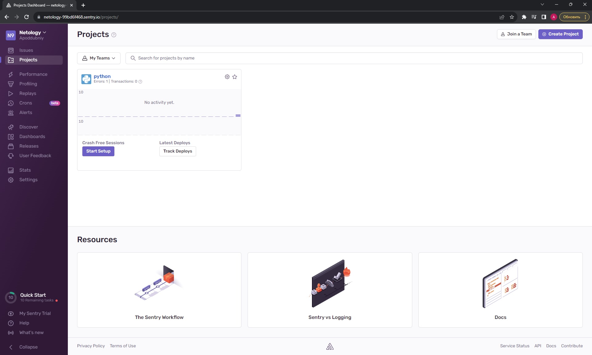
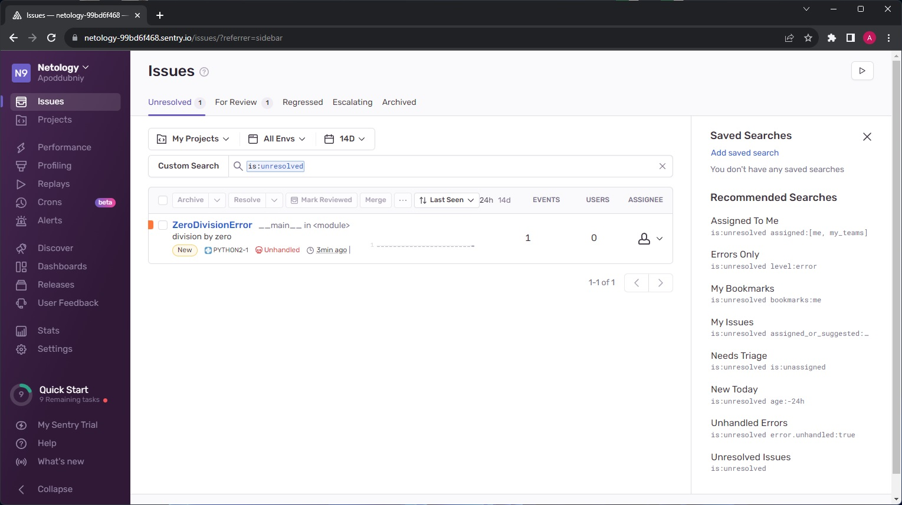
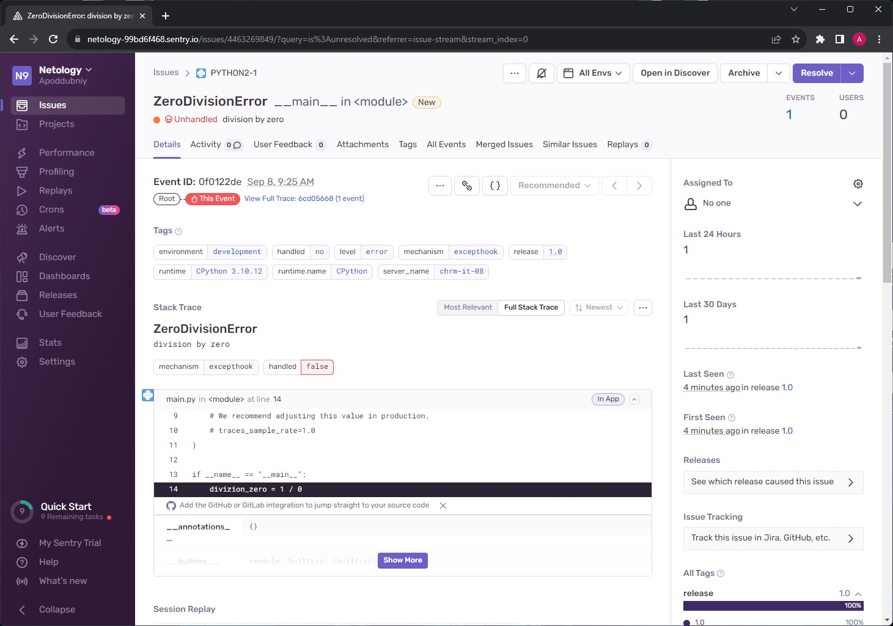
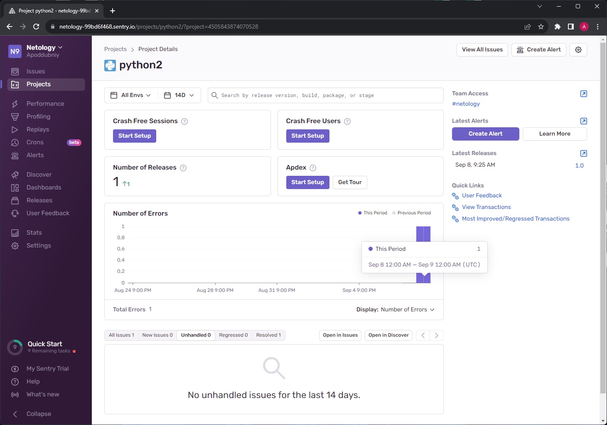
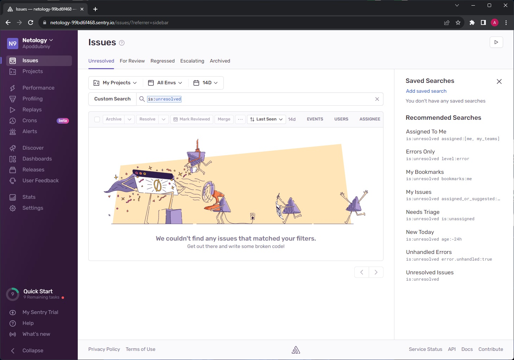
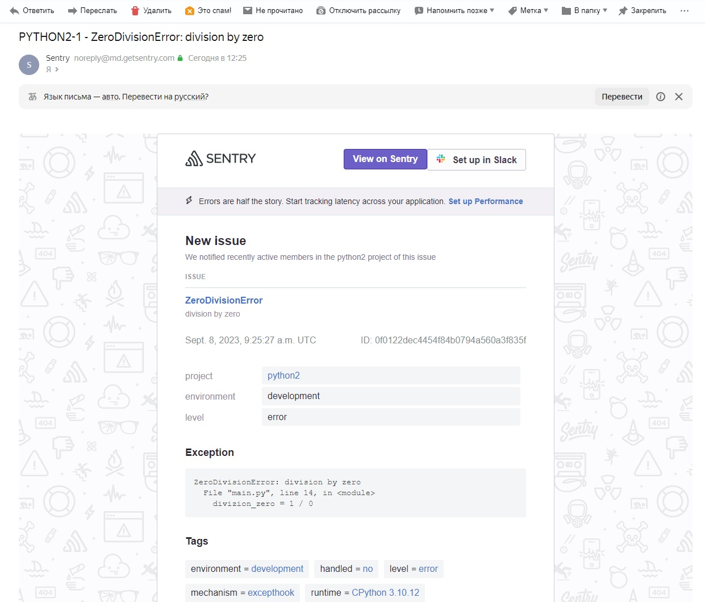

## Ответ на домашнее задание к 10-05 «Платформа мониторинга Sentry»

1. В качестве решения задания пришлите скриншот меню Projects.

2. В качестве решения задание предоставьте скриншот Stack trace из этого события и список событий проекта после нажатия Resolved.

* Создайте python-проект и нажмите Generate sample event для генерации тестового события.  

* Изучите информацию, представленную в событии.

* Перейдите в список событий проекта, выберите созданное вами и нажмите Resolved.
* В качестве решения задание предоставьте скриншот Stack trace из этого события и список событий проекта после нажатия Resolved.

#### All resolved

3. В качестве решения задания пришлите скриншот тела сообщения из оповещения на почте....
