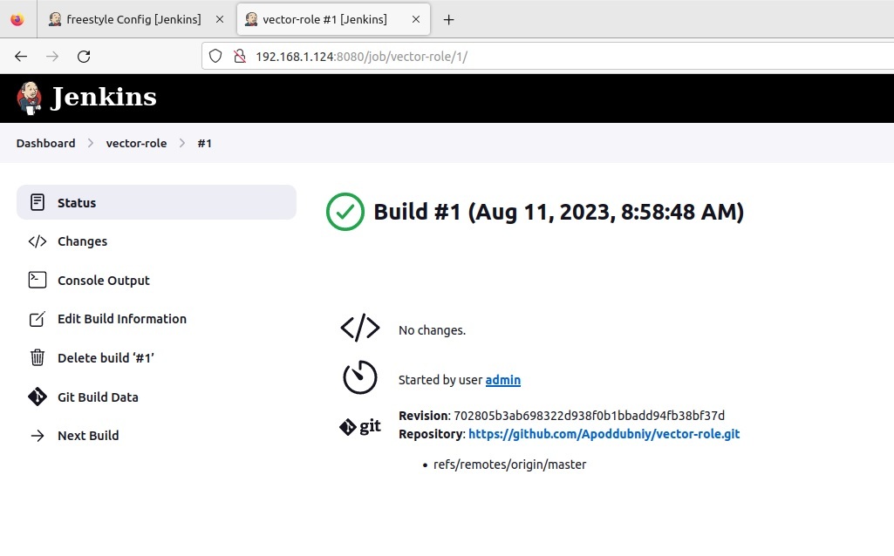
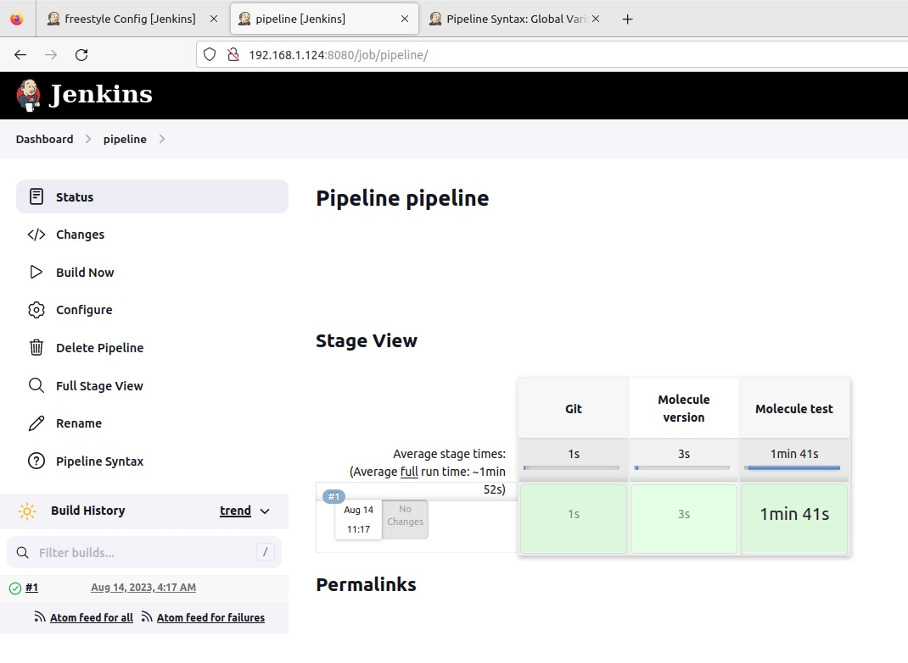
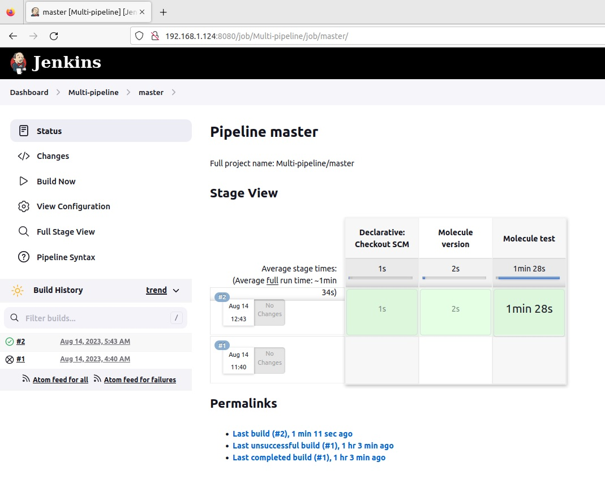
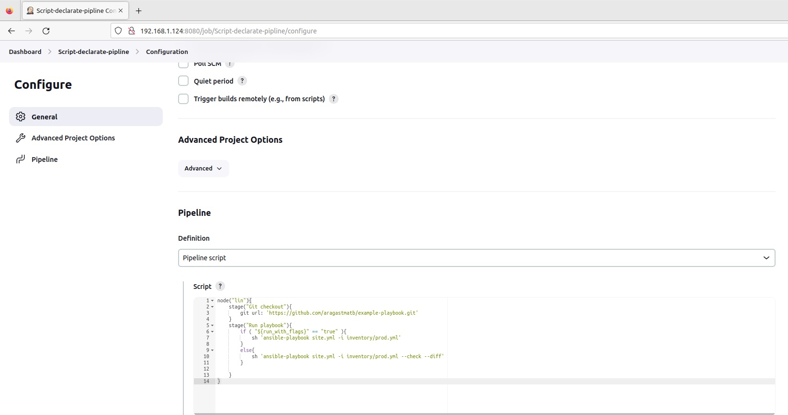
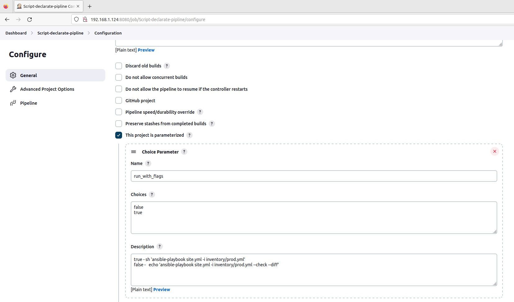

## Ответ на домашнее задание к 09-04 «Jenkins»  


#### Основная часть

---
1. Сделать Freestyle Job, который будет запускать molecule test из любого вашего репозитория с ролью.



<details>
<summary>Лог задания</summary>

```commandline
Started by user admin
Running as SYSTEM
Building remotely on node-125 (linux) in workspace /opt/jenkins_agent/workspace/vector-role
The recommended git tool is: NONE
No credentials specified
Cloning the remote Git repository
Cloning repository https://github.com/Apoddubniy/vector-role.git
 > git init /opt/jenkins_agent/workspace/vector-role # timeout=10
Fetching upstream changes from https://github.com/Apoddubniy/vector-role.git
 > git --version # timeout=10
 > git --version # 'git version 2.39.3'
 > git fetch --tags --force --progress -- https://github.com/Apoddubniy/vector-role.git +refs/heads/*:refs/remotes/origin/* # timeout=10
 > git config remote.origin.url https://github.com/Apoddubniy/vector-role.git # timeout=10
 > git config --add remote.origin.fetch +refs/heads/*:refs/remotes/origin/* # timeout=10
Avoid second fetch
 > git rev-parse refs/remotes/origin/master^{commit} # timeout=10
Checking out Revision 702805b3ab698322d938f0b1bbadd94fb38bf37d (refs/remotes/origin/master)
 > git config core.sparsecheckout # timeout=10
 > git checkout -f 702805b3ab698322d938f0b1bbadd94fb38bf37d # timeout=10
Commit message: "Fix9"
First time build. Skipping changelog.
[vector-role] $ /bin/sh -xe /tmp/jenkins16522599724808772555.sh
+ molecule test -s docker
WARNING  Driver docker does not provide a schema.
INFO     docker scenario test matrix: dependency, cleanup, destroy, syntax, create, prepare, converge, idempotence, side_effect, verify, cleanup, destroy
INFO     Performing prerun with role_name_check=0...
INFO     Set ANSIBLE_LIBRARY=/root/.cache/ansible-compat/f5bcd7/modules:/root/.ansible/plugins/modules:/usr/share/ansible/plugins/modules
INFO     Set ANSIBLE_COLLECTIONS_PATH=/root/.cache/ansible-compat/f5bcd7/collections:/root/.ansible/collections:/usr/share/ansible/collections
INFO     Set ANSIBLE_ROLES_PATH=/root/.cache/ansible-compat/f5bcd7/roles:/root/.ansible/roles:/usr/share/ansible/roles:/etc/ansible/roles
INFO     Using /root/.cache/ansible-compat/f5bcd7/roles/vector.vector symlink to current repository in order to enable Ansible to find the role using its expected full name.
INFO     Running docker > dependency
WARNING  Skipping, missing the requirements file.
WARNING  Skipping, missing the requirements file.
INFO     Running docker > cleanup
WARNING  Skipping, cleanup playbook not configured.
INFO     Running docker > destroy
INFO     Sanity checks: 'docker'

PLAY [Destroy] *****************************************************************

TASK [Set async_dir for HOME env] **********************************************
ok: [localhost]

TASK [Destroy molecule instance(s)] ********************************************
changed: [localhost] => (item=centos7)

TASK [Wait for instance(s) deletion to complete] *******************************
FAILED - RETRYING: [localhost]: Wait for instance(s) deletion to complete (300 retries left).
ok: [localhost] => (item=centos7)

TASK [Delete docker networks(s)] ***********************************************
skipping: [localhost]

PLAY RECAP *********************************************************************
localhost                  : ok=3    changed=1    unreachable=0    failed=0    skipped=1    rescued=0    ignored=0

INFO     Running docker > syntax

playbook: /opt/jenkins_agent/workspace/vector-role/molecule/docker/converge.yml
INFO     Running docker > create

PLAY [Create] ******************************************************************

TASK [Set async_dir for HOME env] **********************************************
ok: [localhost]

TASK [Log into a Docker registry] **********************************************
skipping: [localhost] => (item=None) 
skipping: [localhost]

TASK [Check presence of custom Dockerfiles] ************************************
ok: [localhost] => (item={'image': 'docker.io/pycontribs/centos:7', 'name': 'centos7', 'pre_build_image': True})

TASK [Create Dockerfiles from image names] *************************************
skipping: [localhost] => (item={'image': 'docker.io/pycontribs/centos:7', 'name': 'centos7', 'pre_build_image': True})
skipping: [localhost]

TASK [Synchronization the context] *********************************************
skipping: [localhost] => (item={'image': 'docker.io/pycontribs/centos:7', 'name': 'centos7', 'pre_build_image': True})
skipping: [localhost]

TASK [Discover local Docker images] ********************************************
ok: [localhost] => (item={'changed': False, 'skipped': True, 'skip_reason': 'Conditional result was False', 'false_condition': 'not item.pre_build_image | default(false)', 'item': {'image': 'docker.io/pycontribs/centos:7', 'name': 'centos7', 'pre_build_image': True}, 'ansible_loop_var': 'item', 'i': 0, 'ansible_index_var': 'i'})

TASK [Build an Ansible compatible image (new)] *********************************
skipping: [localhost] => (item=molecule_local/docker.io/pycontribs/centos:7) 
skipping: [localhost]

TASK [Create docker network(s)] ************************************************
skipping: [localhost]

TASK [Determine the CMD directives] ********************************************
ok: [localhost] => (item={'image': 'docker.io/pycontribs/centos:7', 'name': 'centos7', 'pre_build_image': True})

TASK [Create molecule instance(s)] *********************************************
changed: [localhost] => (item=centos7)

TASK [Wait for instance(s) creation to complete] *******************************
FAILED - RETRYING: [localhost]: Wait for instance(s) creation to complete (300 retries left).
changed: [localhost] => (item={'failed': 0, 'started': 1, 'finished': 0, 'ansible_job_id': 'j962848261568.16246', 'results_file': '/root/.ansible_async/j962848261568.16246', 'changed': True, 'item': {'image': 'docker.io/pycontribs/centos:7', 'name': 'centos7', 'pre_build_image': True}, 'ansible_loop_var': 'item'})

PLAY RECAP *********************************************************************
localhost                  : ok=6    changed=2    unreachable=0    failed=0    skipped=5    rescued=0    ignored=0

INFO     Running docker > prepare
WARNING  Skipping, prepare playbook not configured.
INFO     Running docker > converge

PLAY [Converge] ****************************************************************

TASK [Gathering Facts] *********************************************************
ok: [centos7]

TASK [Include vector] **********************************************************

TASK [vector-role : install *.rpm] *********************************************
included: /opt/jenkins_agent/workspace/vector-role/tasks/rpm.yml for centos7

TASK [vector-role : Get RPM Vector] ********************************************
changed: [centos7]

TASK [vector-role : Install RPM vector] ****************************************
changed: [centos7]

TASK [vector-role : Input config Vector] ***************************************
changed: [centos7]

TASK [vector-role : install *.deb] *********************************************
skipping: [centos7]

PLAY RECAP *********************************************************************
centos7                    : ok=5    changed=3    unreachable=0    failed=0    skipped=1    rescued=0    ignored=0

INFO     Running docker > idempotence

PLAY [Converge] ****************************************************************

TASK [Gathering Facts] *********************************************************
ok: [centos7]

TASK [Include vector] **********************************************************

TASK [vector-role : install *.rpm] *********************************************
included: /opt/jenkins_agent/workspace/vector-role/tasks/rpm.yml for centos7

TASK [vector-role : Get RPM Vector] ********************************************
ok: [centos7]

TASK [vector-role : Install RPM vector] ****************************************
ok: [centos7]

TASK [vector-role : Input config Vector] ***************************************
ok: [centos7]

TASK [vector-role : install *.deb] *********************************************
skipping: [centos7]

PLAY RECAP *********************************************************************
centos7                    : ok=5    changed=0    unreachable=0    failed=0    skipped=1    rescued=0    ignored=0

INFO     Idempotence completed successfully.
INFO     Running docker > side_effect
WARNING  Skipping, side effect playbook not configured.
INFO     Running docker > verify
INFO     Running Ansible Verifier

PLAY [Verify] ******************************************************************

TASK [Example assertion] *******************************************************
ok: [centos7] => {
    "changed": false,
    "msg": "All assertions passed"
}

TASK [Check config file] *******************************************************
changed: [centos7]

PLAY RECAP *********************************************************************
centos7                    : ok=2    changed=1    unreachable=0    failed=0    skipped=0    rescued=0    ignored=0

INFO     Verifier completed successfully.
INFO     Running docker > cleanup
WARNING  Skipping, cleanup playbook not configured.
INFO     Running docker > destroy

PLAY [Destroy] *****************************************************************

TASK [Set async_dir for HOME env] **********************************************
ok: [localhost]

TASK [Destroy molecule instance(s)] ********************************************
changed: [localhost] => (item=centos7)

TASK [Wait for instance(s) deletion to complete] *******************************
FAILED - RETRYING: [localhost]: Wait for instance(s) deletion to complete (300 retries left).
changed: [localhost] => (item=centos7)

TASK [Delete docker networks(s)] ***********************************************
skipping: [localhost]

PLAY RECAP *********************************************************************
localhost                  : ok=3    changed=2    unreachable=0    failed=0    skipped=1    rescued=0    ignored=0

INFO     Pruning extra files from scenario ephemeral directory
Finished: SUCCESS
```
</details>

2. Сделать Declarative Pipeline Job, который будет запускать molecule test из любого вашего репозитория с ролью.



```commandline
pipeline {
    agent {
        label 'pipeline'
    }
    stages {
        stage('Git') {
            steps{
                git branch: 'master', url: 'https://github.com/Apoddubniy/vector-role.git'
            }
        }
        stage ('Molecule version'){
            steps {
                sh 'molecule --version'
            }
        }
        stage('Molecule test'){
            steps{
                sh 'molecule test -s docker'
                cleanWs()
            }
        }
    }
}
```

<details>
<summary>Лог пайплайна</summary>

```commandline
Started by user admin
[Pipeline] Start of Pipeline
[Pipeline] node
Running on node-125 in /opt/jenkins_agent/workspace/pipeline
[Pipeline] {
[Pipeline] stage
[Pipeline] { (Git)
[Pipeline] git
The recommended git tool is: NONE
No credentials specified
Cloning the remote Git repository
Cloning repository https://github.com/Apoddubniy/vector-role.git
 > git init /opt/jenkins_agent/workspace/pipeline # timeout=10
Fetching upstream changes from https://github.com/Apoddubniy/vector-role.git
 > git --version # timeout=10
 > git --version # 'git version 2.39.3'
 > git fetch --tags --force --progress -- https://github.com/Apoddubniy/vector-role.git +refs/heads/*:refs/remotes/origin/* # timeout=10
Avoid second fetch
Checking out Revision 702805b3ab698322d938f0b1bbadd94fb38bf37d (refs/remotes/origin/master)
Commit message: "Fix9"
First time build. Skipping changelog.
[Pipeline] }
[Pipeline] // stage
[Pipeline] stage
[Pipeline] { (Molecule version)
[Pipeline] sh
+ molecule --version
 > git config remote.origin.url https://github.com/Apoddubniy/vector-role.git # timeout=10
 > git config --add remote.origin.fetch +refs/heads/*:refs/remotes/origin/* # timeout=10
 > git rev-parse refs/remotes/origin/master^{commit} # timeout=10
 > git config core.sparsecheckout # timeout=10
 > git checkout -f 702805b3ab698322d938f0b1bbadd94fb38bf37d # timeout=10
 > git branch -a -v --no-abbrev # timeout=10
 > git checkout -b master 702805b3ab698322d938f0b1bbadd94fb38bf37d # timeout=10
molecule 5.1.0 using python 3.9 
    ansible:2.15.2
    delegated:5.1.0 from molecule
    docker:2.1.0 from molecule_docker requiring collections: community.docker>=3.0.2 ansible.posix>=1.4.0
[Pipeline] }
[Pipeline] // stage
[Pipeline] stage
[Pipeline] { (Molecule test)
[Pipeline] sh
+ molecule test -s docker
WARNING  Driver docker does not provide a schema.
INFO     docker scenario test matrix: dependency, cleanup, destroy, syntax, create, prepare, converge, idempotence, side_effect, verify, cleanup, destroy
INFO     Performing prerun with role_name_check=0...
INFO     Set ANSIBLE_LIBRARY=/root/.cache/ansible-compat/23bf0d/modules:/root/.ansible/plugins/modules:/usr/share/ansible/plugins/modules
INFO     Set ANSIBLE_COLLECTIONS_PATH=/root/.cache/ansible-compat/23bf0d/collections:/root/.ansible/collections:/usr/share/ansible/collections
INFO     Set ANSIBLE_ROLES_PATH=/root/.cache/ansible-compat/23bf0d/roles:/root/.ansible/roles:/usr/share/ansible/roles:/etc/ansible/roles
INFO     Using /root/.cache/ansible-compat/23bf0d/roles/vector.vector symlink to current repository in order to enable Ansible to find the role using its expected full name.
INFO     Running docker > dependency
WARNING  Skipping, missing the requirements file.
WARNING  Skipping, missing the requirements file.
INFO     Running docker > cleanup
WARNING  Skipping, cleanup playbook not configured.
INFO     Running docker > destroy
INFO     Sanity checks: 'docker'

PLAY [Destroy] *****************************************************************

TASK [Set async_dir for HOME env] **********************************************
ok: [localhost]

TASK [Destroy molecule instance(s)] ********************************************
changed: [localhost] => (item=centos7)

TASK [Wait for instance(s) deletion to complete] *******************************
FAILED - RETRYING: [localhost]: Wait for instance(s) deletion to complete (300 retries left).
ok: [localhost] => (item=centos7)

TASK [Delete docker networks(s)] ***********************************************
skipping: [localhost]

PLAY RECAP *********************************************************************
localhost                  : ok=3    changed=1    unreachable=0    failed=0    skipped=1    rescued=0    ignored=0

INFO     Running docker > syntax

playbook: /opt/jenkins_agent/workspace/pipeline/molecule/docker/converge.yml
INFO     Running docker > create

PLAY [Create] ******************************************************************

TASK [Set async_dir for HOME env] **********************************************
ok: [localhost]

TASK [Log into a Docker registry] **********************************************
skipping: [localhost] => (item=None) 
skipping: [localhost]

TASK [Check presence of custom Dockerfiles] ************************************
ok: [localhost] => (item={'image': 'docker.io/pycontribs/centos:7', 'name': 'centos7', 'pre_build_image': True})

TASK [Create Dockerfiles from image names] *************************************
skipping: [localhost] => (item={'image': 'docker.io/pycontribs/centos:7', 'name': 'centos7', 'pre_build_image': True})
skipping: [localhost]

TASK [Synchronization the context] *********************************************
skipping: [localhost] => (item={'image': 'docker.io/pycontribs/centos:7', 'name': 'centos7', 'pre_build_image': True})
skipping: [localhost]

TASK [Discover local Docker images] ********************************************
ok: [localhost] => (item={'changed': False, 'skipped': True, 'skip_reason': 'Conditional result was False', 'false_condition': 'not item.pre_build_image | default(false)', 'item': {'image': 'docker.io/pycontribs/centos:7', 'name': 'centos7', 'pre_build_image': True}, 'ansible_loop_var': 'item', 'i': 0, 'ansible_index_var': 'i'})

TASK [Build an Ansible compatible image (new)] *********************************
skipping: [localhost] => (item=molecule_local/docker.io/pycontribs/centos:7) 
skipping: [localhost]

TASK [Create docker network(s)] ************************************************
skipping: [localhost]

TASK [Determine the CMD directives] ********************************************
ok: [localhost] => (item={'image': 'docker.io/pycontribs/centos:7', 'name': 'centos7', 'pre_build_image': True})

TASK [Create molecule instance(s)] *********************************************
changed: [localhost] => (item=centos7)

TASK [Wait for instance(s) creation to complete] *******************************
FAILED - RETRYING: [localhost]: Wait for instance(s) creation to complete (300 retries left).
changed: [localhost] => (item={'failed': 0, 'started': 1, 'finished': 0, 'ansible_job_id': 'j491230279447.28937', 'results_file': '/root/.ansible_async/j491230279447.28937', 'changed': True, 'item': {'image': 'docker.io/pycontribs/centos:7', 'name': 'centos7', 'pre_build_image': True}, 'ansible_loop_var': 'item'})

PLAY RECAP *********************************************************************
localhost                  : ok=6    changed=2    unreachable=0    failed=0    skipped=5    rescued=0    ignored=0

INFO     Running docker > prepare
WARNING  Skipping, prepare playbook not configured.
INFO     Running docker > converge

PLAY [Converge] ****************************************************************

TASK [Gathering Facts] *********************************************************
ok: [centos7]

TASK [Include vector] **********************************************************

TASK [vector-role : install *.rpm] *********************************************
included: /opt/jenkins_agent/workspace/vector-role/tasks/rpm.yml for centos7

TASK [vector-role : Get RPM Vector] ********************************************
changed: [centos7]

TASK [vector-role : Install RPM vector] ****************************************
changed: [centos7]

TASK [vector-role : Input config Vector] ***************************************
changed: [centos7]

TASK [vector-role : install *.deb] *********************************************
skipping: [centos7]

PLAY RECAP *********************************************************************
centos7                    : ok=5    changed=3    unreachable=0    failed=0    skipped=1    rescued=0    ignored=0

INFO     Running docker > idempotence

PLAY [Converge] ****************************************************************

TASK [Gathering Facts] *********************************************************
ok: [centos7]

TASK [Include vector] **********************************************************

TASK [vector-role : install *.rpm] *********************************************
included: /opt/jenkins_agent/workspace/vector-role/tasks/rpm.yml for centos7

TASK [vector-role : Get RPM Vector] ********************************************
ok: [centos7]

TASK [vector-role : Install RPM vector] ****************************************
ok: [centos7]

TASK [vector-role : Input config Vector] ***************************************
ok: [centos7]

TASK [vector-role : install *.deb] *********************************************
skipping: [centos7]

PLAY RECAP *********************************************************************
centos7                    : ok=5    changed=0    unreachable=0    failed=0    skipped=1    rescued=0    ignored=0

INFO     Idempotence completed successfully.
INFO     Running docker > side_effect
WARNING  Skipping, side effect playbook not configured.
INFO     Running docker > verify
INFO     Running Ansible Verifier

PLAY [Verify] ******************************************************************

TASK [Example assertion] *******************************************************
ok: [centos7] => {
    "changed": false,
    "msg": "All assertions passed"
}

TASK [Check config file] *******************************************************
changed: [centos7]

PLAY RECAP *********************************************************************
centos7                    : ok=2    changed=1    unreachable=0    failed=0    skipped=0    rescued=0    ignored=0

INFO     Verifier completed successfully.
INFO     Running docker > cleanup
WARNING  Skipping, cleanup playbook not configured.
INFO     Running docker > destroy

PLAY [Destroy] *****************************************************************

TASK [Set async_dir for HOME env] **********************************************
ok: [localhost]

TASK [Destroy molecule instance(s)] ********************************************
changed: [localhost] => (item=centos7)

TASK [Wait for instance(s) deletion to complete] *******************************
FAILED - RETRYING: [localhost]: Wait for instance(s) deletion to complete (300 retries left).
changed: [localhost] => (item=centos7)

TASK [Delete docker networks(s)] ***********************************************
skipping: [localhost]

PLAY RECAP *********************************************************************
localhost                  : ok=3    changed=2    unreachable=0    failed=0    skipped=1    rescued=0    ignored=0

INFO     Pruning extra files from scenario ephemeral directory
[Pipeline] cleanWs
[WS-CLEANUP] Deleting project workspace...
[WS-CLEANUP] Deferred wipeout is used...
[WS-CLEANUP] done
[Pipeline] }
[Pipeline] // stage
[Pipeline] }
[Pipeline] // node
[Pipeline] End of Pipeline
Finished: SUCCESS

```
</details>

3. Перенести Declarative Pipeline в репозиторий в файл `Jenkinsfile`.

### [Ссылка на репозиторий с Jenkinsfile](https://github.com/Apoddubniy/vector-role/blob/master/Jenkinsfile)

4. Создать Multibranch Pipeline на запуск Jenkinsfile из репозитория.



<details>
<summary>Find log</summary>

```commandline
Started by user admin
[Mon Aug 14 05:43:00 EDT 2023] Starting branch indexing...
 > git --version # timeout=10
 > git --version # 'git version 2.39.3'
 > git ls-remote --symref -- https://github.com/Apoddubniy/vector-role # timeout=10
 > git rev-parse --resolve-git-dir /var/lib/jenkins/caches/git-0cb5c8cd1f822474722619e92a256c29/.git # timeout=10
Setting origin to https://github.com/Apoddubniy/vector-role
 > git config remote.origin.url https://github.com/Apoddubniy/vector-role # timeout=10
Fetching & pruning origin...
Listing remote references...
 > git config --get remote.origin.url # timeout=10
 > git --version # timeout=10
 > git --version # 'git version 2.39.3'
 > git ls-remote -h -- https://github.com/Apoddubniy/vector-role # timeout=10
Fetching upstream changes from origin
 > git config --get remote.origin.url # timeout=10
 > git fetch --tags --force --progress --prune -- origin +refs/heads/*:refs/remotes/origin/* # timeout=10
Checking branches...
  Checking branch master
      ‘Jenkinsfile’ found
    Met criteria
Changes detected: master (ceed7a3062336f25fe081c1469a536b35fa0ef5d → 08a27948efda77f13c1af99d7c1f1f7c31d4773b)
Scheduled build for branch: master
Processed 1 branches
[Mon Aug 14 05:43:02 EDT 2023] Finished branch indexing. Indexing took 1.9 sec
Finished: SUCCESS

```
</details>

<details>
<summary>Work log</summary>

```commandline
Branch indexing
 > git rev-parse --resolve-git-dir /var/lib/jenkins/caches/git-0cb5c8cd1f822474722619e92a256c29/.git # timeout=10
Setting origin to https://github.com/Apoddubniy/vector-role
 > git config remote.origin.url https://github.com/Apoddubniy/vector-role # timeout=10
Fetching origin...
Fetching upstream changes from origin
 > git --version # timeout=10
 > git --version # 'git version 2.39.3'
 > git config --get remote.origin.url # timeout=10
 > git fetch --tags --force --progress -- origin +refs/heads/*:refs/remotes/origin/* # timeout=10
Seen branch in repository origin/master
Seen 1 remote branch
Obtained Jenkinsfile from 08a27948efda77f13c1af99d7c1f1f7c31d4773b
[Pipeline] Start of Pipeline
[Pipeline] node
Running on node-125 in /opt/jenkins_agent/workspace/Multi-pipeline_master
[Pipeline] {
[Pipeline] stage
[Pipeline] { (Declarative: Checkout SCM)
[Pipeline] checkout
Selected Git installation does not exist. Using Default
The recommended git tool is: NONE
No credentials specified
Cloning the remote Git repository
Cloning with configured refspecs honoured and without tags
Avoid second fetch
Checking out Revision 08a27948efda77f13c1af99d7c1f1f7c31d4773b (master)
Cloning repository https://github.com/Apoddubniy/vector-role
 > git init /opt/jenkins_agent/workspace/Multi-pipeline_master # timeout=10
Fetching upstream changes from https://github.com/Apoddubniy/vector-role
 > git --version # timeout=10
 > git --version # 'git version 2.39.3'
 > git fetch --no-tags --force --progress -- https://github.com/Apoddubniy/vector-role +refs/heads/*:refs/remotes/origin/* # timeout=10
 > git config remote.origin.url https://github.com/Apoddubniy/vector-role # timeout=10
 > git config --add remote.origin.fetch +refs/heads/*:refs/remotes/origin/* # timeout=10
 > git config core.sparsecheckout # timeout=10
 > git checkout -f 08a27948efda77f13c1af99d7c1f1f7c31d4773b # timeout=10
Commit message: "Fix Jenkinsfile"
First time build. Skipping changelog.
[Pipeline] }
[Pipeline] // stage
[Pipeline] withEnv
[Pipeline] {
[Pipeline] stage
[Pipeline] { (Molecule version)
[Pipeline] sh
+ molecule --version
molecule 5.1.0 using python 3.9 
    ansible:2.15.2
    delegated:5.1.0 from molecule
    docker:2.1.0 from molecule_docker requiring collections: community.docker>=3.0.2 ansible.posix>=1.4.0
[Pipeline] }
[Pipeline] // stage
[Pipeline] stage
[Pipeline] { (Molecule test)
[Pipeline] sh
+ molecule test -s docker
WARNING  Driver docker does not provide a schema.
INFO     docker scenario test matrix: dependency, cleanup, destroy, syntax, create, prepare, converge, idempotence, side_effect, verify, cleanup, destroy
INFO     Performing prerun with role_name_check=0...
INFO     Set ANSIBLE_LIBRARY=/root/.cache/ansible-compat/93d2f9/modules:/root/.ansible/plugins/modules:/usr/share/ansible/plugins/modules
INFO     Set ANSIBLE_COLLECTIONS_PATH=/root/.cache/ansible-compat/93d2f9/collections:/root/.ansible/collections:/usr/share/ansible/collections
INFO     Set ANSIBLE_ROLES_PATH=/root/.cache/ansible-compat/93d2f9/roles:/root/.ansible/roles:/usr/share/ansible/roles:/etc/ansible/roles
INFO     Using /root/.cache/ansible-compat/93d2f9/roles/vector.vector symlink to current repository in order to enable Ansible to find the role using its expected full name.
INFO     Running docker > dependency
WARNING  Skipping, missing the requirements file.
WARNING  Skipping, missing the requirements file.
INFO     Running docker > cleanup
WARNING  Skipping, cleanup playbook not configured.
INFO     Running docker > destroy
INFO     Sanity checks: 'docker'

PLAY [Destroy] *****************************************************************

TASK [Set async_dir for HOME env] **********************************************
ok: [localhost]

TASK [Destroy molecule instance(s)] ********************************************
changed: [localhost] => (item=centos7)

TASK [Wait for instance(s) deletion to complete] *******************************
FAILED - RETRYING: [localhost]: Wait for instance(s) deletion to complete (300 retries left).
ok: [localhost] => (item=centos7)

TASK [Delete docker networks(s)] ***********************************************
skipping: [localhost]

PLAY RECAP *********************************************************************
localhost                  : ok=3    changed=1    unreachable=0    failed=0    skipped=1    rescued=0    ignored=0

INFO     Running docker > syntax

playbook: /opt/jenkins_agent/workspace/Multi-pipeline_master/molecule/docker/converge.yml
INFO     Running docker > create

PLAY [Create] ******************************************************************

TASK [Set async_dir for HOME env] **********************************************
ok: [localhost]

TASK [Log into a Docker registry] **********************************************
skipping: [localhost] => (item=None) 
skipping: [localhost]

TASK [Check presence of custom Dockerfiles] ************************************
ok: [localhost] => (item={'image': 'docker.io/pycontribs/centos:7', 'name': 'centos7', 'pre_build_image': True})

TASK [Create Dockerfiles from image names] *************************************
skipping: [localhost] => (item={'image': 'docker.io/pycontribs/centos:7', 'name': 'centos7', 'pre_build_image': True})
skipping: [localhost]

TASK [Synchronization the context] *********************************************
skipping: [localhost] => (item={'image': 'docker.io/pycontribs/centos:7', 'name': 'centos7', 'pre_build_image': True})
skipping: [localhost]

TASK [Discover local Docker images] ********************************************
ok: [localhost] => (item={'changed': False, 'skipped': True, 'skip_reason': 'Conditional result was False', 'false_condition': 'not item.pre_build_image | default(false)', 'item': {'image': 'docker.io/pycontribs/centos:7', 'name': 'centos7', 'pre_build_image': True}, 'ansible_loop_var': 'item', 'i': 0, 'ansible_index_var': 'i'})

TASK [Build an Ansible compatible image (new)] *********************************
skipping: [localhost] => (item=molecule_local/docker.io/pycontribs/centos:7) 
skipping: [localhost]

TASK [Create docker network(s)] ************************************************
skipping: [localhost]

TASK [Determine the CMD directives] ********************************************
ok: [localhost] => (item={'image': 'docker.io/pycontribs/centos:7', 'name': 'centos7', 'pre_build_image': True})

TASK [Create molecule instance(s)] *********************************************
changed: [localhost] => (item=centos7)

TASK [Wait for instance(s) creation to complete] *******************************
FAILED - RETRYING: [localhost]: Wait for instance(s) creation to complete (300 retries left).
changed: [localhost] => (item={'failed': 0, 'started': 1, 'finished': 0, 'ansible_job_id': 'j909628156725.31284', 'results_file': '/root/.ansible_async/j909628156725.31284', 'changed': True, 'item': {'image': 'docker.io/pycontribs/centos:7', 'name': 'centos7', 'pre_build_image': True}, 'ansible_loop_var': 'item'})

PLAY RECAP *********************************************************************
localhost                  : ok=6    changed=2    unreachable=0    failed=0    skipped=5    rescued=0    ignored=0

INFO     Running docker > prepare
WARNING  Skipping, prepare playbook not configured.
INFO     Running docker > converge

PLAY [Converge] ****************************************************************

TASK [Gathering Facts] *********************************************************
ok: [centos7]

TASK [Include vector] **********************************************************

TASK [vector-role : install *.rpm] *********************************************
included: /opt/jenkins_agent/workspace/vector-role/tasks/rpm.yml for centos7

TASK [vector-role : Get RPM Vector] ********************************************
changed: [centos7]

TASK [vector-role : Install RPM vector] ****************************************
changed: [centos7]

TASK [vector-role : Input config Vector] ***************************************
changed: [centos7]

TASK [vector-role : install *.deb] *********************************************
skipping: [centos7]

PLAY RECAP *********************************************************************
centos7                    : ok=5    changed=3    unreachable=0    failed=0    skipped=1    rescued=0    ignored=0

INFO     Running docker > idempotence

PLAY [Converge] ****************************************************************

TASK [Gathering Facts] *********************************************************
ok: [centos7]

TASK [Include vector] **********************************************************

TASK [vector-role : install *.rpm] *********************************************
included: /opt/jenkins_agent/workspace/vector-role/tasks/rpm.yml for centos7

TASK [vector-role : Get RPM Vector] ********************************************
ok: [centos7]

TASK [vector-role : Install RPM vector] ****************************************
ok: [centos7]

TASK [vector-role : Input config Vector] ***************************************
ok: [centos7]

TASK [vector-role : install *.deb] *********************************************
skipping: [centos7]

PLAY RECAP *********************************************************************
centos7                    : ok=5    changed=0    unreachable=0    failed=0    skipped=1    rescued=0    ignored=0

INFO     Idempotence completed successfully.
INFO     Running docker > side_effect
WARNING  Skipping, side effect playbook not configured.
INFO     Running docker > verify
INFO     Running Ansible Verifier

PLAY [Verify] ******************************************************************

TASK [Example assertion] *******************************************************
ok: [centos7] => {
    "changed": false,
    "msg": "All assertions passed"
}

TASK [Check config file] *******************************************************
changed: [centos7]

PLAY RECAP *********************************************************************
centos7                    : ok=2    changed=1    unreachable=0    failed=0    skipped=0    rescued=0    ignored=0

INFO     Verifier completed successfully.
INFO     Running docker > cleanup
WARNING  Skipping, cleanup playbook not configured.
INFO     Running docker > destroy

PLAY [Destroy] *****************************************************************

TASK [Set async_dir for HOME env] **********************************************
ok: [localhost]

TASK [Destroy molecule instance(s)] ********************************************
changed: [localhost] => (item=centos7)

TASK [Wait for instance(s) deletion to complete] *******************************
FAILED - RETRYING: [localhost]: Wait for instance(s) deletion to complete (300 retries left).
changed: [localhost] => (item=centos7)

TASK [Delete docker networks(s)] ***********************************************
skipping: [localhost]

PLAY RECAP *********************************************************************
localhost                  : ok=3    changed=2    unreachable=0    failed=0    skipped=1    rescued=0    ignored=0

INFO     Pruning extra files from scenario ephemeral directory
[Pipeline] cleanWs
[WS-CLEANUP] Deleting project workspace...
[WS-CLEANUP] Deferred wipeout is used...
[WS-CLEANUP] done
[Pipeline] }
[Pipeline] // stage
[Pipeline] }
[Pipeline] // withEnv
[Pipeline] }
[Pipeline] // node
[Pipeline] End of Pipeline
Finished: SUCCESS

```
</details>

5. Создать Scripted Pipeline, наполнить его скриптом из pipeline.


6. Внести необходимые изменения, чтобы Pipeline запускал ansible-playbook без флагов --check --diff, если не установлен параметр при запуске джобы (prod_run = True). По умолчанию параметр имеет значение False и запускает прогон с флагами --check --diff.

7. Проверить работоспособность, исправить ошибки, исправленный Pipeline вложить в репозиторий в файл ScriptedJenkinsfile.


<details>
<summary>False</summary>

```commandline
Started by user admin
[Pipeline] Start of Pipeline
[Pipeline] node
Running on node-125 in /opt/jenkins_agent/workspace/Script-declarate-pipline
[Pipeline] {
[Pipeline] stage
[Pipeline] { (Git checkout)
[Pipeline] git
The recommended git tool is: NONE
No credentials specified
Fetching changes from the remote Git repository
Checking out Revision 20bd8d945340bb742acdd9e8c1a8fb5b73cc1700 (refs/remotes/origin/master)
Commit message: "Merge branch 'master' of https://github.com/aragastmatb/example-playbook"
 > git rev-parse --resolve-git-dir /opt/jenkins_agent/workspace/Script-declarate-pipline/.git # timeout=10
 > git config remote.origin.url https://github.com/aragastmatb/example-playbook.git # timeout=10
Fetching upstream changes from https://github.com/aragastmatb/example-playbook.git
 > git --version # timeout=10
 > git --version # 'git version 2.39.3'
 > git fetch --tags --force --progress -- https://github.com/aragastmatb/example-playbook.git +refs/heads/*:refs/remotes/origin/* # timeout=10
 > git rev-parse refs/remotes/origin/master^{commit} # timeout=10
 > git config core.sparsecheckout # timeout=10
 > git checkout -f 20bd8d945340bb742acdd9e8c1a8fb5b73cc1700 # timeout=10
 > git branch -a -v --no-abbrev # timeout=10
 > git branch -D master # timeout=10
 > git checkout -b master 20bd8d945340bb742acdd9e8c1a8fb5b73cc1700 # timeout=10
 > git rev-list --no-walk 20bd8d945340bb742acdd9e8c1a8fb5b73cc1700 # timeout=10
[Pipeline] }
[Pipeline] // stage
[Pipeline] stage
[Pipeline] { (Run playbook)
[Pipeline] sh
+ ansible-playbook site.yml -i inventory/prod.yml --check --diff

PLAY [Install Java] ************************************************************

TASK [Gathering Facts] *********************************************************
ok: [localhost]

TASK [java : Upload .tar.gz file containing binaries from local storage] *******
skipping: [localhost]

TASK [java : Upload .tar.gz file conaining binaries from remote storage] *******
ok: [localhost]

TASK [java : Ensure installation dir exists] ***********************************
ok: [localhost]

TASK [java : Extract java in the installation directory] ***********************
skipping: [localhost]

TASK [java : Export environment variables] *************************************
ok: [localhost]

PLAY RECAP *********************************************************************
localhost                  : ok=4    changed=0    unreachable=0    failed=0    skipped=2    rescued=0    ignored=0   

[Pipeline] }
[Pipeline] // stage
[Pipeline] }
[Pipeline] // node
[Pipeline] End of Pipeline
Finished: SUCCESS

```
</details>

<details>
<summary>True</summary>

```commandline
Started by user admin
[Pipeline] Start of Pipeline
[Pipeline] node
Running on node-125 in /opt/jenkins_agent/workspace/Script-declarate-pipline
[Pipeline] {
[Pipeline] stage
[Pipeline] { (Git checkout)
[Pipeline] git
The recommended git tool is: NONE
No credentials specified
Fetching changes from the remote Git repository
Checking out Revision 20bd8d945340bb742acdd9e8c1a8fb5b73cc1700 (refs/remotes/origin/master)
Commit message: "Merge branch 'master' of https://github.com/aragastmatb/example-playbook"
 > git rev-parse --resolve-git-dir /opt/jenkins_agent/workspace/Script-declarate-pipline/.git # timeout=10
 > git config remote.origin.url https://github.com/aragastmatb/example-playbook.git # timeout=10
Fetching upstream changes from https://github.com/aragastmatb/example-playbook.git
 > git --version # timeout=10
 > git --version # 'git version 2.39.3'
 > git fetch --tags --force --progress -- https://github.com/aragastmatb/example-playbook.git +refs/heads/*:refs/remotes/origin/* # timeout=10
 > git rev-parse refs/remotes/origin/master^{commit} # timeout=10
 > git config core.sparsecheckout # timeout=10
 > git checkout -f 20bd8d945340bb742acdd9e8c1a8fb5b73cc1700 # timeout=10
 > git branch -a -v --no-abbrev # timeout=10
 > git branch -D master # timeout=10
 > git checkout -b master 20bd8d945340bb742acdd9e8c1a8fb5b73cc1700 # timeout=10
 > git rev-list --no-walk 20bd8d945340bb742acdd9e8c1a8fb5b73cc1700 # timeout=10
[Pipeline] }
[Pipeline] // stage
[Pipeline] stage
[Pipeline] { (Run playbook)
[Pipeline] sh
+ ansible-playbook site.yml -i inventory/prod.yml

PLAY [Install Java] ************************************************************

TASK [Gathering Facts] *********************************************************
ok: [localhost]

TASK [java : Upload .tar.gz file containing binaries from local storage] *******
skipping: [localhost]

TASK [java : Upload .tar.gz file conaining binaries from remote storage] *******
ok: [localhost]

TASK [java : Ensure installation dir exists] ***********************************
ok: [localhost]

TASK [java : Extract java in the installation directory] ***********************
skipping: [localhost]

TASK [java : Export environment variables] *************************************
ok: [localhost]

PLAY RECAP *********************************************************************
localhost                  : ok=4    changed=0    unreachable=0    failed=0    skipped=2    rescued=0    ignored=0   

[Pipeline] }
[Pipeline] // stage
[Pipeline] }
[Pipeline] // node
[Pipeline] End of Pipeline
Finished: SUCCESS
```
</details>

### [Ссылка на SkriptedJenkinsfile](https://github.com/Apoddubniy/vector-role/blob/master/ScriptedJenkinsfile)
