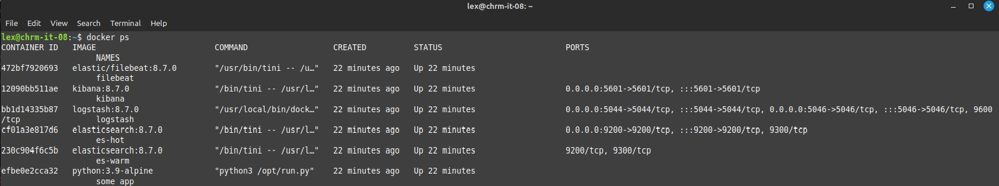
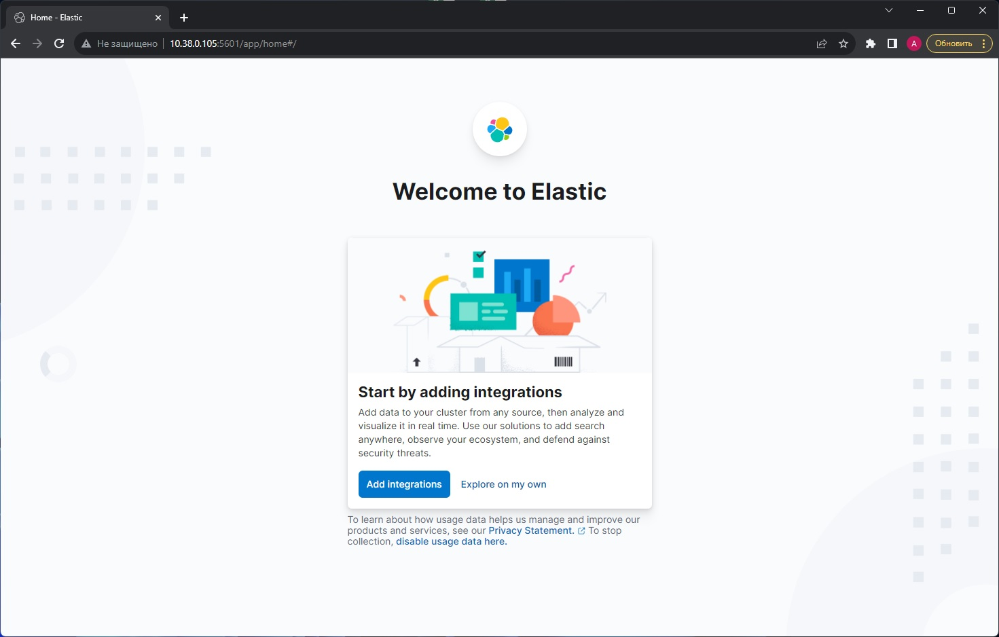
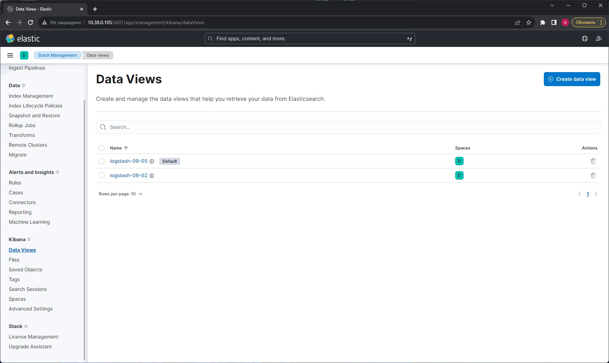
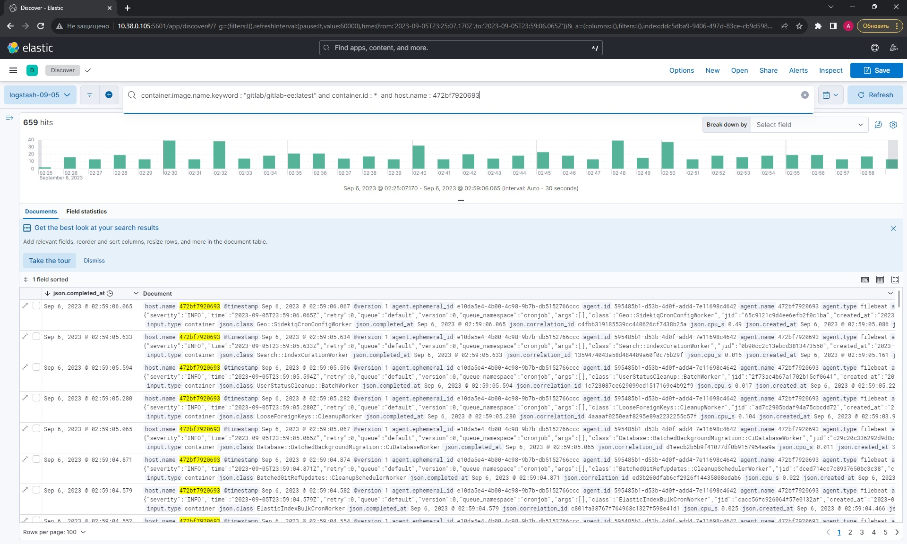

## Ответ на домашнее задание к 10-04 «Система сбора логов Elastic Stack»

1. Результатом выполнения задания должны быть:

* скриншот docker ps через 5 минут после старта всех контейнеров (их должно быть 5);

* скриншот интерфейса kibana;

* docker-compose манифест (если вы не использовали директорию help);
`Использовалась папка "help"`
* ваши yml-конфигурации для стека (если вы не использовали директорию help).
`Использовалась папка "help"`

2. Перейдите в меню создания index-patterns в kibana и создайте несколько index-patterns из имеющихся.

Перейдите в меню просмотра логов в kibana (Discover) и самостоятельно изучите, как отображаются логи и как производить поиск по логам.  

