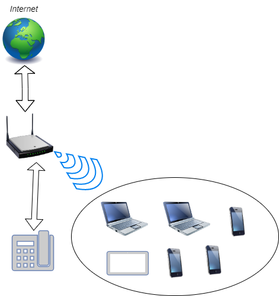

### Ответ на домашнее задание к занятию "3.8. Компьютерные сети, лекция 3"

1. telnet route-views.routeviews.org
```commandline
route-views>show ip route 213.79.86.190
Routing entry for 213.79.64.0/18, supernet
  Known via "bgp 6447", distance 20, metric 0
  Tag 6939, type external
  Last update from 64.71.137.241 1w4d ago
  Routing Descriptor Blocks:
  * 64.71.137.241, from 64.71.137.241, 1w4d ago
      Route metric is 0, traffic share count is 1
      AS Hops 2
      Route tag 6939
      MPLS label: none
route-views>

```
```commandline
route-views>show bgp 213.79.86.0/24
% Network not in table
route-views>

```
2. Создание интерфейса:
```commandline
vagrant@vagrant:~$ sudo -i
root@vagrant:~# echo "dummy" >> /etc/modules
root@vagrant:~# echo "options dummy numdummies=2" > /etc/modprobe.d/dummy.conf
root@vagrant:~# vi /etc/network/interfaces
# interfaces(5) file used by ifup(8) and ifdown(8)
# Include files from /etc/network/interfaces.d:
source-directory /etc/network/interfaces.d

auto dummy0
iface dummy0 inet static
    address 10.2.2.2/32
    pre-up ip link add dummy0 type dummy
    post-down ip link del dummy0`
    
root@vagrant:~# ifenslave -a
1: lo: <LOOPBACK,UP,LOWER_UP> mtu 65536 qdisc noqueue state UNKNOWN mode DEFAULT group default qlen 1000
    link/loopback 00:00:00:00:00:00 brd 00:00:00:00:00:00
2: eth0: <BROADCAST,MULTICAST,UP,LOWER_UP> mtu 1500 qdisc fq_codel state UP mode DEFAULT group default qlen 1000
    link/ether 08:00:27:59:cb:31 brd ff:ff:ff:ff:ff:ff
3: eth1: <BROADCAST,MULTICAST> mtu 1500 qdisc noop state DOWN mode DEFAULT group default qlen 1000
    link/ether 08:00:27:ee:cc:ae brd ff:ff:ff:ff:ff:ff
5: dummy0: <BROADCAST,NOARP,UP,LOWER_UP> mtu 1500 qdisc noqueue state UNKNOWN mode DEFAULT group default qlen 1000
    link/ether ce:4e:ca:40:c9:e7 brd ff:ff:ff:ff:ff:ff

```
Добавление статических маршрутов:
```commandline
root@vagrant:~# ip route add 192.168.10.0/24 dev dummy0
root@vagrant:~# ip route
default via 10.0.2.2 dev eth0 proto dhcp src 10.0.2.15 metric 100
10.0.2.0/24 dev eth0 proto kernel scope link src 10.0.2.15
10.0.2.2 dev eth0 proto dhcp scope link src 10.0.2.15 metric 100
192.168.10.0/24 dev dummy0 scope link

```
3. Порты TCP которые открыты в Ubuntu 
```commandline
root@vagrant:~# ss -altp
State        Recv-Q       Send-Q             Local Address:Port               Peer Address:Port      Process
LISTEN       0            4096               127.0.0.53%lo:domain                  0.0.0.0:*          users:(("systemd-resolve",pid=691,fd=13))
LISTEN       0            128                      0.0.0.0:ssh                     0.0.0.0:*          users:(("sshd",pid=2121,fd=3))
LISTEN       0            4096                   127.0.0.1:8125                    0.0.0.0:*          users:(("netdata",pid=2055,fd=60))
LISTEN       0            4096                     0.0.0.0:19999                   0.0.0.0:*          users:(("netdata",pid=2055,fd=4))
LISTEN       0            4096                           *:9100                          *:*          users:(("node_exporter",pid=2058,fd=3))
LISTEN       0            128                         [::]:ssh                        [::]:*          users:(("sshd",pid=2121,fd=4))


```
На данный момент прослушивают порты следующие программы: "sshd", "netdata", "node_exporter"
4. Порты UDP которые открыты в Ubuntu 
```commandline
root@vagrant:~# ss -alup
State        Recv-Q       Send-Q              Local Address:Port               Peer Address:Port      Process
UNCONN       0            0                       127.0.0.1:8125                    0.0.0.0:*          users:(("netdata",pid=2055,fd=41))
UNCONN       0            0                   127.0.0.53%lo:domain                  0.0.0.0:*          users:(("systemd-resolve",pid=691,fd=12))
UNCONN       0            0                  10.0.2.15%eth0:bootpc                  0.0.0.0:*          users:(("systemd-network",pid=666,fd=19))

```
На данный момент прослушивают UDP порты следующие программы: "netdata", "systemd-resolve", "systemd-network"  

5. Диаграмма L3 сети  

