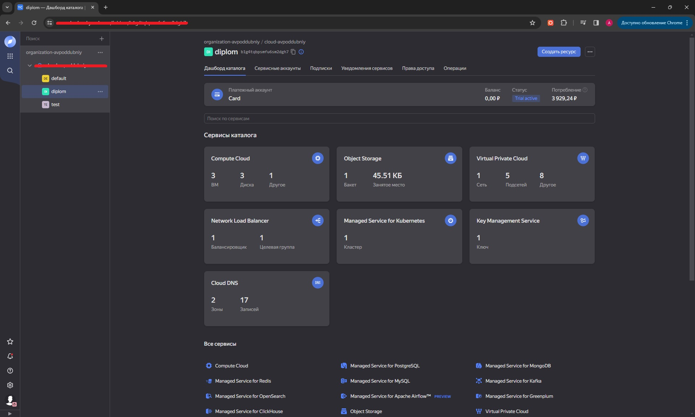
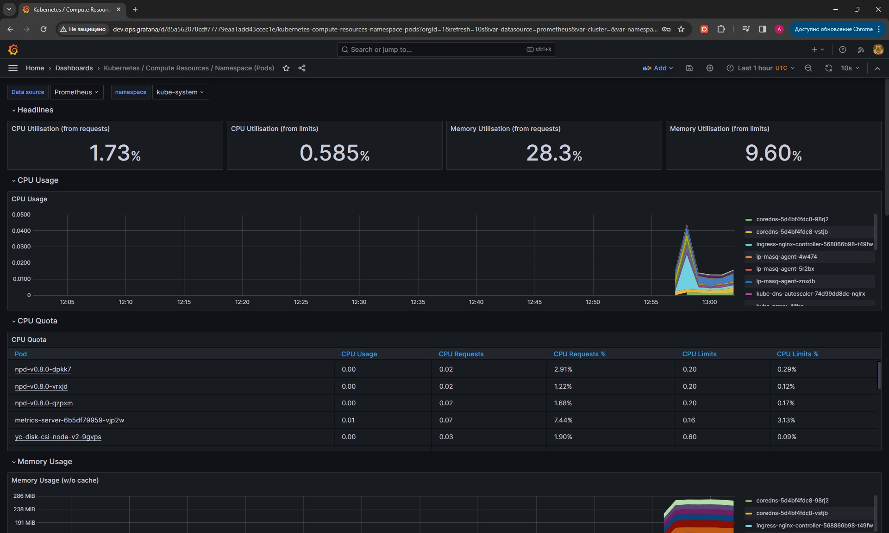
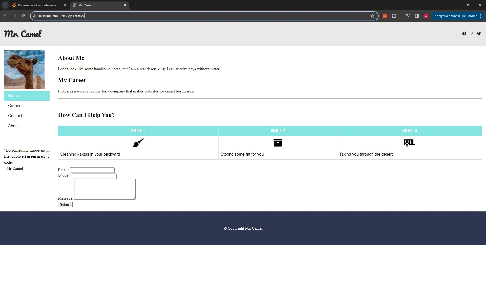
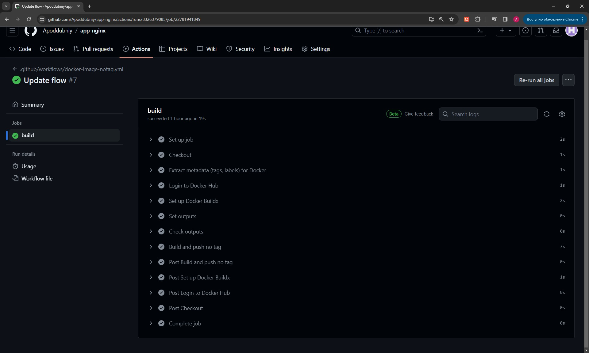

# Дипломный практикум


## Цели:
1. Подготовить облачную инфраструктуру на базе облачного провайдера Яндекс.Облако.
2. Запустить и сконфигурировать Kubernetes кластер.
3. Установить и настроить систему мониторинга.
4. Настроить и автоматизировать сборку тестового приложения с использованием Docker-контейнеров.
5. Настроить CI для автоматической сборки и тестирования.

---
## Создание облачной инфраструктуры

Для создания облачной инфраструктуры используется код из [директории terraform](./terraform).

Данный код поднимает всю необходимую инфраструктуру для задания, и устанавливает автоматически тестовое приложение и систему мониторинга с помощью helm провайдера для terraform.

Описание файлов проекта:
```commandline
tree /f        
Структура папок
│   helm.tf
│   kuber_cluster.tf
│   kuber_nodes.tf
│   main.tf
│   network.tf
│   sa.tf
│   sec_groups.tf
│   variables.tf
│
└───values
        chart-monitoring.yaml
        test-app.yaml

```
| Файл | Описание                                              |
|------|-------------------------------------------------------|
|helm.tf | описание провайдера helm, деплой в кластер kubernetes |
|kuber_cluster.tf | созадние регионального мастера кластера               | 
|kuber_nodes.tf| создание нод                                          |
|main.tf| описание бекэнда и провайдера                         |
|network.tf| созадние сети и подсетей в разных щзонах доступности  |
|sa.tf| созадние сервисного аккауна и ролей                   |
|sec_groups.tf| настройка security groups для сетей                   |
|variables.tf| файл с переменными                                    |
|values:|                                                       |
|* chart-monitoring.yaml| значения переменных для чарта мониторинга             |
|* test-app.yaml| значения перменных для чарта с тестовым приложением   |


Скриншот консоил после создания ресурсов: 



---
## Создание Kubernetes кластера

Для создания кластера Kubernetes используется код из файлов [kuber_cluster](terraform/kuber_cluster.tf) и [kuber_nodes](terraform/kuber_nodes.tf)

Подготовлен региональный мастер и 3 ноды в разных подсетях

Работоспособный Kubernetes кластер.
* В файле ~/.kube/config находятся данные для доступа к кластеру.

```commandline
kubectl cluster-info
Kubernetes control plane is running at https://158.160.153.219
CoreDNS is running at https://158.160.153.219/api/v1/namespaces/kube-system/services/kube-dns:dns/proxy

To further debug and diagnose cluster problems, use 'kubectl cluster-info dump'.


```
* Команда kubectl get pods --all-namespaces отрабатывает без ошибок.

```commandline
kubectl get pods --all-namespaces
NAMESPACE         NAME                                                        READY   STATUS    RESTARTS   AGE
default           test-app-nginx-static-7fd86f677c-82h9g                      1/1     Running   0          4m59s
default           test-app-nginx-static-7fd86f677c-hwv57                      1/1     Running   0          4m59s
default           test-app-nginx-static-7fd86f677c-ks2c9                      1/1     Running   0          4m59s
kube-monitoring   alertmanager-kube-monitoring-stack-kube-alertmanager-0      2/2     Running   0          4m3s
kube-monitoring   kube-monitoring-stack-grafana-58d99d8d5d-r4nmh              3/3     Running   0          4m11s
kube-monitoring   kube-monitoring-stack-kube-operator-74fc879884-6t59k        1/1     Running   0          4m11s
kube-monitoring   kube-monitoring-stack-kube-state-metrics-6b5d4ff44b-8cttp   1/1     Running   0          4m11s
kube-monitoring   kube-monitoring-stack-prometheus-node-exporter-2zlbm        1/1     Running   0          4m11s
kube-monitoring   kube-monitoring-stack-prometheus-node-exporter-7v6tw        1/1     Running   0          4m11s
kube-monitoring   kube-monitoring-stack-prometheus-node-exporter-b82bf        1/1     Running   0          4m11s
kube-monitoring   prometheus-kube-monitoring-stack-kube-prometheus-0          2/2     Running   0          4m3s
kube-system       coredns-5d4bf4fdc8-98rj2                                    1/1     Running   0          5m31s
kube-system       coredns-5d4bf4fdc8-vstjb                                    1/1     Running   0          8m53s
kube-system       ingress-nginx-controller-568866b98-t49fw                    1/1     Running   0          3m
kube-system       ip-masq-agent-4w474                                         1/1     Running   0          5m34s
kube-system       ip-masq-agent-5r2bx                                         1/1     Running   0          5m32s
kube-system       ip-masq-agent-znxdb                                         1/1     Running   0          5m46s
kube-system       kube-dns-autoscaler-74d99dd8dc-nqlrx                        1/1     Running   0          8m51s
kube-system       kube-proxy-4lfhs                                            1/1     Running   0          5m34s
kube-system       kube-proxy-4qdzq                                            1/1     Running   0          5m46s
kube-system       kube-proxy-59qzc                                            1/1     Running   0          5m32s
kube-system       metrics-server-6b5df79959-vjp2w                             2/2     Running   0          5m40s
kube-system       npd-v0.8.0-dpkk7                                            1/1     Running   0          5m46s
kube-system       npd-v0.8.0-qzpxm                                            1/1     Running   0          5m32s
kube-system       npd-v0.8.0-vrxjd                                            1/1     Running   0          5m34s
kube-system       yc-disk-csi-node-v2-9gvps                                   6/6     Running   0          5m46s
kube-system       yc-disk-csi-node-v2-sxn6l                                   6/6     Running   0          5m34s
kube-system       yc-disk-csi-node-v2-wrpbn                                   6/6     Running   0          5m32s
```
---
## Создание тестового приложения

Для создания тестового статичного сайта использовался код найденный на просторах интернета

* Git репозиторий с тестовым приложением и Dockerfile.
#### [Сыылка на репозиторй](https://github.com/Apoddubniy/app-nginx)
* Регистри с собранным docker image. В качестве регистри может быть DockerHub или Yandex Container Registry, созданный также с помощью terraform.
#### [Ссылка на реджистри](https://hub.docker.com/r/avpoddubniy/test-app/tags)

---

## Подготовка cистемы мониторинга и деплой приложения

Для разворачивания тестового приложения и мониторинга используется код и файла [helm.tf](terraform/helm.tf)

Разворачивается система мониторинга из чарта kube-prometheus, и разворачивается тестовое приложение из подготовленного образа в предыдущем репозитории и разворачивается 
сервис ингресс для внешнего доступа к приложениям:  

Добавляем IP-адрес ингресса в файл hosts:

```commandline
lex@chrm-it-08:~/diplom/terraform$ kubectl get ingress
NAME                    CLASS   HOSTS            ADDRESS           PORTS   AGE
test-app-nginx-static   nginx   dev.ops.static   158.160.153.250   80      35m
lex@chrm-it-08:~/diplom/terraform$ kubectl get ingress -n kube-monitoring
NAME                            CLASS   HOSTS             ADDRESS           PORTS   AGE
kube-monitoring-stack-grafana   nginx   dev.ops.grafana   158.160.153.250   80      35m

```
Пароль от Grafana указан в файле [chart-monitoring.yaml](values/chart-monitoring.yaml) в поле grafana.adminPassword

Настроенный мониторинг:



Тестовое приложение:



---
## Установка и настройка CI/CD

Для настройки ci/cd используется репозиторий с тестовым приложение на [github](https://github.com/Apoddubniy/app-nginx)
В данном репозитории настроен workflow для сборки тестового приложения и пуша получившегося образа в [Docker registry](https://hub.docker.com/r/avpoddubniy/test-app/tags)

