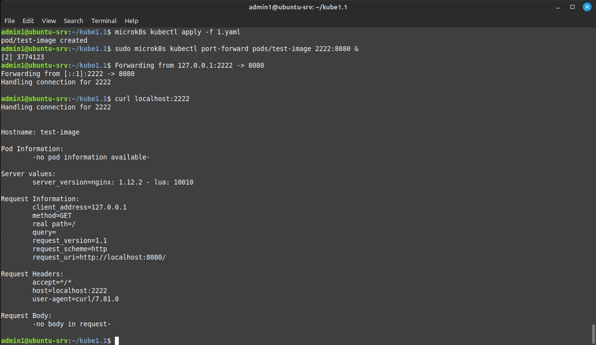
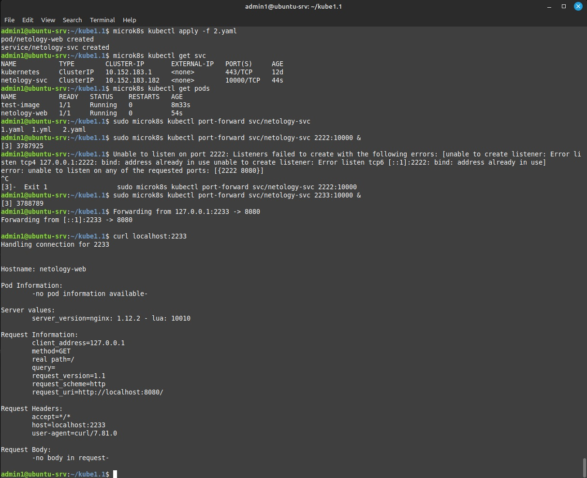

## Ответ на домашнее задание к 12-02 «Базовые объекты K8S»


### Задание 1. Создать Pod с именем hello-world
1. Создать манифест (yaml-конфигурацию) Pod.  
```yaml
apiVersion: v1
kind: Pod
metadata:
  name: test-image
spec:
  containers:
  - name: test-image
    image: gcr.io/kubernetes-e2e-test-images/echoserver:2.2
    ports:
    - containerPort: 8080
```
2. Использовать image - gcr.io/kubernetes-e2e-test-images/echoserver:2.2.  
`image: gcr.io/kubernetes-e2e-test-images/echoserver:2.2`
3. Подключиться локально к Pod с помощью kubectl port-forward и вывести значение (curl или в браузере). 



### Задание 2. Создать Service и подключить его к Pod
1. Создать Pod с именем netology-web.  
Строчка `name:  netology-web` в пункте 3 этого задания.
2. Использовать image — gcr.io/kubernetes-e2e-test-images/echoserver:2.2.  
Строчка `name: netology-svc` в пункте 3 этого задания.
3. Создать Service с именем netology-svc и подключить к netology-web.  
```yaml
---
apiVersion: v1
kind: Pod
metadata:
  name:  netology-web
  labels:
    key: netology-web
spec:
  containers:
    - name: netology-web
      image: gcr.io/kubernetes-e2e-test-images/echoserver:2.2
---
apiVersion: v1
kind: Service
metadata:
  name: netology-svc
spec:
  selector:
    key: netology-web
  ports:
  - protocol: TCP
    port: 10000
    targetPort: 8080
```
4. Подключиться локально к Service с помощью kubectl port-forward и вывести значение (curl или в браузере).  
