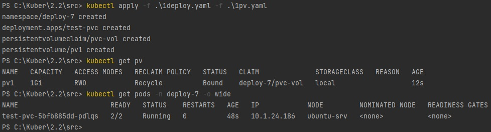
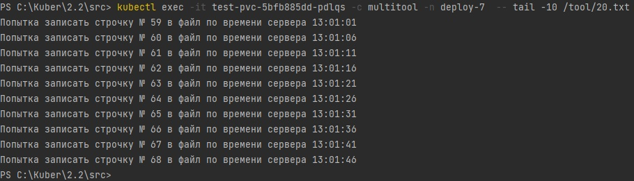
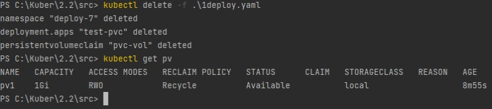
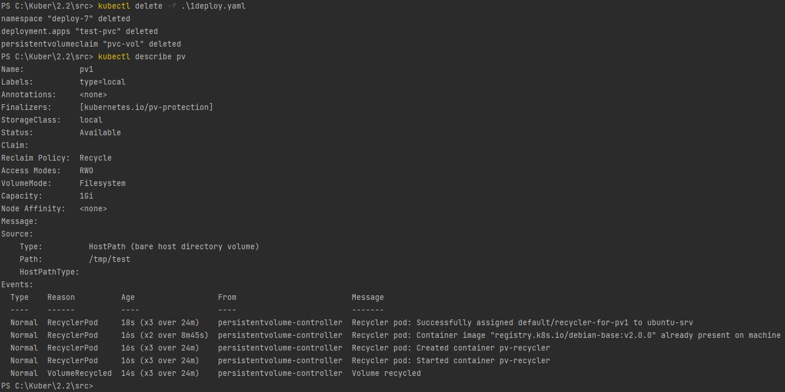
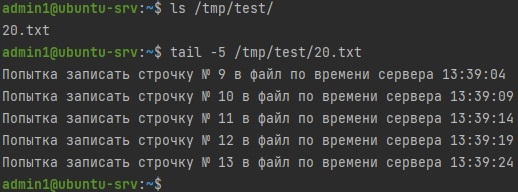
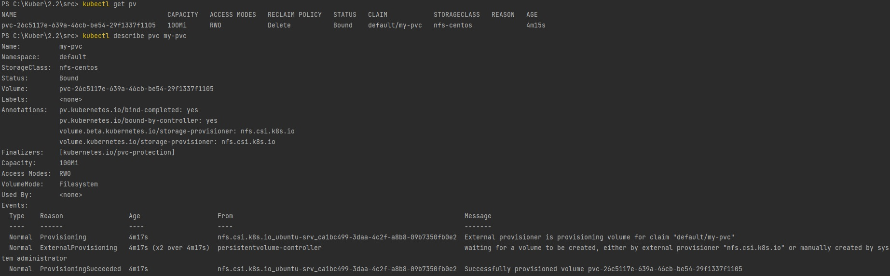
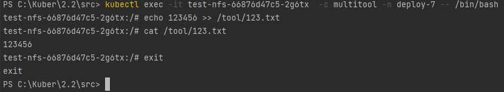
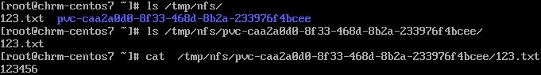

## Ответ на домашнее задание к 12-07 «Хранение в K8s. Часть 2»

### Задание 1
Что нужно сделать

Создать Deployment приложения, использующего локальный PV, созданный вручную.

1. Создать Deployment приложения, состоящего из контейнеров busybox и multitool.
#### [Ссылка на файл](src/1deploy.yaml)
2. Создать PV и PVC для подключения папки на локальной ноде, которая будет использована в поде.
#### [Ссылка на файл](src/1pv.yaml)

3. Продемонстрировать, что multitool может читать файл, в который busybox пишет каждые пять секунд в общей директории.

4. Удалить Deployment и PVC. Продемонстрировать, что после этого произошло с PV. Пояснить, почему.

`  persistentVolumeReclaimPolicy: Recycle - файл удалился с ноды, после удаления деплоймента и pvc.`

5. Продемонстрировать, что файл сохранился на локальном диске ноды. Удалить PV. Продемонстрировать что произошло с файлом после удаления PV. Пояснить, почему.

`После изменения параметра persistentVolumeReclaimPolicy: Recycle -> Retain, файлы в pv остались на месте после удаления deployment и pvc`

Подробный ответ на вопрос:  
ReclaimPolicy — определяет как будут использованы ресурсы после удаления PV  
* Retain — после удаления PV ресурсы из внешних провайдеров автоматически не удаляются.  
* Delete — после удаления PV ресурсы из внешних провайдеров автоматически удаляются (работает только в облачных Storage)  
* Recycle — [rm-rf] автоматически удаляет ресурсы (устаревшее)

6. Предоставить манифесты, а также скриншоты или вывод необходимых команд.

---
### Задание 2
Что нужно сделать

Создать Deployment приложения, которое может хранить файлы на NFS с динамическим созданием PV.

1. Включить и настроить NFS-сервер на MicroK8S.

2. Создать Deployment приложения состоящего из multitool, и подключить к нему PV, созданный автоматически на сервере NFS.  

#### [Ссылка на файл](src/2deploy.yaml)

3. Продемонстрировать возможность чтения и записи файла изнутри пода.  
`Скрин с консоли, пришлось делать внутри контейнера`

`Скрин с консоли сервера с ролью NFS  в папке /tmp/nfs`

4. Предоставить манифесты, а также скриншоты или вывод необходимых команд.