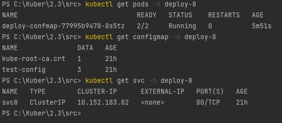
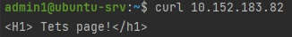
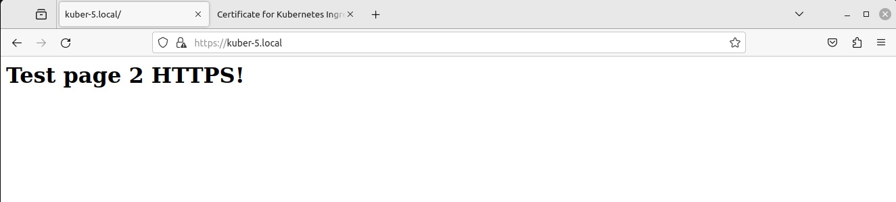

## Ответ на домашнее задание к 12-08 «Конфигурация приложений»

### Задание 1. Создать Deployment приложения и решить возникшую проблему с помощью ConfigMap. Добавить веб-страницу
1. Создать Deployment приложения, состоящего из контейнеров nginx и multitool.
#### [Ссылка на файл](src/1deploy.yaml)
2. Решить возникшую проблему с помощью ConfigMap.
3. Продемонстрировать, что pod стартовал и оба конейнера работают.



4. Сделать простую веб-страницу и подключить её к Nginx с помощью ConfigMap. Подключить Service и показать вывод curl или в браузере.



5. Предоставить манифесты, а также скриншоты или вывод необходимых команд.

---

### Задание 2. Создать приложение с вашей веб-страницей, доступной по HTTPS
1. Создать Deployment приложения, состоящего из Nginx.
#### [Ссылка на файл](src/2deploy.yaml)
2. Создать собственную веб-страницу и подключить её как ConfigMap к приложению.
3. Выпустить самоподписной сертификат SSL. Создать Secret для использования сертификата.  
```commandline
admin1@ubuntu-srv:~$ sudo openssl req -x509 -nodes -days 365 -newkey rsa:4096 -keyout deploy-8-2.key -out deploy-8-2.crt
You are about to be asked to enter information that will be incorporated
into your certificate request.
What you are about to enter is what is called a Distinguished Name or a DN.
There are quite a few fields but you can leave some blank
For some fields there will be a default value,
If you enter '.', the field will be left blank.
-----
Country Name (2 letter code) [AU]:RU
State or Province Name (full name) [Some-State]:MSK
Locality Name (eg, city) []:MSK
Organization Name (eg, company) [Internet Widgits Pty Ltd]:Local
Organizational Unit Name (eg, section) []:PC
Common Name (e.g. server FQDN or YOUR name) []:kuber-5.local
Email Address []:

```
4. Создать Ingress и необходимый Service, подключить к нему SSL в вид. Продемонстировать доступ к приложению по HTTPS.
5. Предоставить манифесты, а также скриншоты или вывод необходимых команд.

