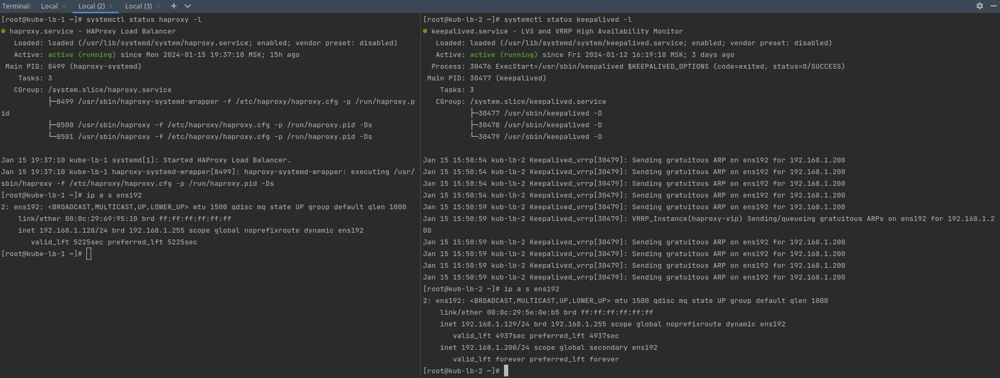
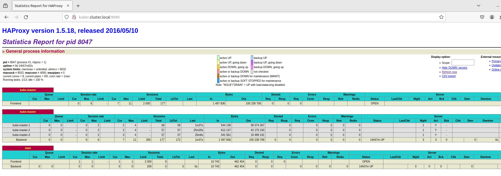

## Домашнее задание к занятию «Установка Kubernetes»

### Цель задания
Установить кластер K8s.

### Чеклист готовности к домашнему заданию
Развёрнутые ВМ с ОС Ubuntu 20.04-lts.

### Задание 2*. Установить HA кластер
1. Установить кластер в режиме HA.
2. Использовать нечётное количество Master-node.
3. Для cluster ip использовать keepalived или другой способ.

---
### Решение
#### Переходим сразу к заданию №2 и устанавливаем кластер в НА режиме.  

Реализована следующая схема:

| Node                | IP            | Role |
|---------------------|---------------|-----|
| kube-master-1       | 192.168.1.112 | master, etcd|
| kube-master-2       | 192.168.1.111 | master, etcd|
| kube-master-3       | 192.168.1.110 | master, etcd|
| kube-worker-1       | 192.168.1.109 | worker|
| kube-worker-2       | 192.168.1.108 | worker|
| kube-lb-1           | 192.168.1.128 | 	Keepalived & HAproxy|
| kube-lb-2           | 192.168.1.129 | 	Keepalived & HAproxy|
| kuber.cluster.local | 192.168.1.200 | Virtual IP address|


* Были подготовлены виртуальные машины из образа [flatcar](https://www.flatcar.org/releases), в количестве 5 шт.  
* Установка производилась через Kubespray последней версии. Подготовлена конфигруация, и изменены некоторые значения.

```commandline
core@kube-master-1 ~ $ sudo kubectl cluster-info
Kubernetes control plane is running at https://kuber.cluster.local:6443

To further debug and diagnose cluster problems, use 'kubectl cluster-info dump'.
core@kube-master-1 ~ $ nslookup kuber.cluster.local
;; Got recursion not available from 169.254.25.10, trying next server
Server:         192.168.1.1
Address:        192.168.1.1#53

Name:   kuber.cluster.local
Address: 192.168.1.200
;; Got recursion not available from 169.254.25.10, trying next server

```

```commandline
PS C:\Kuber> kubectl get nodes -o wide
NAME            STATUS   ROLES           AGE     VERSION   INTERNAL-IP     EXTERNAL-IP   OS-IMAGE                                             KERNEL-VERSION     CONTAINER-RUNTIME
kube-master-1   Ready    control-plane   4d13h   v1.28.4   192.168.1.112   <none>        Flatcar Container Linux by Kinvolk 3602.2.3 (Oklo)   5.15.142-flatcar   containerd://1.7.11
kube-master-2   Ready    control-plane   4d13h   v1.28.4   192.168.1.111   <none>        Flatcar Container Linux by Kinvolk 3602.2.3 (Oklo)   5.15.142-flatcar   containerd://1.7.11
kube-master-3   Ready    control-plane   4d13h   v1.28.4   192.168.1.110   <none>        Flatcar Container Linux by Kinvolk 3602.2.3 (Oklo)   5.15.142-flatcar   containerd://1.7.11
kube-worker-1   Ready    <none>          4d13h   v1.28.4   192.168.1.109   <none>        Flatcar Container Linux by Kinvolk 3602.2.3 (Oklo)   5.15.142-flatcar   containerd://1.7.11
kube-worker-2   Ready    <none>          4d13h   v1.28.4   192.168.1.108   <none>        Flatcar Container Linux by Kinvolk 3602.2.3 (Oklo)   5.15.142-flatcar   containerd://1.7.11

```
* Для балансировщика нагрузки `HA Proxy` и `keepalive` использовались 2 виртуальные машины с Centos 7.


* Выделен виртуальный ip-адрес для балансировки нагрузки.
* Настроен днс сервер для доменного имени с ip балансировщика.


* ИТОГ:

```commandline
PS C:\Kuber> kubectl get pods -n kube-system
NAME                                      READY   STATUS    RESTARTS        AGE
calico-kube-controllers-648dffd99-czpn9   1/1     Running   0               4d14h
calico-node-85k76                         1/1     Running   0               4d14h
calico-node-m9wq4                         1/1     Running   0               4d14h
calico-node-r2x66                         1/1     Running   0               4d14h
calico-node-v9p6z                         1/1     Running   0               4d14h
calico-node-w25xp                         1/1     Running   0               4d14h
coredns-77f7cc69db-6d6zw                  1/1     Running   0               4d14h
coredns-77f7cc69db-967vz                  1/1     Running   0               4d14h
dns-autoscaler-8576bb9f5b-v27pb           1/1     Running   0               4d14h
kube-apiserver-kube-master-1              1/1     Running   0               4d14h
kube-apiserver-kube-master-2              1/1     Running   0               4d14h
kube-apiserver-kube-master-3              1/1     Running   0               4d14h
kube-controller-manager-kube-master-1     1/1     Running   2 (4d14h ago)   4d14h
kube-controller-manager-kube-master-2     1/1     Running   2 (4d14h ago)   4d14h
kube-controller-manager-kube-master-3     1/1     Running   1               4d14h
kube-proxy-54bbv                          1/1     Running   0               57m
kube-proxy-95l7v                          1/1     Running   0               57m
kube-proxy-fhpqc                          1/1     Running   0               57m
kube-proxy-mqv5m                          1/1     Running   0               57m
kube-proxy-nzfz9                          1/1     Running   0               57m
kube-scheduler-kube-master-1              1/1     Running   1               4d14h
kube-scheduler-kube-master-2              1/1     Running   1               4d14h
kube-scheduler-kube-master-3              1/1     Running   1               4d14h
nginx-proxy-kube-worker-1                 1/1     Running   0               4d14h
nginx-proxy-kube-worker-2                 1/1     Running   0               4d14h
nodelocaldns-8lkst                        1/1     Running   1 (4d14h ago)   4d14h
nodelocaldns-9b6m6                        1/1     Running   2 (4d14h ago)   4d14h
nodelocaldns-9wm2t                        1/1     Running   0               4d14h
nodelocaldns-rfl4j                        1/1     Running   0               4d14h
nodelocaldns-zcxd6                        1/1     Running   2 (14h ago)     4d14h

```

