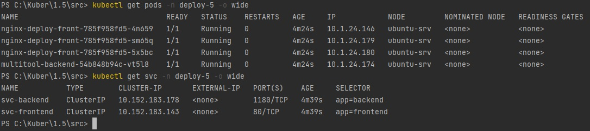
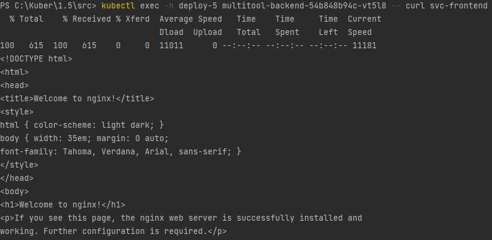
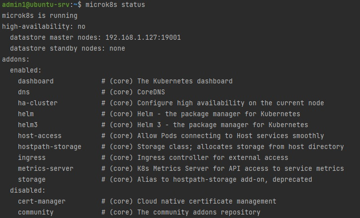
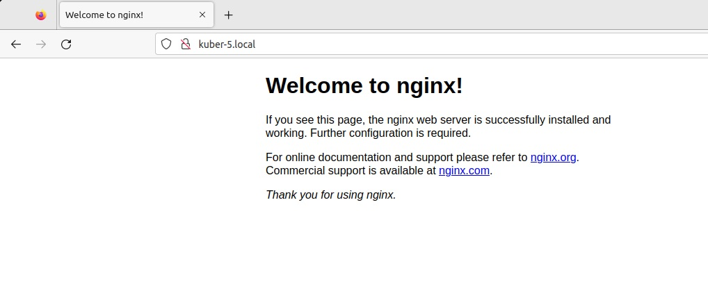
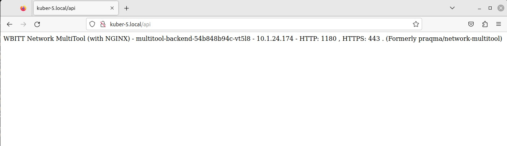

## Ответ на домашнее задание к 12-05 «Сетевое взаимодействие в K8S. Часть 2»

### Задание 1. Создать Deployment приложений backend и frontend
1. Создать Deployment приложения frontend из образа nginx с количеством реплик 3 шт.
### [Ссылка на манифест nginx](src/1nginx.yaml)
2. Создать Deployment приложения backend из образа multitool.
### [Ссылка на манифест multitool](src/1multitool.yaml)
3. Добавить Service, которые обеспечат доступ к обоим приложениям внутри кластера.

4. Продемонстрировать, что приложения видят друг друга с помощью Service.
  
``
  
5. Предоставить манифесты Deployment и Service в решении, а также скриншоты или вывод команды п.4.  

### Задание 2. Создать Ingress и обеспечить доступ к приложениям снаружи кластера
1. Включить Ingress-controller в MicroK8S.

2. Создать Ingress, обеспечивающий доступ снаружи по IP-адресу кластера MicroK8S так, чтобы при запросе только по адресу открывался frontend а при добавлении /api - backend.
### [Ссылка на манифест ingress](src/ingress.yaml)
3. Продемонстрировать доступ с помощью браузера или curl с локального компьютера.

``

4. Предоставить манифесты и скриншоты или вывод команды п.2.