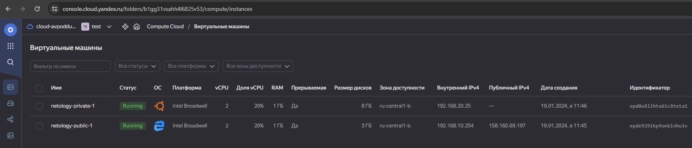
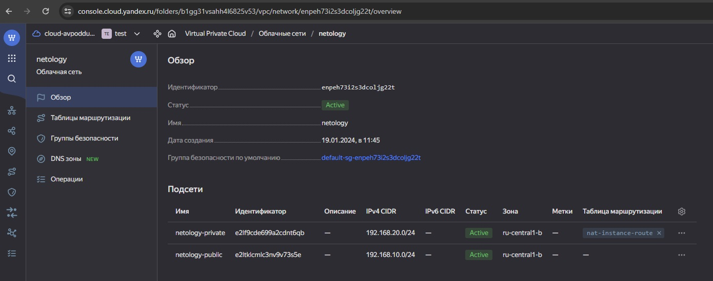

## Домашнее задание к занятию «Организация сети»

### Задание 1. Yandex Cloud 

**Что нужно сделать**

1. Создать пустую VPC. Выбрать зону.
2. Публичная подсеть.

 - Создать в VPC subnet с названием public, сетью 192.168.10.0/24.
 - Создать в этой подсети NAT-инстанс, присвоив ему адрес 192.168.10.254. В качестве image_id использовать fd80mrhj8fl2oe87o4e1.
 - Создать в этой публичной подсети виртуалку с публичным IP, подключиться к ней и убедиться, что есть доступ к интернету.
3. Приватная подсеть.
 - Создать в VPC subnet с названием private, сетью 192.168.20.0/24.
 - Создать route table. Добавить статический маршрут, направляющий весь исходящий трафик private сети в NAT-инстанс.
 - Создать в этой приватной подсети виртуалку с внутренним IP, подключиться к ней через виртуалку, созданную ранее, и убедиться, что есть доступ к интернету.

---
### Решение:
**Файлы проекта**  

| Ссылка | Описание                                   |
|---|--------------------------------------------|
| [main](src/main.tf)| Создаются сети, таблица маршрутизации.     |
| [providers](src/providers.tf)| Описание провайдера                        |
| [security](src/security.tf)| Создаются правила в security groups + ICMP |
|[variable](src/variables.tf)| Переменные в проекте                       |
|[vms](src/vms.tf)| Создание инстансов, 2 шт.                  |
|[personal data](src/personal.auto.tfvars)| Файл с id для авторизации                  |

### Результаты:
После создания через `terraform apply` картина следующая:

* Виртуальные машины:


* Сети


С помощью настроеных на вход правил подключаемся сразу на NAT-инстанс, по внешнему IP:
```commandline
lex@chrm-it-08:~/clopro-homework/15.1$ ssh ubuntu@158.160.69.197
Welcome to Ubuntu 18.04.1 LTS (GNU/Linux 4.15.0-29-generic x86_64)
.....
To run a command as administrator (user "root"), use "sudo <command>".
See "man sudo_root" for details.

ubuntu@epde929ikp9onblnhu1v:~$ ip a s
1: lo: <LOOPBACK,UP,LOWER_UP> mtu 65536 qdisc noqueue state UNKNOWN group default qlen 1000
    link/loopback 00:00:00:00:00:00 brd 00:00:00:00:00:00
    inet 127.0.0.1/8 scope host lo
       valid_lft forever preferred_lft forever
    inet6 ::1/128 scope host 
       valid_lft forever preferred_lft forever
2: eth0: <BROADCAST,MULTICAST,UP,LOWER_UP> mtu 1500 qdisc mq state UP group default qlen 1000
    link/ether d0:0d:e4:89:32:a6 brd ff:ff:ff:ff:ff:ff
    inet 192.168.10.254/24 brd 192.168.10.255 scope global eth0
       valid_lft forever preferred_lft forever
    inet6 fe80::d20d:e4ff:fe89:32a6/64 scope link 
       valid_lft forever preferred_lft forever
ubuntu@epde929ikp9onblnhu1v:~$ ping 192.168.20.25
PING 192.168.20.25 (192.168.20.25) 56(84) bytes of data.
64 bytes from 192.168.20.25: icmp_seq=1 ttl=61 time=1.55 ms
64 bytes from 192.168.20.25: icmp_seq=2 ttl=61 time=0.462 ms
^C
--- 192.168.20.25 ping statistics ---
2 packets transmitted, 2 received, 0% packet loss, time 1001ms
rtt min/avg/max/mdev = 0.462/1.006/1.551/0.545 ms
ubuntu@epde929ikp9onblnhu1v:~$ ping 8.8.8.8
PING 8.8.8.8 (8.8.8.8) 56(84) bytes of data.
64 bytes from 8.8.8.8: icmp_seq=1 ttl=58 time=23.7 ms
64 bytes from 8.8.8.8: icmp_seq=2 ttl=58 time=23.3 ms
^C
--- 8.8.8.8 ping statistics ---
2 packets transmitted, 2 received, 0% packet loss, time 1001ms
rtt min/avg/max/mdev = 23.371/23.572/23.773/0.201 ms
ubuntu@epde929ikp9onblnhu1v:~$ 


```

- Как видим: выход в интернет у него есть, и доступ до локального инстанса тоже есть.

Подключаемся через джамп-хост в виде nat-инстанса на локальную машину.
```commandline
lex@chrm-it-08:~/clopro-homework/15.1$ ssh -J ubuntu@158.160.69.197 ubuntu@192.168.20.25
Welcome to Ubuntu 22.04.3 LTS (GNU/Linux 5.15.0-91-generic x86_64)

 * Documentation:  https://help.ubuntu.com
 * Management:     https://landscape.canonical.com
 * Support:        https://ubuntu.com/advantage

  System information as of Fri Jan 19 08:55:31 AM UTC 2024

  System load:  0.0               Processes:             126
  Usage of /:   53.7% of 7.79GB   Users logged in:       0
  Memory usage: 23%               IPv4 address for eth0: 192.168.20.25
  Swap usage:   0%


Expanded Security Maintenance for Applications is not enabled.

0 updates can be applied immediately.

Enable ESM Apps to receive additional future security updates.
See https://ubuntu.com/esm or run: sudo pro status


Last login: Fri Jan 19 08:48:32 2024 from 192.168.10.254
To run a command as administrator (user "root"), use "sudo <command>".
See "man sudo_root" for details.

ubuntu@epd8o8lihto61c8teta1:~$ ip a s
1: lo: <LOOPBACK,UP,LOWER_UP> mtu 65536 qdisc noqueue state UNKNOWN group default qlen 1000
    link/loopback 00:00:00:00:00:00 brd 00:00:00:00:00:00
    inet 127.0.0.1/8 scope host lo
       valid_lft forever preferred_lft forever
    inet6 ::1/128 scope host 
       valid_lft forever preferred_lft forever
2: eth0: <BROADCAST,MULTICAST,UP,LOWER_UP> mtu 1500 qdisc mq state UP group default qlen 1000
    link/ether d0:0d:8c:22:b2:8f brd ff:ff:ff:ff:ff:ff
    altname enp138s0
    altname ens8
    inet 192.168.20.25/24 metric 100 brd 192.168.20.255 scope global eth0
       valid_lft forever preferred_lft forever
    inet6 fe80::d20d:8cff:fe22:b28f/64 scope link 
       valid_lft forever preferred_lft forever
ubuntu@epd8o8lihto61c8teta1:~$ ping 192.168.10.254
PING 192.168.10.254 (192.168.10.254) 56(84) bytes of data.
64 bytes from 192.168.10.254: icmp_seq=1 ttl=61 time=1.29 ms
64 bytes from 192.168.10.254: icmp_seq=2 ttl=61 time=0.562 ms
64 bytes from 192.168.10.254: icmp_seq=3 ttl=61 time=0.735 ms
64 bytes from 192.168.10.254: icmp_seq=4 ttl=61 time=0.606 ms
^C
--- 192.168.10.254 ping statistics ---
4 packets transmitted, 4 received, 0% packet loss, time 3048ms
rtt min/avg/max/mdev = 0.562/0.797/1.285/0.288 ms
ubuntu@epd8o8lihto61c8teta1:~$ ping 8.8.8.8
PING 8.8.8.8 (8.8.8.8) 56(84) bytes of data.
64 bytes from 8.8.8.8: icmp_seq=1 ttl=54 time=22.9 ms
64 bytes from 8.8.8.8: icmp_seq=2 ttl=54 time=22.2 ms
64 bytes from 8.8.8.8: icmp_seq=3 ttl=54 time=22.1 ms
^C
--- 8.8.8.8 ping statistics ---
3 packets transmitted, 3 received, 0% packet loss, time 2003ms
rtt min/avg/max/mdev = 22.108/22.403/22.947/0.384 ms
ubuntu@epd8o8lihto61c8teta1:~$ 

```
* Доступ в интернет присутствует.
