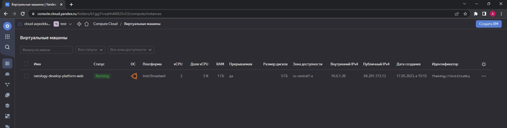
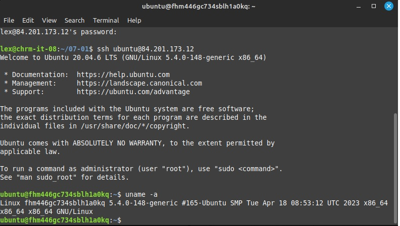
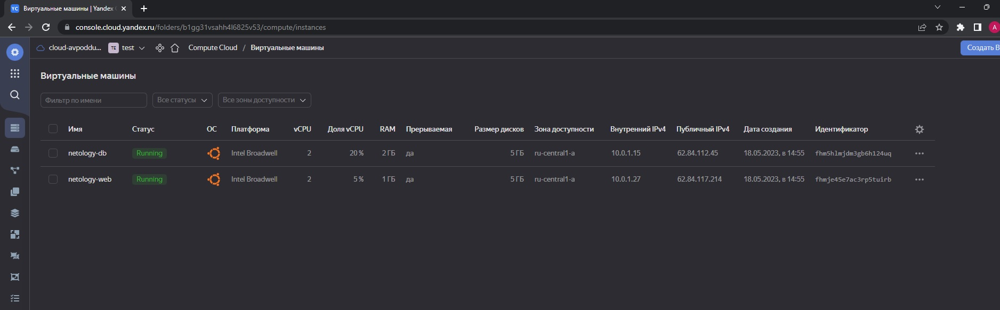

 ### Ответ на домашнее задание к 07-02 «Основы Terraform. Yandex Cloud»
 

задание №0 
1. Ознакомился
2. Доступ к данному разделу имеется.


***Ответ на задание № 1***  

1. Изучите проект. В файле variables.tf объявлены переменные для yandex provider.
`Выполнено, переменные установлены.`
2. Переименуйте файл personal.auto.tfvars_example в personal.auto.tfvars. Заполните переменные (идентификаторы облака, токен доступа). Благодаря .gitignore этот файл не попадет в публичный репозиторий. **Вы можете выбрать иной способ безопасно передать секретные данные в terraform.**  
`Файл переименован и записаны переменные`.
3. Сгенерируйте или используйте свой текущий ssh ключ. Запишите его открытую часть в переменную **vms_ssh_root_key**.
Записано:
```html
variable "vms_ssh_root_key" {
  type        = string
  default     = "ssh-ed25519 AAAAC3N...."
```
4. Инициализируйте проект, выполните код. Исправьте возникшую ошибку. Ответьте в чем заключается ее суть?  
Ошибка:
```commandline
InvalidArgument desc = the specified number of cores is not available on platform "standard-v1"; allowed core number: 2, 4
│ 
│   with yandex_compute_instance.platform,
│   on main.tf line 15, in resource "yandex_compute_instance" "platform":
│   15: resource "yandex_compute_instance" "platform" {

```
Суть ошибки в следующем: для платформы `standart-v1` разрешено только четное количество ядер процессора:  
5. Ответьте, как в процессе обучения могут пригодиться параметры```preemptible = true``` и ```core_fraction=5``` в параметрах ВМ? Ответ в документации Yandex cloud.
* `preemptible = true` это параметр для создания прерываемой виртуальной машины, которые удаляются спустя 24 часа и в разы отличаются по стоимости в меньшую сторону. Странно и почему я раньше этого не видел.
* `core_fraction=5` Basic vCPU performance level, этот уровень определяет долю вычислительного времени физических ядер, которую гарантирует vCPU.  
Скриншоты:



***Ответ на задание № 2***

1. Изучите файлы проекта.   
`Выполнено`
2. Замените все "хардкод" **значения** для ресурсов **yandex_compute_image** и **yandex_compute_instance** на **отдельные** переменные. К названиям переменных ВМ добавьте в начало префикс **vm_web_** .  Пример: **vm_web_name**.
```commandline
data "yandex_compute_image" "vm_web_image" {
  family = var.image_family
}
  resource "yandex_compute_instance" "vm_web_instance" {
    name = var.instance_ubuntu
    resources {
      cores         = 2
      memory        = 1
      core_fraction = 5
    }
    ........
```
3. Объявите нужные переменные в файле variables.tf, обязательно указывайте тип переменной. Заполните их **default** прежними значениями из main.tf.
```html
variable "image_family" {
  description = "name image in yc"
  default = "ubuntu-2004-lts"
}

variable "instance_ubuntu" {
  description = "shortname"
  default = "vm_web_name"
}
```
4. Проверьте terraform plan (изменений быть не должно). 
<details>
<summary>Результат terraform plan</summary>

```commandline
lex@chrm-it-08:~/terraform/07-02/src$ terraform plan
data.yandex_compute_image.ubuntu: Reading...
yandex_vpc_network.develop: Refreshing state... [id=enp669kh4ej85e46f719]
data.yandex_compute_image.ubuntu: Read complete after 0s [id=fd8qssu7gclkmoi9flt4]
yandex_vpc_subnet.develop: Refreshing state... [id=e9b25dr29jiipqeie3dp]
yandex_compute_instance.platform: Refreshing state... [id=fhmm43kbtqlt9mmq1m4d]

No changes. Your infrastructure matches the configuration.

Terraform has compared your real infrastructure against your configuration and found no differences, so no
changes are needed.
```
</details>

***Ответ на задание № 3***

1. Создайте в корне проекта файл 'vms_platform.tf' . Перенесите в него все переменные первой ВМ.
2. Скопируйте блок ресурса и создайте с его помощью вторую ВМ(в файле main.tf): **"netology-develop-platform-db"** ,  cores  = 2, memory = 2, core_fraction = 20. Объявите ее переменные с префиксом **vm_db_** в том же файле('vms_platform.tf').
3. Примените изменения.

Ответ сразу на 3 вопроса, даже делить не буду:
* Содержимое файла vms_platform.tf
```commandline
variable "instance_ubuntu_db" {
  description = "shortname"
  default = "netology-develop-platform_"
}

variable "platform_db" {
  default = "standard-v1"
}
```
Скриншот запуска ВМ из консоли:


***Ответ на задание № 4***

```commandline
Apply complete! Resources: 4 added, 0 changed, 0 destroyed.

Outputs:

ip_db = "{netology-db = 158.160.56.63}"
ip_web = "{netology-web = 51.250.90.240}"
lex@chrm-it-08:~/terraform/07-02/src$ terrform output
terrform: command not found
lex@chrm-it-08:~/terraform/07-02/src$ terraform output
ip_db = "{netology-db = 158.160.56.63}"
ip_web = "{netology-web = 51.250.90.240}"


```

***Ответ на задание № 5***

1. 
Переменные:
```commandline
locals {
  name_suffix_web = "${var.prod_name_suff}-${var.instance_web}"
  name_suffix_db = "${var.prod_name_suff}-${var.instance_db}"
}
```
2. 
Имена машин:
```commandline
resource "yandex_compute_instance" "web" {
    name = local.name_suffix_web
    ,,,,,,,

resource "yandex_compute_instance" "db" {
    name        = local.name_suffix_db

```


***Ответ на задание № 6***

* Вместо использования 3-х переменных ".._cores",".._memory",".._core_fraction" в блоке resources {...}, объедените их в переменные типа map с именами "vm_web_resources" и "vm_db_resources".
`Добавлены переменные в файл locals.tf`
* Так же поступите с блоком metadata {serial-port-enable, ssh-keys}, эта переменная должна быть общая для всех ваших ВМ.
`Добавлены переменные в файл locals.tf`
* Найдите и удалите все более не используемые переменные проекта.
`Удалил`
* Проверьте terraform plan (изменений быть не должно).

<details>
<summary>Результат terraform plan(без изменений)</summary>

```commandline
lex@chrm-it-08:~/terraform/07-02/src$ terraform plan
data.yandex_compute_image.ubuntu: Reading...
yandex_vpc_network.develop: Refreshing state... [id=enp6t3g36lcs4mg944tf]
data.yandex_compute_image.bubuntu: Reading...
data.yandex_compute_image.ubuntu: Read complete after 0s [id=fd8qssu7gclkmoi9flt4]
data.yandex_compute_image.bubuntu: Read complete after 0s [id=fd8qssu7gclkmoi9flt4]
yandex_vpc_subnet.develop: Refreshing state... [id=e9bljppujjvhcc9cg0vj]
yandex_compute_instance.platform: Refreshing state... [id=fhmf6dbl11qkmogv7ild]
yandex_compute_instance.db: Refreshing state... [id=fhml6mt1llvs210i7hul]

No changes. Your infrastructure matches the configuration.

Terraform has compared your real infrastructure against your configuration and found no differences, so no
changes are needed.


```
</details>

***Ответ на задание № 7***

1. Напишите, какой командой можно отобразить второй элемент списка test_list?
```commandline
> local.test_list[1]
"staging"

```
2. Найдите длину списка test_list с помощью функции length(<имя переменной>).
```commandline
> length(local.test_list)
3

```
3. Напишите, какой командой можно отобразить значение ключа admin из map test_map ?
```commandline
> local.test_map.admin
"John"

```
4. Напишите interpolation выражение, результатом которого будет: "John is admin for production server based on OS ubuntu-20-04 with X vcpu, Y ram and Z virtual disks", используйте данные из переменных test_list, test_map, servers и функцию length() для подстановки значений.
```commandline
> "${local.test_map.admin} is admin for ${local.test_list[2]} server based on OS ${local.servers[local.test_list[2]].image} with ${local.servers[local.test_list[2]].cpu} vcpu, ${local.servers[local.test_list[2]].ram} ram and ${length(local.servers[local.test_list[2]].disks)} virtual disks"
"John is admin for production server based on OS ubuntu-20-04 with 10 vcpu, 40 ram and 4 virtual disks"

```