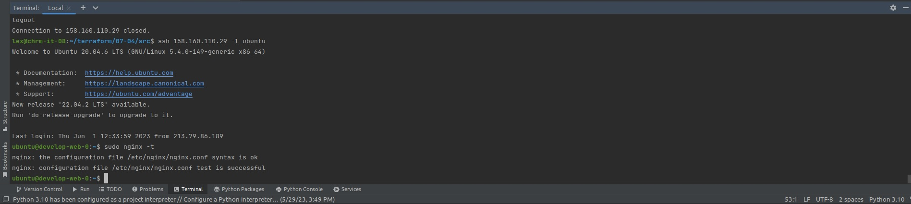

### Ответ на домашнее задание к 07-03 «Продвинутые методы работы с Terraform»

***Ответ на задание № 1*** 

* Возьмите из демонстрации к лекции готовый код для создания ВМ с помощью remote модуля.  
`Скопировано`
* Создайте 1 ВМ, используя данный модуль. В файле cloud-init.yml необходимо использовать переменную для ssh ключа вместо хардкода. Передайте ssh-ключ в функцию template_file в блоке vars ={} . Воспользуйтесь примером. Обратите внимание что ssh-authorized-keys принимает в себя список, а не строку!  
`В файле  cloud-init.yml исправлено на это  - ${ssh_public_key}`
* Добавьте в файл cloud-init.yml установку nginx.  
`Дописано в конце файла "nginx"`
* Предоставьте скриншот подключения к консоли и вывод команды sudo nginx -t.  



***Ответ на задание № 2*** 

* Напишите локальный модуль vpc, который будет создавать 2 ресурса: одну сеть и одну подсеть в зоне, объявленной при вызове модуля. например: ru-central1-a.  
```commandline
lex@chrm-it-08:~/terraform/07-04/src$ terraform init

Initializing the backend...
Initializing modules...
- vpc_dev in vpc
.....
```
`Вот один или два параметра проще вручную записать. Сделаный модуль будет в папке src/vpc`
* Модуль должен возвращать значения vpc.id и subnet.id  
`Как то так.`
```commandline
output "vpc_id" {
  value = yandex_vpc_network.develop.id
}

output "vpc_subnet" {
  value = yandex_vpc_subnet.develop.id

}
```
`Вызов модуля: я не знаю как я это сделал, но он работает`
```commandline
module "vpc_dev" {
  source = "./vpc"
  env_name = "develop"
  subnet_zones = "ru-central1-a"
  cidr = ["10.0.1.0/24"]
  network_id = ""
  subnet_id = ""
}
```
* Замените ресурсы yandex_vpc_network и yandex_vpc_subnet, созданным модулем.  
`Тут вот так`
```commandline
  network_id      = module.vpc_dev.vpc_id
  subnet_ids      = [module.vpc_dev.vpc_subnet]
```
* Сгенерируйте документацию к модулю с помощью terraform-docs.  


***Ответ на задание № 3***
* Выведите список ресурсов в стейте.  
```commandline
lex@chrm-it-08:~/terraform/07-04/src$ terraform state list
data.template_file.cloudinit
module.test-vm.data.yandex_compute_image.my_image
module.test-vm.yandex_compute_instance.vm[0]
module.vpc_dev.yandex_vpc_network.develop
module.vpc_dev.yandex_vpc_subnet.develop

```
* Удалите из стейта модуль vpc.  
```commandline
lex@chrm-it-08:~/terraform/07-04/src$ terraform state rm 'module.vpc_dev.yandex_vpc_network.develop'
Removed module.vpc_dev.yandex_vpc_network.develop
Successfully removed 1 resource instance(s).
lex@chrm-it-08:~/terraform/07-04/src$ terraform state rm 'module.vpc_dev.yandex_vpc_subnet.develop'
Removed module.vpc_dev.yandex_vpc_subnet.develop
Successfully removed 1 resource instance(s).

```
* Импортируйте его обратно. Проверьте terraform plan - изменений быть не должно. Приложите список выполненных команд и вывод.
<details>
<summary>Список команд</summary>

```commandline
lex@chrm-it-08:~/terraform/07-04/src$ terraform import  'module.vpc_dev.yandex_vpc_network.develop' 'enp61btdufntgcrtdetn'
data.template_file.cloudinit: Reading...
data.template_file.cloudinit: Read complete after 0s [id=a004e981ae32dc5dbc2d51e86bc882a97629e112572c0de767191761d929e3c9]
module.vpc_dev.yandex_vpc_network.develop: Importing from ID "enp61btdufntgcrtdetn"...
module.test-vm.data.yandex_compute_image.my_image: Reading...
module.vpc_dev.yandex_vpc_network.develop: Import prepared!
  Prepared yandex_vpc_network for import
module.vpc_dev.yandex_vpc_network.develop: Refreshing state... [id=enp61btdufntgcrtdetn]
module.test-vm.data.yandex_compute_image.my_image: Read complete after 0s [id=fd8lape4adm5melne14m]

Import successful!

The resources that were imported are shown above. These resources are now in
your Terraform state and will henceforth be managed by Terraform.

lex@chrm-it-08:~/terraform/07-04/src$ terraform import 'module.vpc_dev.yandex_vpc_subnet.develop' 'e9bsos3a6i4pq4ba8scs'
data.template_file.cloudinit: Reading...
data.template_file.cloudinit: Read complete after 0s [id=a004e981ae32dc5dbc2d51e86bc882a97629e112572c0de767191761d929e3c9]
module.test-vm.data.yandex_compute_image.my_image: Reading...
module.vpc_dev.yandex_vpc_subnet.develop: Importing from ID "e9bsos3a6i4pq4ba8scs"...
module.vpc_dev.yandex_vpc_subnet.develop: Import prepared!
  Prepared yandex_vpc_subnet for import
module.vpc_dev.yandex_vpc_subnet.develop: Refreshing state... [id=e9bsos3a6i4pq4ba8scs]
module.test-vm.data.yandex_compute_image.my_image: Read complete after 1s [id=fd8lape4adm5melne14m]

Import successful!

The resources that were imported are shown above. These resources are now in
your Terraform state and will henceforth be managed by Terraform.

lex@chrm-it-08:~/terraform/07-04/src$ terraform plan
data.template_file.cloudinit: Reading...
data.template_file.cloudinit: Read complete after 0s [id=a004e981ae32dc5dbc2d51e86bc882a97629e112572c0de767191761d929e3c9]
module.test-vm.data.yandex_compute_image.my_image: Reading...
module.vpc_dev.yandex_vpc_network.develop: Refreshing state... [id=enp61btdufntgcrtdetn]
module.test-vm.data.yandex_compute_image.my_image: Read complete after 0s [id=fd8lape4adm5melne14m]
module.vpc_dev.yandex_vpc_subnet.develop: Refreshing state... [id=e9bsos3a6i4pq4ba8scs]
module.test-vm.yandex_compute_instance.vm[0]: Refreshing state... [id=fhmb4bvkoofjbhej17ra]

No changes. Your infrastructure matches the configuration.

Terraform has compared your real infrastructure against your configuration and found no differences, so no changes are needed.


```
</details>

***Ответ на задание № 4***
