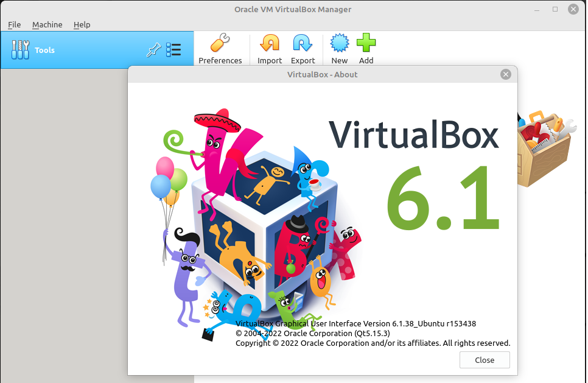

### Ответ на домашнее задание к занятию 2. «Применение принципов IaaC в работе с виртуальными машинами»


1. 
 * Опишите основные преимущества применения на практике IaaC-паттернов:  
** Ускорение производства и вывода на рынок.  
** Стабильность средств и устранение разности конфигураций.  
** Быстрая и эффективная разработка  
 * Какой из принципов IaaC является основополагающим?  
** Это time-to-market!. А по правильному: идемпотентность, с помощью этого принципа не нужно задумываться о дрейфе конфигураций.

2. Чем Ansible выгодно отличается от других систем управление конфигурациями?
* Ansible более прост в использовании, использует существующую SSH инфраструктуру, в то время как другие инструменты требуют установки специального окружения. 

Какой, на ваш взгляд, метод работы систем конфигурации более надёжный — push или pull?
* Более надежный метод конфигурации это "push", при использовании этого метода 
есть возможность спрятать сервис за файерволами и обеспечить сохранность данных авторизации в локальной сети. 

3. Virtualbox
     

* Vagrant
```commandline
lex@chrm-it-08:~$ vagrant --version
Vagrant 2.2.19

```
* Terraform
```commandline
lex@chrm-it-08:/terraform$ ./terraform -version
Terraform v1.4.2
on linux_amd64

```

* Ansible
```commandline
lex@chrm-it-08:/terraform$ ansible --version
ansible 2.10.8
  config file = None
  configured module search path = ['/home/lex/.ansible/plugins/modules', '/usr/share/ansible/plugins/modules']
  ansible python module location = /usr/lib/python3/dist-packages/ansible
  executable location = /usr/bin/ansible
  python version = 3.10.6 (main, Mar 10 2023, 10:55:28) [GCC 11.3.0]

```
4. Виртуальная машина создана и запущена. Докер установился через Ansible.

```commandline
lex@chrm-it-08:~/Vagrant$ vagrant up --provision
Bringing machine 'server1.netology' up with 'virtualbox' provider...
==> server1.netology: Clearing any previously set forwarded ports...
==> server1.netology: Clearing any previously set network interfaces...
==> server1.netology: Preparing network interfaces based on configuration...
    server1.netology: Adapter 1: nat
    server1.netology: Adapter 2: hostonly
==> server1.netology: Forwarding ports...
    server1.netology: 22 (guest) => 20011 (host) (adapter 1)
...

==> server1.netology: Running provisioner: ansible...
    server1.netology: Running ansible-playbook...

PLAY [Playbook] ****************************************************************

TASK [Gathering Facts] *********************************************************
ok: [server1.netology]

TASK [Installing tools] ********************************************************
ok: [server1.netology] => (item=['git', 'curl'])

TASK [Installing docker] *******************************************************
changed: [server1.netology]

TASK [Add the current user to docker group] ************************************
changed: [server1.netology]

PLAY RECAP *********************************************************************
server1.netology           : ok=4    changed=2    unreachable=0    failed=0    skipped=0    rescued=0    ignored=0   

lex@chrm-it-08:~/Vagrant$ vagrant ssh
Welcome to Ubuntu 20.04.6 LTS (GNU/Linux 5.4.0-144-generic x86_64)
...
  System information as of Tue 21 Mar 2023 12:24:30 PM UTC

  System load:  0.94               Users logged in:          0
  Usage of /:   14.0% of 30.34GB   IPv4 address for docker0: 172.17.0.1
  Memory usage: 25%                IPv4 address for eth0:    10.0.2.15
  Swap usage:   0%                 IPv4 address for eth1:    192.168.56.11
  Processes:    155

...

This system is built by the Bento project by Chef Software
More information can be found at https://github.com/chef/bento
Last login: Tue Mar 21 12:23:55 2023 from 10.0.2.2
vagrant@server1:~$ docker ps
permission denied while trying to connect to the Docker daemon socket at unix:///var/run/docker.sock: Get "http://%2Fvar%2Frun%2Fdocker.sock/v1.24/containers/json": dial unix /var/run/docker.sock: connect: permission denied
vagrant@server1:~$ sudo docker ps
CONTAINER ID   IMAGE     COMMAND   CREATED   STATUS    PORTS     NAMES
vagrant@server1:~$ exit
logout
lex@chrm-it-08:~/Vagrant$ 

```