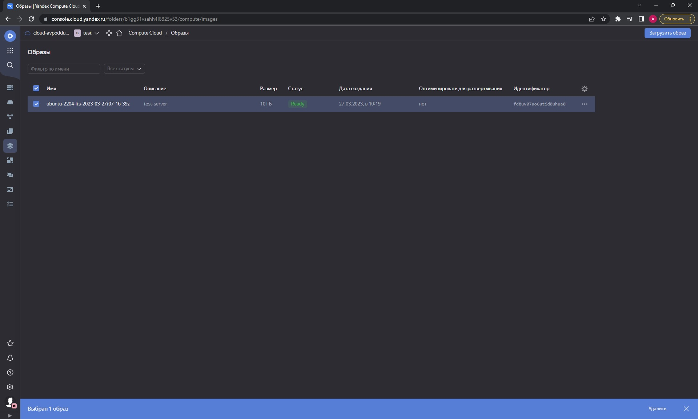
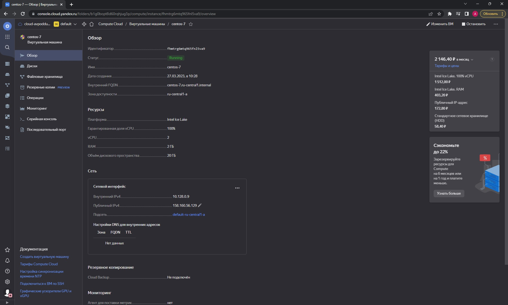
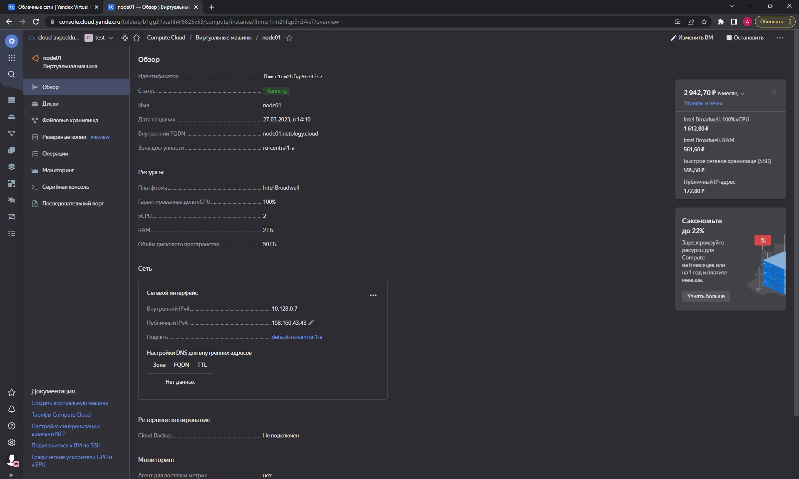
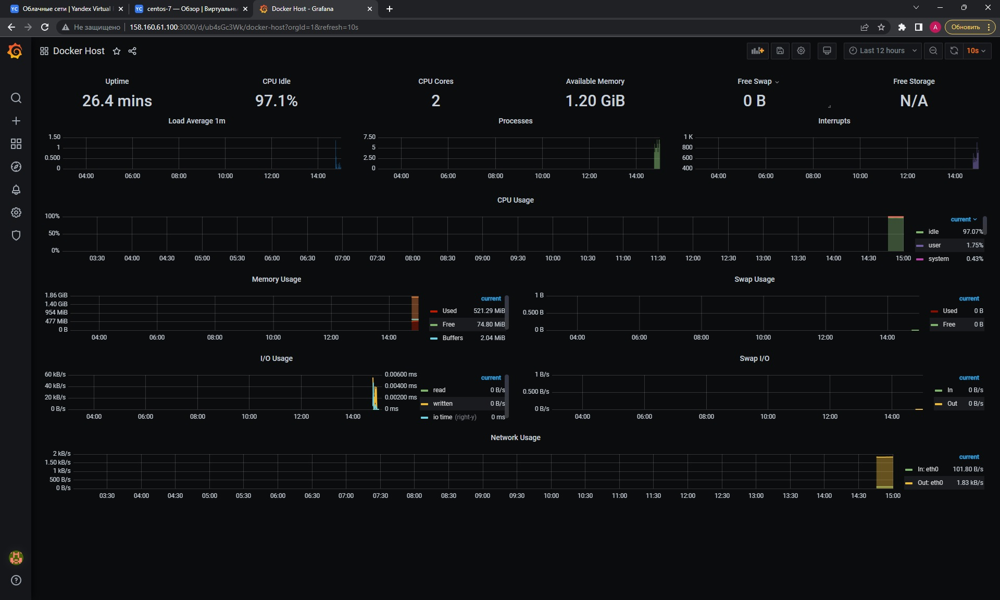

###  Ответ на домашнее задание к занятию 4 «Оркестрация группой Docker-контейнеров на примере Docker Compose»

1. Образ создан.
  

2. 
* Скриншот сделанной вручную виртуальной машины
  

* Скриншот созданной виртуальной машины через Terraform   
   
* terraform apply
```commandline
lex@chrm-it-08:~/terraform/05-virt-04$ terraform apply

Terraform used the selected providers to generate the following execution plan. Resource actions are indicated with the following symbols:
  + create

Terraform will perform the following actions:

  # yandex_compute_instance.node01 will be created
  + resource "yandex_compute_instance" "node01" {
      + allow_stopping_for_update = true
      + created_at                = (known after apply)
      + folder_id                 = (known after apply)
      + fqdn                      = (known after apply)
      + gpu_cluster_id            = (known after apply)
      + hostname                  = "node01.netology.cloud"
      + id                        = (known after apply)
      + metadata                  = {
          + "ssh-keys" = <<-EOT
                ...
        }
      + name                      = "node01"
      + network_acceleration_type = "standard"
      + platform_id               = "standard-v1"
      + service_account_id        = (known after apply)
      + status                    = (known after apply)
      + zone                      = "ru-central1-a"

      + boot_disk {
          + auto_delete = true
          + device_name = (known after apply)
          + disk_id     = (known after apply)
          + mode        = (known after apply)

          + initialize_params {
              + block_size  = (known after apply)
              + description = (known after apply)
              + image_id    = "fd8uv07uo6utid0uhua0"
              + name        = "root-node01"
              + size        = 50
              + snapshot_id = (known after apply)
              + type        = "network-nvme"
            }
        }

      + network_interface {
          + index              = (known after apply)
          + ip_address         = (known after apply)
          + ipv4               = true
          + ipv6               = (known after apply)
          + ipv6_address       = (known after apply)
          + mac_address        = (known after apply)
          + nat                = true
          + nat_ip_address     = (known after apply)
          + nat_ip_version     = (known after apply)
          + security_group_ids = (known after apply)
          + subnet_id          = "e9bcv5e9mccbi0g02bb4"
        }

      + resources {
          + core_fraction = 100
          + cores         = 2
          + memory        = 2
        }
    }

Plan: 1 to add, 0 to change, 0 to destroy.

Do you want to perform these actions?
  Terraform will perform the actions described above.
  Only 'yes' will be accepted to approve.

  Enter a value: yes

yandex_compute_instance.node01: Creating...
yandex_compute_instance.node01: Still creating... [10s elapsed]
yandex_compute_instance.node01: Still creating... [20s elapsed]
yandex_compute_instance.node01: Still creating... [30s elapsed]
yandex_compute_instance.node01: Still creating... [40s elapsed]
yandex_compute_instance.node01: Still creating... [50s elapsed]
yandex_compute_instance.node01: Still creating... [1m0s elapsed]
yandex_compute_instance.node01: Creation complete after 1m2s [id=fhmcr1rm2hfqp9n34is7]

Apply complete! Resources: 1 added, 0 changed, 0 destroyed.

```
3. Выполнено
```commandline
lex@chrm-it-08:~/terraform/05-virt-04/ansible$ ansible-playbook provision.yml 

PLAY [nodes] ***********************************************************************************************************************************************************

TASK [Gathering Facts] *************************************************************************************************************************************************
ok: [node01.netology.cloud]

TASK [Create directory for ssh-keys] ***********************************************************************************************************************************
ok: [node01.netology.cloud]

TASK [Adding rsa-key in /root/.ssh/authorized_keys] ********************************************************************************************************************
ok: [node01.netology.cloud]

TASK [Installing tools] ************************************************************************************************************************************************
changed: [node01.netology.cloud] => (item=['git', 'curl'])

TASK [Add docker repository] *******************************************************************************************************************************************
changed: [node01.netology.cloud]

TASK [Installing docker package] ***************************************************************************************************************************************
changed: [node01.netology.cloud] => (item=['docker-ce', 'docker-ce-cli', 'containerd.io'])

TASK [Enable docker daemon] ********************************************************************************************************************************************
changed: [node01.netology.cloud]

TASK [Install docker-compose] ******************************************************************************************************************************************
changed: [node01.netology.cloud]

TASK [Synchronization] *************************************************************************************************************************************************
changed: [node01.netology.cloud]

TASK [Pull all images in compose] **************************************************************************************************************************************
changed: [node01.netology.cloud]

TASK [Up all services in compose] **************************************************************************************************************************************
changed: [node01.netology.cloud]

PLAY RECAP *************************************************************************************************************************************************************
node01.netology.cloud      : ok=11   changed=8    unreachable=0    failed=0    skipped=0    rescued=0    ignored=0   

```
 
4. Выполнено.

```commandline
[lex@centos-7 ~]$ sudo docker ps
CONTAINER ID   IMAGE                              COMMAND                  CREATED          STATUS                    PORTS                                                                              NAMES
19e136d6e883   prom/alertmanager:v0.20.0          "/bin/alertmanager -…"   47 minutes ago   Up 47 minutes             9093/tcp                                                                           alertmanager
0d0f0830b73e   prom/pushgateway:v1.2.0            "/bin/pushgateway"       47 minutes ago   Up 47 minutes             9091/tcp                                                                           pushgateway
6ae45fca0257   grafana/grafana:7.4.2              "/run.sh"                47 minutes ago   Up 47 minutes             3000/tcp                                                                           grafana
67c20822f0ca   stefanprodan/caddy                 "/sbin/tini -- caddy…"   47 minutes ago   Up 47 minutes             0.0.0.0:3000->3000/tcp, 0.0.0.0:9090-9091->9090-9091/tcp, 0.0.0.0:9093->9093/tcp   caddy
56d25be59e8d   prom/prometheus:v2.17.1            "/bin/prometheus --c…"   47 minutes ago   Up 47 minutes             9090/tcp                                                                           prometheus
4a575f9e81d2   prom/node-exporter:v0.18.1         "/bin/node_exporter …"   47 minutes ago   Up 47 minutes             9100/tcp                                                                           nodeexporter
69179e4d56e2   gcr.io/cadvisor/cadvisor:v0.47.0   "/usr/bin/cadvisor -…"   47 minutes ago   Up 47 minutes (healthy)   8080/tcp      
```
 

5. Так как задача не обязательная, и у меня огромные проблемы с добавлением дополнительного сервера к Grafana, то выполню задачу когда будет время.