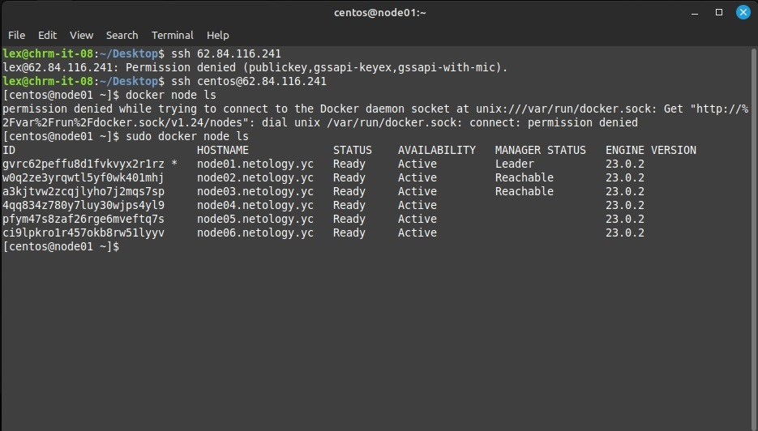
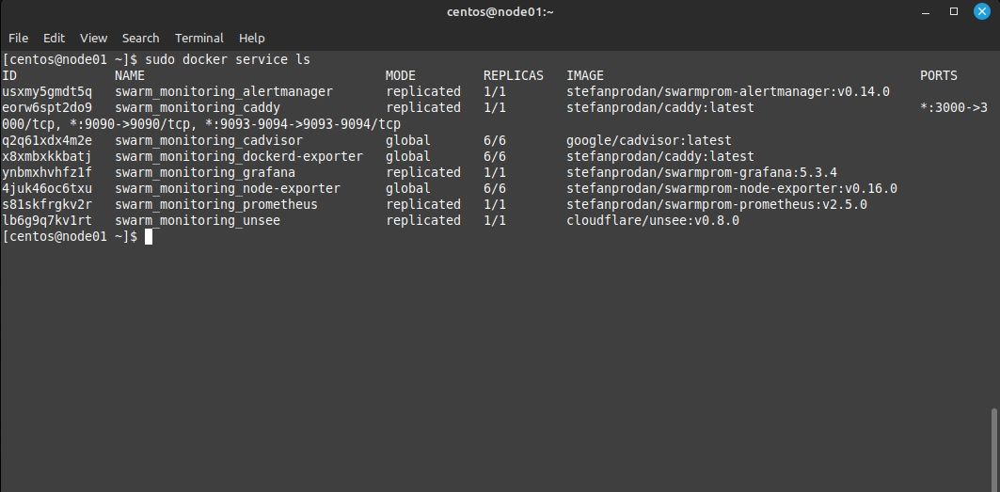

###  Ответ на домашнее задание к занятию 5 «Оркестрация кластером Docker контейнеров на примере Docker Swarm»


sdaf
* В чём отличие режимов работы сервисов в Docker Swarm-кластере: replication и global?  
`Если global это означает, что данный сервис будет запущен ровно в одном экземпляре на всех возможных нодах. А replicated означает, что n -ое кол-во контейнеров для данного сервиса будет запущено на всех доступных нодах.`
* Какой алгоритм выбора лидера используется в Docker Swarm-кластере?  
[Ссылка на то как работает алгоритм Raft, очень залипательно.](http://thesecretlivesofdata.com/raft/)
* Что такое Overlay Network?  
`Overlay — виртуальная сеть туннелей, натянутая поверх физической сети, она позволяет ВМ одного клиента общаться друг с другом, при этом обеспечивая изоляцию от других клиентов.`

2. Скриншот  


3. Скриншот


4. Данная команда блокирует ключи шифрования TLS и ключи шифрования журналов Raft на менеджерах кластера. 
```commandline
[centos@node01 ~]$ sudo docker swarm update --autolock=true
Swarm updated.
To unlock a swarm manager after it restarts, run the `docker swarm unlock`
command and provide the following key:

  @Secrets-key@

Please remember to store this key in a password manager, since without it you
will not be able to restart the manager.
[centos@node01 ~]$ 


```